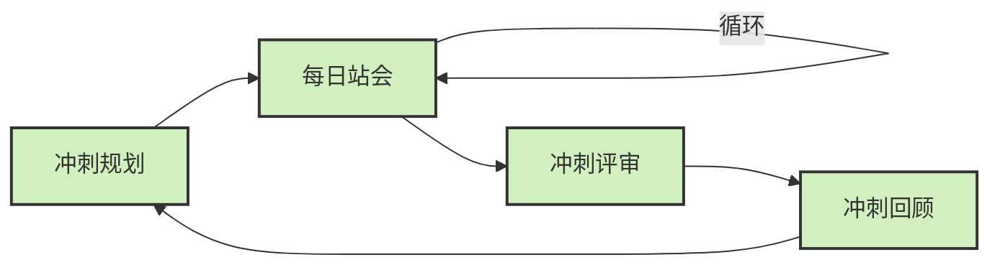

Не знаю, доводилось ли вам, как разработчикам, работающим на передовой, слушать, как руководитель или лидер команды обсуждает что-то вроде "Scrum" или "Kanban", а вы только киваете головой в замешательстве. Не волнуйтесь, я был одним из вас - я был сосредоточен на реализации кода и очень мало знал об этих "управленческих терминах".

<!--more-->

# 从开发者视角理解Scrum与Kanban

Я не собираюсь объяснять эти два подхода в высокопарных терминах управления проектами. Вместо этого я хотел бы поделиться тем, как в реальном мире вы как обычный разработчик будете различать эти два способа работы - в конце концов, как бы руководство ни определяло их, в конечном итоге именно тем из нас, кто пишет код, приходится работать в этих рамках.

## Scrum：生活在短跑循环中

Проще говоря, Scrum - это разбивка работы на спринты определенной продолжительности (обычно две недели). Когда вы работаете в команде Scrum, ваш день может выглядеть примерно так:

**Утреннее общее собрание в понедельник**: В начале спринта все собираются вместе и обсуждают, что они собираются делать в течение следующих двух недель. Вы можете услышать такие термины, как "сюжетные точки", которые, по сути, являются оценкой сложности задачи.
* **Ежедневное собрание**: каждое утро в течение 15 минут по очереди говорите: "Что я сделал вчера?", "Что я собираюсь сделать сегодня?", "Что мешает?", а затем расходитесь на работу.
* **Принятие задач**: Задачи обычно назначаются в начале спринта или "принимаются" членами команды. Как только спринт начинается, задачи, по сути, "фиксируются".
* **Презентация и обзор**: в конце спринта результаты двух недель представляются соответствующим людям, а затем команда обсуждает внутри себя, что было хорошо сделано за эти две недели и что можно улучшить.

В Scrum у вас, как у разработчика, есть четкое ощущение ритма и границ - у задач есть четкое время начала и окончания, и это все, что вы собираетесь делать в течение двух недель, и ничего больше.

## Kanban：持续流动的工作方式

Канбан - это совершенно другое, он больше похож на производственную линию или на то, как колл-центр обрабатывает рабочие заказы. В команде Канбан:

* **Нет фиксированного цикла**: работа идет непрерывно, без концепции "спринтов".
* **Визуализированный Kanban**: работа размещается на доске Kanban (обычно это такой инструмент, как Trello или Jira) и делится на колонки, такие как "To Do", "In Progress", "Done" и т. д.
* **Вытягивание задач**: после выполнения задачи вы сами вытягиваете следующую задачу из колонки "Выполнить", подобно тому, как агент по работе с клиентами обрабатывает следующий входящий звонок.
* **Лимит незавершенных работ**: предотвратите накопление и перегрузку работы, ограничив количество задач в каждом столбце.
*Меньше и более гибкие совещания**: нет фиксированных совещаний по планированию и обзору, поэтому общение происходит более оперативно и целенаправленно.

Как разработчик, в Kanban вы имеете больше свободы в выборе задач и работаете в более равномерном темпе, но вам также необходимы лучшие навыки самоменеджмента.

# 开发者的真实感受差异

Исходя из своего опыта и общения с коллегами, я обобщил наиболее очевидные различия в опыте между двумя способами работы:

## 时间体验的不同

В Scrum мое рабочее время распределяется следующим образом:
* Около 10-15% моего времени уходит на различные совещания.
* В начале и конце спринта наблюдается явная "занятость".
* Иногда возникает давление, чтобы успеть до конца спринта.

А в Kanban:
* Время на совещания значительно сокращается, а на его место приходят более фрагментарные и немедленные обсуждения.
* Рабочее давление относительно равномерно, без значительных циклических колебаний
* Легче войти в состояние "потока сознания" и сфокусироваться на текущей задаче.

## 工作自主性的差异

Скрам для меня:
* Задачи обычно планируются и назначаются заранее.
* Знание того, что будет сделано в ближайшие две недели, очень предсказуемо.
* Относительно мало изменений в требованиях (в теории)

Канбан дает мне такое ощущение:
* Большую свободу выбора задач.
* Возможность выбора следующей задачи на основе вашего опыта и статуса
* Требования и приоритеты могут быть скорректированы в любой момент, что требует лучшей адаптивности

## 成就感来源的不同

Это тонко, но важно:
* Чувство достижения в Scrum часто возникает после "большой сдачи" в конце спринта.
* Чувство достижения в Kanban приходит от маленьких побед в конце каждой задачи, чаще всего

# 哪种方式更好？一个开发者的个人观点

Лично я, испытав на себе оба способа работы, считаю, что **не существует абсолютно лучшего способа, есть только способ, который лучше подходит вам и вашей команде**.

Тем не менее, я считаю, что Канбан имеет некоторые аспекты, которые являются более современными и более соответствующими реалиям разработки программного обеспечения:

1. **Возможность адаптироваться к изменениям**: меняющиеся требования - это норма в разработке программного обеспечения, а мобильность Канбана позволяет лучше приспосабливаться к таким изменениям
2. **Снижение количества неэффективных совещаний**: как разработчики, мы все знаем, что слишком много совещаний может прервать реализацию идей.
3. **Визуализация проблем**: Канбан обеспечивает более интуитивный способ отображения точек блокировки в рабочем процессе.
4. **Самоорганизующиеся команды**: предоставление разработчикам большей автономии часто приводит к повышению мотивации

Однако для некоторых команд, особенно для проектов, требующих четкого графика выполнения и предсказуемости, нельзя игнорировать структурированные преимущества Scrum.

# 真实世界的混合实践

Стоит отметить, что реальные команды редко строго следуют чистому Scrum или Kanban; большинство из них используют гибридный подход, который сочетает в себе лучшее из обоих миров:

* :: Сохранить циклическое планирование и ретроспективные совещания Scrum.
* Принять визуальные рабочие процессы Kanban и ограничения WIP
* Гибкость для адаптации к фазе проекта и характеристикам команды

Для разработчика самое главное - понять принципы, лежащие в основе этих методов, а не придерживаться формальностей. Хорошая коммуникация и сотрудничество в команде всегда являются ключом к успеху при любом подходе к управлению.

# 给普通开发者的建议

Мой совет, если вы новичок в этих методах работы:

1. **Сосредоточьтесь на реальном опыте работы**: независимо от того, какой метод использует команда, главное - как он влияет на вашу повседневную работу.
2. **Предлагайте улучшения**: Не думайте, что только потому, что эти процессы "заданы сверху", вы не можете их изменить - хорошие команды всегда приветствуют конструктивные идеи.
3. **Понимайте цель, стоящую за этим**: Все эти методы направлены на более эффективное предоставление ценности, и понимание этого поможет вам лучше адаптироваться.

В конце концов, и структура Scrum, и гибкость Kanban - это инструменты, а не самоцель. Что действительно важно, так это найти способы, которые позволят вам и вашей команде работать эффективно и с удовольствием.

Как ветеран, пишущий код уже более десяти лет, я все больше убеждаюсь в том, что важно приспосабливаться к тому, как работает ваша команда, но еще важнее найти такой темп работы, который обеспечит вам продуктивность и энтузиазм. В конце концов, лучшие методы управления не сравнятся с внутренне мотивированной и хорошо управляемой командой разработчиков.

Какой способ работы использует ваша команда? Как вы себя чувствуете? Не стесняйтесь делиться своим опытом в разделе комментариев.