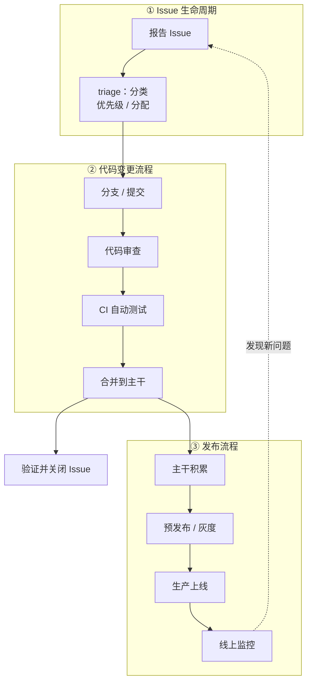

你向一个开源项目提了 Pull Request，几天后维护者给它打上了一个叫 `triaged` 的标签。你盯着这个词想：所以……然后呢？会被合并吗？还是被搁置了？

或者换个场景：你在公司写完一个功能，本地测试通过，PR 也合进了主干。三天后有人问你「这个功能上线了吗」，你发现自己居然答不上来。

这些困惑都指向同一个问题：**一份代码从「想法」到「用户手里」，中间到底经历了什么？**

多数人的直觉答案是一条直线：分类 → 标记优先级 → 处理 → 测试 → 上线。这条线不能算错，但它是三个不同流程被压缩之后产生的错觉。真实的软件工程系统是**三条各自独立、又互相咬合的流水线**：Issue 生命周期、代码变更流程、发布流程。这篇文章把这三条线拆开讲清楚——最后一节给出具体配置，你可以照抄，在自己的项目里把这套系统亲手装起来。

<!--more-->

## 一、为什么「一条直线」不够用

「分类 → 优先级 → 处理 → 测试 → 上线」这个直觉，其实是经典瀑布模型（SDLC）的压缩版：把软件开发想象成一条传送带，输入需求，输出软件。

但如果你观察一个真实运转的项目——无论是开源社区还是成规模的公司——会发现三个不同层面的流程同时在跑，各自有自己的状态机：



对照你熟悉的场景，这个图会纠正三个常见误解：

**误解一：「分类、标记优先级」贯穿全程。** 实际上它只发生在第一条线的入口——triage 是分流阀，不是主干。你的 PR 被打上 `triaged`，只说明「有团队成员看过它了，并且把它分了类」，后面还有很长的路。

**误解二：「处理 → 测试 → 上线」是一个人的顺序动作。** 实际上它跨越了两条流程线，中间还有两个被忽略的关键环节：**代码审查（Code Review）** 和 **合并（Merge）**。它们是主干上的闸门，没有它们，「处理完」的代码到不了用户手里。

**误解三：「上线」是终点。** 实际上流程首尾相连成环：线上监控发现问题，又变成新的 Issue 回到起点。这就是为什么现代工程把整个循环叫 DevOps——Development 和 Operations 是一件事的两端。

下面把三条线逐条展开。

## 二、第一条线：Issue 生命周期——分诊台

Issue 是流程的入口，但它不等于「Bug 报告」。在一个成熟项目里，Issue 大致分几类：bug（东西坏了）、feature request（想要新东西）、question（用法问题）、documentation（文档问题）。它们都从同一个入口进来，需要被分流。

**triage 的准确含义**。这个词来自医学的急诊分诊：伤员同时涌来，医生资源有限，必须先判断谁需要立即抢救、谁可以等、谁只需简单处理。软件工程借用了全套语义——稀缺的是维护者的注意力，涌来的是大量 Issue 和 PR。

以 PyTorch 为例，它的 `triaged` 标签官方定义是这样的：

> This issue has been looked at a team member, and triaged and prioritized into an appropriate module
> （这个 issue 已被团队成员查看，并分诊、排定优先级、归入相应模块）

所以当你的贡献被标记 `triaged`，它传达的全部信息是：**「看过了，分好类了」**——既不代表接受，也不代表拒绝，只是完成了进入队列前的分诊。它有一个配套标签叫 `triage review`，意思是「分类存疑，需要人工再判断」，两者是不同的状态。

triage 的输出通常有三个维度：

| 维度 | 示例 | 回答的问题 |
|------|------|-----------|
| 类型 | `bug` / `enhancement` / `question` | 这是什么？ |
| 优先级 | `P0` / `P1` / `P2` / `P3` | 先处理谁？ |
| 归属 | `module: inductor` / `oncall: pt2` | 谁来看？ |

分诊完成后，Issue 进入它自己的状态机：**open → triaged → in progress → fixed → closed**。注意最后一步「closed」通常不是手动操作的——如果你的 PR 描述里写了 `Fixes #123`，PR 合并的那一刻，对应 Issue 会被平台自动关闭。这就是「验证并关闭」环节在现代工具链里的自动化形态。

关于 triage 背后的资源分配逻辑、以及「当你自己是等待分诊的人 / 主持分诊的人」时的应对策略，我们之前写过一篇详解，可以参考[软件开发中的 Triage 机制]( "软件开发中的Triage机制：新人必知的资源分配游戏")。

> 💡 一个正在发生的变化：PyTorch 的 triage 体系现在已经高度自动化——先是接入 AI agent 做第一轮分诊（自动打 `bot-triaged`、路由到对应模块），人工只处理存疑的 `triage review` 部分。流程的三个维度没变，但「分诊台的护士」正在变成机器人。

## 三、第二条线：代码变更流程——两道闸门

这是开发者最熟悉、也最容易被误解的一条线。它的完整形态是：

```
分支 → 提交 → 提 PR → 代码审查 + CI 自动测试（并行）→ 合并
```

关键纠正：**测试不是「处理完之后」才做的事**。在你 push 代码的那一刻，CI（持续集成）就开始跑了——自动拉取你的分支、安装依赖、运行全部测试。与此同时，reviewer 在另一条轨道上读你的代码。两件事并行发生，共同决定这份变更是去是留。

这条线上有两道闸门：

**第一道闸门：代码审查（Code Review）。** 它不是「找茬」，它至少承担三个功能：质量把关（这个逻辑对吗）、知识传递（作者和 reviewer 互相学到项目上下文）、责任分担（合并后出问题，不是一个人的事）。大项目（如 PyTorch）要求至少一位 reviewer 批准；个人项目里，哪怕你自己审自己，也是一个「切换视角再看一遍」的仪式。

**第二道闸门：CI 自动测试。** 它的价值在于「自动」和「持续」：不依赖任何人记得跑测试，每次 push 都强制运行；分支保护规则可以要求「CI 不通过就不许合并」，让闸门真正硬起来。测试在这里的意义也随之变化——它不再是开发者个人的自查工具，而是**合并的准入条件**。

两闸齐开，才发生这条线上最重要的一个动作：**合并（Merge）**。合并是代码的「入库」时刻——从这一刻起，你的代码属于主干，属于所有人。之前的一切（分支、PR、讨论）都是准备动作。

理解了这一点，就能回答开头那个问题了：PR 被标记 `triaged` 只是拿到了「准备入场」的资格，真正决定它命运的是这条变更线——有没有 reviewer 愿意深入审查，CI 是不是全绿。

## 四、第三条线：发布流程——从主干到用户

新手最容易断裂的认知就在这里：**代码合并进主干（main），不等于用户能用上**。

主干只是一个「所有已验收变更的集合」。用户手里的东西和主干之间的距离，由第三条线来填补：

- **环境分级**：典型的路径是「开发环境 → 预发布环境（staging）→ 生产环境（production）」。变更先在低风险环境被验证，再逐级推向用户。预发布环境的最大价值是：它有和生产一样的基础设施，但没有真实用户——炸了不心疼。
- **灰度发布**：不把新版本一次性推给所有人，而是先给 1%、5%、20% 的用户，观察指标正常再扩大范围。金丝雀发布（Canary）、蓝绿部署（Blue-Green）都是这个思路的具体形态。
- **监控与回滚**：上线之后，监控系统盯着错误率、延迟、业务指标。出问题时，理想的应对不是「冲上去修」，而是**回滚**——把系统恢复到上一个已知良好的状态，然后从容地排查。

注意「回滚」这个动作怎么做的：不是现场手改，而是**再走一遍变更线**——把出问题的变更 revert（回退），作为一个新的变更重新走「分支 → 审查 → CI → 合并」的流程，再由发布线推上去。三条线在这里咬合：**回滚不是例外，它就是一次普通的变更**。

开源项目的发布线形态稍有不同：没有「部署到生产服务器」这一步，取而代之的是 **Release**——打上版本号（如 `v2.7.0`）、生成变更日志（changelog）、发布可供下载/安装的产物。你合并进 main 的修复，要等到下一个 Release 才真正抵达用户；回归修复有时还会走一条「补丁发布（patch release）」的高速通道——这本身又是一次小规模 triage（把回归问题分诊进补丁里程碑）。

## 五、动手：给自己的项目装上这三条线

原理讲完了，下面是实操部分。你不需要一次装全套——**从你项目里最痛的那条线开始装**。以下配置全部基于 GitHub（开源项目免费，私有项目也大多可用）。

### 5.1 给 Issue 线装分流阀

**第一步：用 Issue Forms 规范入口。** 在仓库里创建 `.github/ISSUE_TEMPLATE/bug.yml`：

```yaml
name: Bug 报告
description: 报告一个可复现的问题
labels: ["needs-triage"]
body:
  - type: textarea
    id: what-happened
    attributes:
      label: 发生了什么
      description: 描述你预期发生什么、实际发生了什么
    validations:
      required: true
  - type: textarea
    id: reproduce
    attributes:
      label: 复现步骤
      placeholder: |
        1.
        2.
        3.
    validations:
      required: true
  - type: input
    id: version
    attributes:
      label: 版本 / 环境
    validations:
      required: true
```

这个小配置一次解决三件事：issue 有了统一结构（复现步骤必填）、创建时自动打上 `needs-triage` 标签（分诊入口可见）、填写者不用猜该写什么。

**第二步：建立三轴标签体系。** 不要建几十个标签，按上面说的三个维度各建一组就够：

- 类型：`bug` / `enhancement` / `question` / `documentation`
- 优先级：`P0`（立刻处理）/ `P1`（本周）/ `P2`（排期）/ `P3`（有空再说）
- 归属：按你的模块划分，如 `module: frontend`、`module: api`

**第三步：让分诊有痕迹。** 分诊完成的标准动作：把 `needs-triage` 换成类型 + 优先级 + 归属标签。无论分诊者是人还是自动化脚本，这个「入口标签 → 结果标签」的转换就是你的 triage 记录。人少的时候手动即可；量大之后再考虑用 GitHub Actions 或 bot 自动化。

### 5.2 给变更线装两道闸门

**第一步：让 CI 跑起来。** 创建 `.github/workflows/ci.yml`：

```yaml
name: CI
on:
  pull_request:
  push:
    branches: [main]
jobs:
  test:
    runs-on: ubuntu-latest
    steps:
      - uses: actions/checkout@v4
      - uses: actions/setup-python@v5
        with:
          python-version: '3.12'
      - run: pip install -r requirements.txt
      - run: pytest
```

无论你用什么语言，形态都一样：检出代码 → 装环境 → 跑测试。这一步的收益是最大的——**从今往后，任何变更都有一台机器替你无条件地验证**。

**第二步：把 CI 变成硬闸门。** 光有 CI 还不够，因为它可以被无视。进入仓库的 Settings → Branches → Add branch protection rule，对 `main` 分支勾选：

- ☑ Require a pull request before merging（禁止直接 push 主干）
- ☑ Require approvals（至少 1 人批准——个人项目可先跳过此项）
- ☑ Require status checks to pass（选中你的 CI job：**测试不过，合不了**）

做完这两步，你的变更线就完整了：分支 → PR → 审查 + CI → 合并。哪怕是一个人开发，这条线也在保护你——它保证主干永远处于「测试通过」状态，而这正是下一条线能安全运转的前提。

**第三步（可选）：PR 模板。** 创建 `.github/pull_request_template.md`，固定提醒作者写两件事：这个 PR 解决什么（关联 `Fixes #123`）、怎么验证。模板不强制，但它让审查成本直线下降。

### 5.3 给发布线装版本与回滚

**第一步：用 Release 给每次交付留痕。** 合并进主干的变更积累到一定程度时发一个版本：

```bash
git tag -a v1.2.0 -m "v1.2.0"
git push origin v1.2.0
gh release create v1.2.0 --generate-notes
```

`--generate-notes` 会根据合并的 PR 自动生成 changelog——你平时坚持写清楚的 PR 描述，在这里获得回报。

**第二步：给部署加环境与审批。** 如果项目需要部署到服务器，用 GitHub Environments 给「预发布 → 生产」分级：在 Settings → Environments 新建 `staging` 和 `production` 两个环境，给 `production` 配置 required reviewers（人工审批）。然后部署 workflow 只需要声明环境：

```yaml
name: Deploy
on:
  push:
    tags: ['v*']
jobs:
  staging:
    runs-on: ubuntu-latest
    environment: staging
    steps:
      - run: ./deploy.sh staging
  production:
    needs: staging
    runs-on: ubuntu-latest
    environment: production   # 挂人工审批：点击通过才会执行
    steps:
      - run: ./deploy.sh production
```

效果：每次发布先自动进预发布环境；要进生产，必须有人在 GitHub 界面上点一次「Approve」。这个审批按钮就是你的发布闸门。

**第三步：把回滚写进习惯。** 出事时不要现场手改，用平台的 Revert 按钮（或 `git revert`）生成一个反向 PR，走完整的变更线 + 发布线。第一次这么做会显得「慢」，第二次你会发现它比手改快得多——因为每一个动作都有记录、可追溯、不会制造新的意外。

### 5.4 装机顺序建议

如果你现在就要动手，按这个顺序来：

1. **CI（5.2 第一步）**——半小时装好，当天见效
2. **分支保护（5.2 第二步）**——让 CI 从建议变成规则
3. **Issue Forms + 三轴标签（5.1）**——等你开始被 issue 或 PR 轰炸时装
4. **Release 流程（5.3 第一步）**——有外部用户后装
5. **环境分级 + 审批（5.3 第二步）**——有生产部署需求后装

这套系统的妙处在于：每一步都只依赖前一步，而且每一步都可以独立获得收益。它不是一次性的「流程改造」，而是五次小手术。

## 最后

回到最初的困惑。`triaged` 只是一个入口状态的标签，它背后是一整套三条流水线咬合运转的系统；你的代码是否「上线」，取决于它走完了哪几条线、停在了哪一格的哪个状态机上。

留一个问题给你：**打开你正在参与的项目（公司里的或开源的），对照上面三条线，哪一条是断的——哪一环今天还在靠人肉手工衔接？** 从那条断掉的线开始，装上第一个闸门。装完之后再回来读这篇文章，你会发现很多东西的位置感不一样了。
