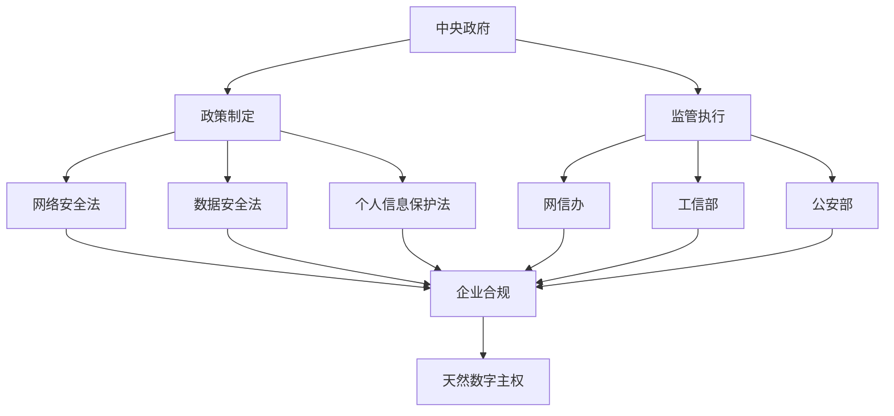
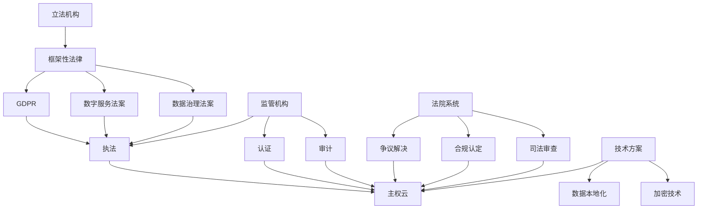
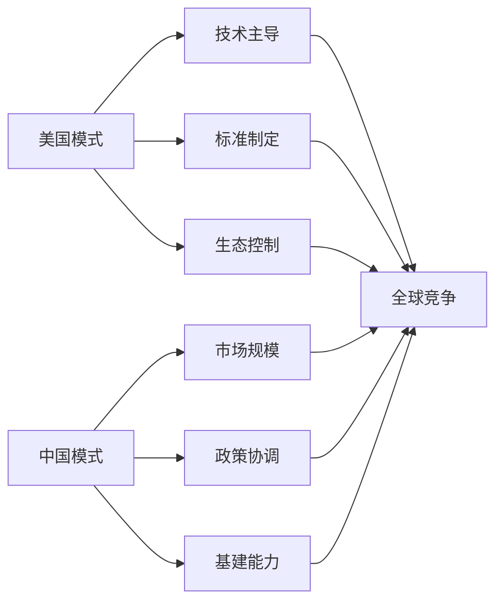

当我们谈论云计算时，我们在谈论什么？十年前，这还是一个纯粹的技术问题——如何更便宜、更高效地使用计算资源。但今天，云计算已经演变成国际关系、法律合规、甚至国家安全的核心议题。主权云的兴起，标志着我们正在进入一个"数字主权"时代。

<!--more-->

## 从技术工具到政治武器的转变

### 云计算的三个发展阶段

**第一阶段（2006-2015）：纯技术时代**
- 关注点：成本、性能、可靠性
- 代表厂商：AWS、阿里云、Azure
- 核心逻辑：规模经济，全球化资源配置
- 政治因素：几乎为零

**第二阶段（2015-2020）：合规觉醒**
- 关注点：数据保护、隐私合规
- 标志事件：GDPR生效、中国《网络安全法》
- 核心逻辑：技术发展必须服从法律框架
- 政治因素：开始显现

**第三阶段（2020-现在）：地缘政治化**
- 关注点：数字主权、国家安全
- 标志事件：华为被禁、TikTok争议、俄乌冲突后的技术制裁
- 核心逻辑：云服务成为国家间博弈的工具
- 政治因素：占主导地位

### 一个生动的类比

云计算的演变过程，很像航空业的发展：

- **早期航空**：纯粹的交通工具，追求速度和效率
- **二战时期**：成为军事战略资源，制空权决定战争胜负
- **冷战时期**：民航也被政治化，航线、技术都受地缘政治影响
- **今天的云计算**：正在经历类似的从民用到军用，从商业到政治的转变

## 不同治理模式的深层逻辑

### 中国模式：行政主导型数字主权

**核心特征**：


**运作逻辑**：
- 政府直接制定规则和标准
- 企业被动适应政府要求
- 通过市场准入控制外国云服务商
- 结果：形成事实上的"主权云环境"

**优势**：
- 执行效率高，政策一致性强
- 成本相对较低，无需复杂认证
- 适合快速发展和统一标准的需要

**局限**：
- 国际化时面临"信任赤字"
- 技术创新可能受到行政干预
- 难以适应复杂多元的国际环境

### 欧美模式：司法+技术型数字主权

**核心特征**：


**运作逻辑**：
- 立法部门制定原则性框架
- 监管机构细化执行标准
- 法院独立裁决争议案件
- 技术方案提供合规工具

**优势**：
- 程序正义，多方制衡
- 技术中性，创新友好
- 国际互操作性强

**局限**：
- 决策周期长，执行成本高
- 多方博弈可能导致标准不一
- 在国际竞争中可能处于劣势

## 主权云：数字时代的"粮食安全"

### 为什么各国都在搞主权云？

这个问题的答案，其实可以用"粮食安全"来类比：

**粮食安全的逻辑**：
- 不能完全依赖进口粮食
- 关键时刻可能被断供
- 需要保持自主生产能力
- 确保国民基本需求
- 应对自然灾害和战争

**数字主权的逻辑**：
- 不能完全依赖外国云服务
- 关键时刻可能被断供（制裁）
- 需要保持自主技术能力
- 确保国民数字权利
- 应对网络攻击和技术封锁

### 俄乌冲突的"教科书式"案例

2022年俄乌冲突爆发后的技术制裁，为全世界上了一堂生动的"数字主权课"：

**被制裁的俄罗斯面临**：
```
技术断供清单：
├── AWS、Azure停止在俄服务
├── 苹果、谷歌撤出俄罗斯市场  
├── 芯片、软件被全面禁运
├── SWIFT金融网络被切断
├── 社交媒体平台被限制
└── 迫使使用国产替代方案
```

**全球各国的反思**：
- **欧洲**：加速推进"欧洲云"计划，减少对美国技术依赖
- **印度**：启动"数字印度"战略，要求关键数据本地化
- **新加坡**：建设金融业主权云，确保东南亚金融中心地位
- **巴西**：推动南美数字主权联盟，抵御技术霸权

**启示**：在关键时刻，技术依赖就是政治软肋。

## 中国的独特路径：天然主权云环境

### 为什么中国不需要专门搞"主权云"？

中国通过制度设计和市场机制，创造了一个**事实上的主权云环境**：

**制度壁垒**：
```
法律法规体系：
├── 网络安全法：数据出境审查
├── 数据安全法：数据分类分级保护
├── 个人信息保护法：个人信息跨境传输限制
├── 密码法：加密技术管理
└── 等保制度：信息系统安全等级保护
```

**市场壁垒**：
```
外国云商的困境：
├── AWS：2017年将中国业务卖给光环新网
├── Azure：通过世纪互联运营，功能受限
├── Google Cloud：基本没有进入中国市场
├── Oracle：数据库还在，云服务边缘化
└── 结果：本土云商自然占据主导地位
```

**技术壁垒**：
```
本土化要求：
├── ICP备案：网站必须在境内备案
├── 防火墙：网络访问的天然过滤
├── 技术标准：推行国产密码算法
├── 设备要求：关键设备国产化
└── 人员要求：核心岗位中国公民
```

### 中国模式的国际影响

**"一带一路"的数字化延伸**：
- 为巴基斯坦建设"巴基斯坦云"
- 帮助非洲国家搭建数字基础设施
- 在东南亚推广"中国标准"
- 输出"中国方案"的数字治理模式

**与美国数字霸权的竞争**：


## 未来趋势：混合治理模式的兴起

### 单一模式的局限性

**纯行政模式的挑战**：
- 技术复杂性超出行政管理能力
- 国际协调需要技术标准和法律框架
- 创新活力可能受到过度管制影响

**纯市场模式的问题**：
- 无法应对国家安全和主权挑战
- 缺乏应对地缘政治风险的能力
- 可能导致技术依赖和数字殖民

### 混合模式的必然性

**技术发展的推动**：
```
新兴技术的治理挑战：
├── 人工智能：算法治理需要技术+法律手段
├── 区块链：去中心化技术超出传统监管范围
├── 量子计算：对现有安全体系构成根本挑战
├── 边缘计算：数据处理分散化，监管难度增加
└── 需要多元化的治理工具
```

**国际竞争的要求**：
- 在国际标准制定中需要话语权
- 在技术合作中需要互操作性
- 在贸易争端中需要谈判筹码
- 在安全威胁面前需要协调应对

## 对未来的思考

### 数字主权的边界在哪里？

这是一个开放性的问题，值得深入思考：

**技术边界**：
- 多少技术栈需要自主可控？
- 开源技术算不算技术依赖？
- 国际标准与自主标准如何平衡？

**经济边界**：
- 数字主权的成本如何承担？
- 效率与安全如何平衡？
- 国际分工与自主发展如何协调？

**政治边界**：
- 数字空间的"领土"如何划分？
- 跨境数据流动的"签证"制度？
- 数字时代的"外交豁免权"？

### 小国的数字主权困境

对于大国来说，数字主权是实力的体现。但对于小国来说，这可能是一个悖论：

**挑战**：
- 缺乏建设完整数字基础设施的资源
- 无法承担与大国技术脱钩的成本
- 容易成为大国数字博弈的牺牲品

**可能的出路**：
- 区域性数字主权联盟
- 基于国际法的数字治理框架
- 大国竞争中的"平衡外交"

## 结语：变局中的机遇

主权云的兴起，标志着云计算从一个技术产业演变为国家战略资源。这个变化带来了挑战，也创造了机遇。

对于技术从业者来说，这意味着需要重新思考技术的政治属性和社会责任。

对于政策制定者来说，这意味着需要在效率与安全、开放与自主之间找到平衡。

对于普通公民来说，这意味着数字权利正在成为基本人权的重要组成部分。

**数字主权时代已经到来，问题不是我们是否准备好了，而是我们如何应对。**

在这个充满不确定性的时代，唯一确定的是：理解数字主权，就是理解未来。
