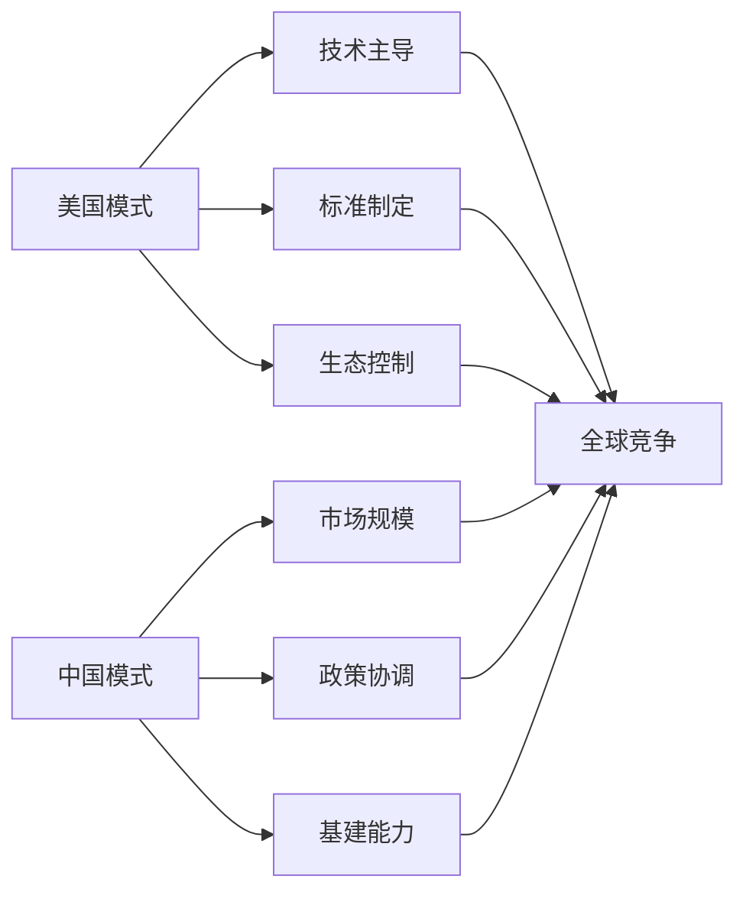

О чем мы говорим, когда говорим об облачных вычислениях? Десять лет назад это был чисто технический вопрос - как использовать вычислительные ресурсы более дешево и эффективно. Но сегодня облачные вычисления превратились в центральный вопрос международных отношений, соблюдения правовых норм и даже национальной безопасности. Возникновение суверенного облака свидетельствует о том, что мы вступаем в эпоху "цифрового суверенитета".

<! -еще-->

## От технологических инструментов к политическому оружию

### Три этапа развития облачных вычислений

**Этап 1 (2006-2015 гг.): эра чистых технологий.
- Фокус: стоимость, производительность, надежность
- Представленные поставщики: AWS, AliCloud, Azure
- Основная логика: экономия на масштабе, глобализированное распределение ресурсов
- Политические факторы: почти нулевые

**Фаза 2 (2015-2020 гг.): пробуждение комплаенса**
- Фокус: защита данных, соблюдение конфиденциальности
- Значимые события: вступление в силу GDPR, китайский закон о кибербезопасности
- Основная логика: технологическое развитие должно подчиняться правовым рамкам
- Политические факторы: зарождение

**Фаза 3 (2020 - настоящее время): геополитическая**
- Фокус: цифровой суверенитет, национальная безопасность
- Знаковые события: запрет Huawei, споры вокруг TikTok, технологические санкции после российско-украинского конфликта
- Основная логика: облачные сервисы становятся инструментом для межгосударственных игр
- Политические факторы: доминируют

### Яркая аналогия

Эволюция облачных вычислений во многом напоминает развитие индустрии авиаперевозок:

- **Ранняя авиация**: исключительно средство передвижения, стремление к скорости и эффективности.
- **Вторая мировая война**: она стала стратегическим военным ресурсом, и право контролировать воздушное пространство определяло, будет ли война выиграна или проиграна.
- **Период холодной войны**: гражданская авиация также была политизирована, маршруты и технологии зависели от геополитики
- **Современные облачные вычисления**: аналогичный переход от гражданского к военному, от коммерческого к политическому.

## Глубокая логика различных моделей управления

### Китайская модель: цифровой суверенитет под руководством исполнительной власти

**Основные функции**:
```mermaid
graph TD
    A[中央政府] --> B[政策制定]
    B --> C[网络安全法]
    B --> D[数据安全法]
    B --> E[个人信息保护法]
    
    A --> F[监管执行]
    F --> G[网信办]
    F --> H[工信部]
    F --> I[公安部]
    
    C --> J[企业合规]
    D --> J
    E --> J
    G --> J
    H --> J
    I --> J
    
    J --> K[天然数字主权]
```.

**Логика работы**:
- Правительство напрямую устанавливает правила и стандарты.
- Бизнес пассивно приспосабливается к требованиям правительства
- Контроль над иностранными поставщиками облачных услуг через доступ на рынок
- Результат: создание де-факто "суверенной облачной среды".

**Преимущество**:
- Эффективная реализация и последовательность политики
- Относительно низкая стоимость, отсутствие необходимости в сложной сертификации
- Идеально подходит для быстрого роста и гармонизации стандартов

**Ограничения**:
- Столкновение с "дефицитом доверия" при выходе на международный рынок.
- Возможное административное вмешательство в технологические инновации
- Трудности адаптации к сложной и разнообразной международной среде.

### Европейская и американская модель: судебный + технологический цифровой суверенитет.

**Основные черты**:
```mermaid
graph TD
    A[立法机构] --> B[框架性法律]
    B --> C[GDPR]
    B --> D[数字服务法案]
    B --> E[数据治理法案]
    
    F[监管机构] --> G[执法]
    F --> H[认证]
    F --> I[审计]
    
    J[法院系统] --> K[争议解决]
    J --> L[合规认定]
    J --> M[司法审查]
    
    N[技术方案] --> O[主权云]
    N --> P[数据本地化]
    N --> Q[加密技术]
    
    C --> G
    D --> G
    E --> G
    G --> O
    H --> O
    I --> O
    K --> O
    L --> O
    M --> O
```

**Логика работы**:
- Законодательный орган устанавливает принципиальные рамки
- Регулирующие органы совершенствуют стандарты правоприменения
- Суды независимо рассматривают спорные дела
- Технические программы предоставляют инструменты для обеспечения соответствия

**Преимущество**:
- Процессуальное правосудие, множество сдержек и противовесов
- Технологическая нейтральность и инновационность
- Сильная международная совместимость

**Ограничения**:
- Длительные циклы принятия решений и высокие затраты на внедрение
- Многочисленные игры могут привести к несогласованности стандартов
- Возможные недостатки в международной конкуренции

## Суверенные облака: "продовольственная безопасность" в цифровую эпоху ##

### Почему страны развивают суверенные облака?

Ответ на этот вопрос можно сравнить с "продовольственной безопасностью":

**Логика продовольственной безопасности**:
- Мы не можем полностью полагаться на импортные продукты питания.
- Поставки продовольствия могут быть прерваны в критические моменты.
- Нам необходимо поддерживать собственные производственные мощности.
- Необходимость поддерживать автономные производственные мощности для обеспечения основных потребностей населения
- Реагирование на стихийные бедствия и войны

**Логика цифрового суверенитета**:
- Нельзя полностью полагаться на иностранные облачные сервисы
- Возможность отключения в критические моменты (санкции)
- Необходимость поддерживать автономные технологические возможности
- Обеспечение национальных цифровых прав
- Реагирование на кибератаки и технологические блокировки

### Хрестоматийный пример российско-украинского конфликта ###

Технологические санкции, последовавшие за началом российско-украинского конфликта в 2022 году, стали для всего мира наглядным уроком цифрового суверенитета:

**Санкционированная Россия сталкивается с **:
```
技术断供清单：
├── AWS、Azure停止在俄服务
├── 苹果、谷歌撤出俄罗斯市场  
├── 芯片、软件被全面禁运
├── SWIFT金融网络被切断
├── 社交媒体平台被限制
└── 迫使使用国产替代方案
```.

**Размышления со всего мира**:
- Европа**: ускорение программы "Европейское облако" для снижения зависимости от американских технологий.
- **Индия**: запуск стратегии "Цифровая Индия", требующей локализации ключевых данных.
- **Сингапур**: создание суверенного облака для финансовой индустрии, чтобы обеспечить позиции страны как финансового центра Юго-Восточной Азии
- **Бразилия**: продвижение южноамериканского альянса цифрового суверенитета для противостояния технологической гегемонии

**Откровение**: в критические моменты технологическая зависимость - это политическая слабость.

## Уникальный путь Китая: естественная суверенная облачная среда

### Почему Китаю не нужно специализироваться на "суверенном облаке"?

Китай создал **де-факто суверенную облачную среду** благодаря институциональному дизайну и рыночным механизмам:

**институциональные барьеры**:
```
法律法规体系：
├── 网络安全法：数据出境审查
├── 数据安全法：数据分类分级保护
├── 个人信息保护法：个人信息跨境传输限制
├── 密码法：加密技术管理
└── 等保制度：信息系统安全等级保护
```

**рыночные барьеры**:
```
外国云商的困境：
├── AWS：2017年将中国业务卖给光环新网
├── Azure：通过世纪互联运营，功能受限
├── Google Cloud：基本没有进入中国市场
├── Oracle：数据库还在，云服务边缘化
└── 结果：本土云商自然占据主导地位
```

**Технические барьеры**:
```
本土化要求：
├── ICP备案：网站必须在境内备案
├── 防火墙：网络访问的天然过滤
├── 技术标准：推行国产密码算法
├── 设备要求：关键设备国产化
└── 人员要求：核心岗位中国公民
```

### Международное влияние китайской модели

**Цифровое расширение "Пояса и пути "**:
- Создание "пакистанского облака" для Пакистана.
- Помощь африканским странам в создании цифровой инфраструктуры
- Продвижение китайских стандартов в Юго-Восточной Азии.
- Экспорт модели цифрового управления "Китайское решение".

**Конкуренция с США за цифровую гегемонию:


## Будущие тенденции: рост гибридных моделей управления

### Ограничения одной модели

**Трудности чисто административной модели**:
- Техническая сложность превышает административные возможности
- Международная координация требует технических стандартов и правовых рамок
- Инновационный динамизм может пострадать от чрезмерного регулирования

**Проблемы чисто рыночной модели**:
- Неспособность решать проблемы национальной безопасности и суверенитета
- Отсутствие потенциала для решения геополитических рисков
- Может привести к технологической зависимости и цифровой колонизации

### Неизбежность гибридной модели

**Движимая технологическим развитием**:
```
新兴技术的治理挑战：
├── 人工智能：算法治理需要技术+法律手段
├── 区块链：去中心化技术超出传统监管范围
├── 量子计算：对现有安全体系构成根本挑战
├── 边缘计算：数据处理分散化，监管难度增加
└── 需要多元化的治理工具
```

**Требования международной конкуренции**:
- Потребность в праве голоса при установлении международных стандартов
- Потребность в операционной совместимости в рамках технического сотрудничества
- Потребность в переговорных рычагах в торговых спорах.
- Необходимость скоординированного реагирования на угрозы безопасности

## Размышления о будущем

### Где границы цифрового суверенитета?

Это открытый вопрос, который заслуживает более глубокого осмысления:

**технологические границы**:
- Какая часть технологического стека должна быть автономной?
- Считаются ли технологии с открытым исходным кодом технологической зависимостью?
- Как сбалансировать международные стандарты с автономными стандартами?

**Экономические границы**:
- Как покрываются расходы на цифровой суверенитет?
- Как сбалансировать эффективность и безопасность?
- Как совместить международное разделение труда с автономным развитием?

**Политические границы**:
- Как должна быть разграничена "территория" цифрового пространства?
- Визовый режим для трансграничных потоков данных?
- Дипломатический иммунитет в цифровую эпоху?

### Дилемма цифрового суверенитета для малых государств

Для больших стран цифровой суверенитет - это признак силы. Но для малых государств это может быть парадоксом:

**Проблема**:
- Нехватка ресурсов для создания полноценной цифровой инфраструктуры
- Невозможность нести расходы, связанные с технологическим отрывом от крупных держав
- Легко стать жертвой цифровой игры великих держав

**Возможный выход**:
- Региональные цифровые суверенные альянсы
- Система цифрового управления на основе международного права
- "Сбалансированная дипломатия" в условиях конкуренции великих держав

## Заключение: возможности в меняющемся ландшафте

Возникновение суверенного облака знаменует собой эволюцию облачных вычислений из технологической отрасли в стратегический национальный ресурс. Эти перемены несут в себе вызовы и создают возможности.

Для практиков технологий это означает необходимость переосмыслить политические атрибуты и социальную ответственность технологий.

Для политиков это означает необходимость найти баланс между эффективностью и безопасностью, открытостью и автономностью.

Для обычных граждан это означает, что цифровые права становятся важной частью основных прав человека.

**Эра цифрового суверенитета наступает, и вопрос не в том, готовы ли мы к ней, а в том, как мы на нее реагируем. **

В эти времена неопределенности единственная уверенность заключается в следующем: понимание цифрового суверенитета означает понимание будущего.
