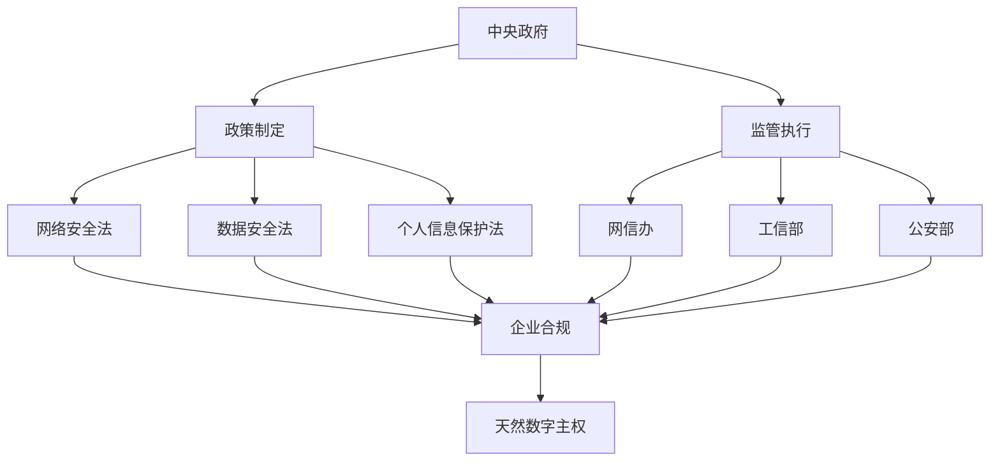
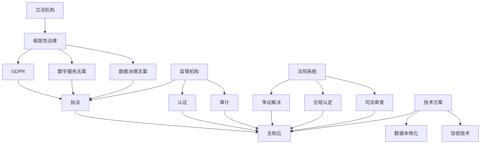

О чем мы говорим, когда говорим об облачных вычислениях? Десять лет назад это был чисто технический вопрос - как использовать вычислительные ресурсы более дешево и эффективно. Но сегодня облачные вычисления превратились в центральный вопрос международных отношений, соблюдения правовых норм и даже национальной безопасности. Возникновение суверенного облака свидетельствует о том, что мы вступаем в эпоху "цифрового суверенитета".

<!--more-->

## 从技术工具到政治武器的转变

### 云计算的三个发展阶段

**Этап I (2006-2015 гг.): эра чистых технологий**.
- Фокус: стоимость, производительность, надежность
- Представленные поставщики: AWS, AliCloud, Azure
- Основная логика: экономия на масштабе, глобализированное распределение ресурсов
- Политические факторы: почти нулевые

**Этап 2 (2015-2020 гг.): пробуждение соответствия**.
- Фокус: защита данных, соблюдение конфиденциальности
- Значимые события: вступление в силу GDPR, китайский закон о кибербезопасности
- Основная логика: технологическое развитие должно подчиняться правовым рамкам
- Политические факторы: зарождение

**Этап III (с 2020 года по настоящее время): геополитизация**.
- Фокус: цифровой суверенитет, национальная безопасность
- Значимые события: запрет Huawei, споры вокруг TikTok, технологические санкции после российско-украинского конфликта
- Основная логика: облачные сервисы становятся инструментом для межгосударственных игр
- Политические факторы: доминируют

### 一个生动的类比

Эволюция облачных вычислений во многом напоминает эволюцию авиационной отрасли:

- **Ранняя авиация**: чисто транспортная, стремление к скорости и эффективности
- **Период Второй мировой войны**: стала военно-стратегическим ресурсом, права на воздушное пространство определяли победу или поражение в войне
- **Период холодной войны**: гражданская авиация также была политизирована, маршруты и технологии зависели от геополитики
- **Современные облачные вычисления**: аналогичный переход от гражданского к военному, от коммерческого к политическому.

## 不同治理模式的深层逻辑

### 中国模式：行政主导型数字主权

**核心特征**：


**Операционная логика**:
- Правительство напрямую устанавливает правила и стандарты
- Предприятия пассивно адаптируются к требованиям правительства
- Контроль над иностранными поставщиками облачных услуг через доступ на рынок
- Результат: создание де-факто "суверенной облачной среды".

**Преимущества**:
- Эффективное внедрение и последовательность политики
- Относительно низкая стоимость, отсутствие необходимости в сложной сертификации
- Подходит для быстрой разработки и гармонизации стандартов

**Ограничения**:
- "Дефицит доверия" при интернационализации.
- Возможное административное вмешательство в технологические инновации
- Трудности адаптации к сложной и разнообразной международной среде

### 欧美模式：司法+技术型数字主权

**核心特征**：


**Операционная логика**:
- Законодательные органы устанавливают принципиальные рамки
- Регулирующие органы совершенствуют стандарты реализации
- Суды независимо рассматривают спорные дела
- Технические программы предоставляют инструменты для обеспечения соответствия

**Преимущества**:
- Процедурное правосудие, многочисленные системы сдержек и противовесов
- Технологическая нейтральность и благоприятность для инноваций
- Сильная международная совместимость

**Ограничения**:
- Длительные циклы принятия решений и высокие затраты на внедрение
- Многочисленные игры могут привести к несогласованности стандартов
- Возможные недостатки в международной конкуренции

## 主权云：数字时代的"粮食安全"

### 为什么各国都在搞主权云？

Ответ на этот вопрос можно сравнить с "продовольственной безопасностью":

**Логика продовольственной безопасности**:
- Нельзя полагаться исключительно на импортное продовольствие
- Возможность быть отрезанным в критические моменты
- Необходимость поддержания автономных производственных мощностей
- Необходимость поддержания автономных производственных мощностей для обеспечения основных потребностей населения
- Реагирование на стихийные бедствия и войны

**Логика цифрового суверенитета**:
- Нельзя полагаться исключительно на иностранные облачные сервисы
- Возможность быть отрезанным в критические моменты (санкции)
- Необходимость поддерживать автономные технологические возможности
- Обеспечение национальных цифровых прав
- Реагирование на кибератаки и технологические блокировки

### 俄乌冲突的"教科书式"案例

Технологические санкции, последовавшие за началом российско-украинского конфликта в 2022 году, стали для всего мира наглядным уроком цифрового суверенитета:

**被制裁的俄罗斯面临**：
```
技术断供清单：
├── AWS、Azure停止在俄服务
├── 苹果、谷歌撤出俄罗斯市场  
├── 芯片、软件被全面禁运
├── SWIFT金融网络被切断
├── 社交媒体平台被限制
└── 迫使使用国产替代方案
```

**Отзывы из стран мира**:
- **Европа**: ускорение программы "Европейское облако", чтобы снизить зависимость от американских технологий.
- **Индия**: запуск стратегии "Цифровая Индия", требующей локализации ключевых данных
- **Сингапур**: создание суверенного облака для финансовой индустрии, чтобы обеспечить позиции страны как финансового центра Юго-Восточной Азии
- **Бразилия**: продвижение южноамериканского альянса цифрового суверенитета для противостояния технологической гегемонии

**Откровение**: в критический момент технологическая зависимость - это политическая слабость.

## 中国的独特路径：天然主权云环境

### 为什么中国不需要专门搞"主权云"？

Китай создал **де-факто суверенную облачную среду** с помощью институционального дизайна и рыночных механизмов:

**制度壁垒**：
```
法律法规体系：
├── 网络安全法：数据出境审查
├── 数据安全法：数据分类分级保护
├── 个人信息保护法：个人信息跨境传输限制
├── 密码法：加密技术管理
└── 等保制度：信息系统安全等级保护
```

**市场壁垒**：
```
外国云商的困境：
├── AWS：2017年将中国业务卖给光环新网
├── Azure：通过世纪互联运营，功能受限
├── Google Cloud：基本没有进入中国市场
├── Oracle：数据库还在，云服务边缘化
└── 结果：本土云商自然占据主导地位
```

**技术壁垒**：
```
本土化要求：
├── ICP备案：网站必须在境内备案
├── 防火墙：网络访问的天然过滤
├── 技术标准：推行国产密码算法
├── 设备要求：关键设备国产化
└── 人员要求：核心岗位中国公民
```

### 中国模式的国际影响

**Цифровое расширение Пояса и пути**:
- Создание "пакистанского облака" для Пакистана
- Помощь африканским странам в создании цифровой инфраструктуры
- Продвижение китайских стандартов в Юго-Восточной Азии.
- Экспорт модели цифрового управления "Китайское решение".

**与美国数字霸权的竞争**：


## 未来趋势：混合治理模式的兴起

### 单一模式的局限性

**Трудности чисто административной модели**:
- Техническая сложность превышает административные возможности
- Международная координация требует технических стандартов и правовых рамок
- Динамизм инноваций может пострадать от чрезмерного регулирования

**Проблемы чисто рыночной модели**:
- Неспособность решать проблемы национальной безопасности и суверенитета
- Отсутствие потенциала для решения геополитических рисков
- Может привести к технологической зависимости и цифровой колонизации

### 混合模式的必然性

**技术发展的推动**：
```
新兴技术的治理挑战：
├── 人工智能：算法治理需要技术+法律手段
├── 区块链：去中心化技术超出传统监管范围
├── 量子计算：对现有安全体系构成根本挑战
├── 边缘计算：数据处理分散化，监管难度增加
└── 需要多元化的治理工具
```

**Требования международной конкуренции**:
- Потребность в праве голоса при установлении международных стандартов
- Потребность в операционной совместимости в рамках технического сотрудничества
- Потребность в переговорных рычагах в торговых спорах
- Необходимость скоординированного реагирования на угрозы безопасности

## 对未来的思考

### 数字主权的边界在哪里？

Это открытый вопрос, который заслуживает более глубокого рассмотрения:

**Технологические границы**:
- Какая часть технологического стека должна быть автономной?
- Считается ли технология с открытым исходным кодом технологической зависимостью?
- Каков баланс между международными и автономными стандартами?

**Экономические границы**:
- Как покрываются расходы на цифровой суверенитет?
- Как сбалансировать эффективность и безопасность?
- Как примирить международное разделение труда с автономным развитием?

**Политические границы**:
- Как демаркируются "территории" в цифровом пространстве?
- Визовый режим для трансграничных потоков данных?
- "Дипломатический иммунитет" в цифровую эпоху?

### 小国的数字主权困境

Для крупных стран цифровой суверенитет - это признак силы. Но для малых стран это может быть парадоксом:

**Трудности**:
- Нехватка ресурсов для создания полноценной цифровой инфраструктуры
- Неспособность нести расходы, связанные с технологическим отрывом от крупных держав
- Легко стать жертвой цифровой игры великих держав

**Возможный путь вперед**:
- Региональные коалиции цифровых суверенов
- Рамки цифрового управления на основе международного права
- "Сбалансированная дипломатия" в условиях конкуренции великих держав

## 结语：变局中的机遇

Возникновение суверенного облака знаменует собой превращение облачных вычислений из технологической отрасли в национальный стратегический ресурс. Эти перемены несут в себе вызовы и создают возможности.

Для практиков технологий это означает необходимость переосмыслить политические атрибуты и социальную ответственность технологий.

Для политиков это означает поиск баланса между эффективностью и безопасностью, открытостью и автономией.

Для обычных граждан это означает, что цифровые права становятся важной частью основных прав человека.

**Эпоха цифрового суверенитета наступает, и вопрос не в том, готовы ли мы к ней, а в том, как мы на нее реагируем. **

В наше время неопределенности единственная уверенность заключается в следующем: понимание цифрового суверенитета - это понимание будущего.