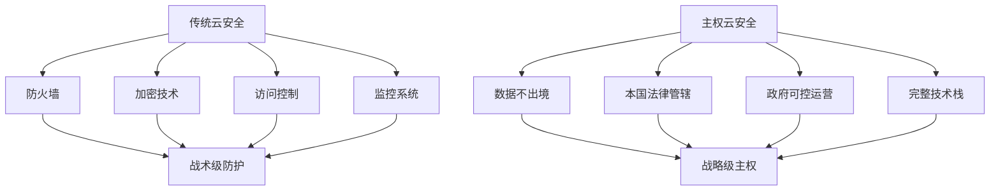
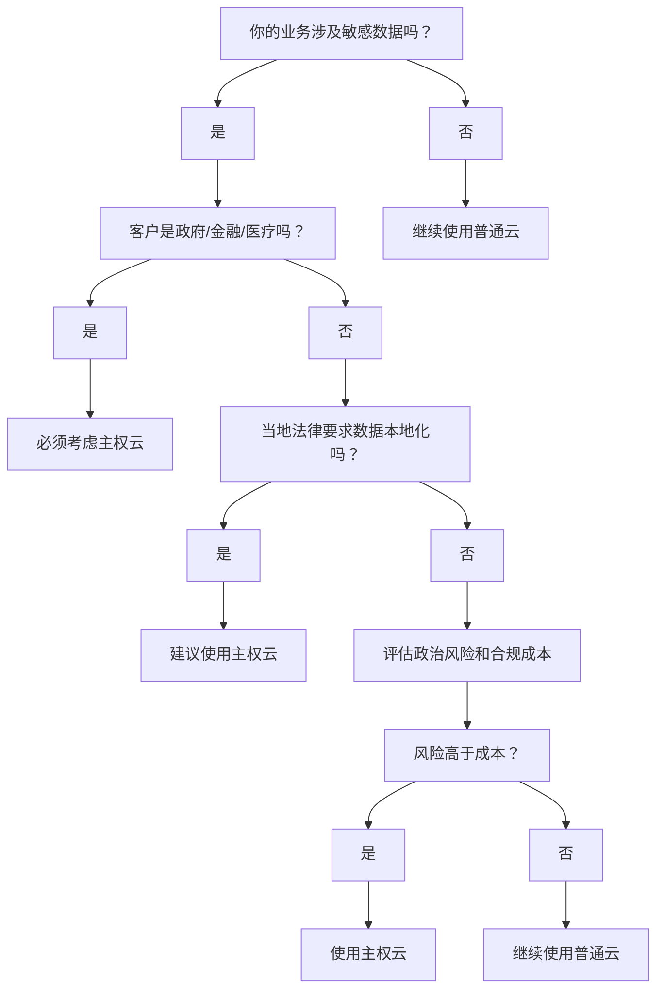

你可能听说过"主权云"这个词，但不确定它到底是什么，更不知道什么时候需要用到它。如果你是云计算从业者、IT管理者，或者正在为企业选择云服务的决策者，这篇文章会告诉你关于主权云的核心要点。

<!--more-->

## 主权云到底是什么？

想象一下，你公司的重要数据就像家里的贵重物品。传统的公有云（比如AWS、阿里云）就像是国际连锁的保险箱服务——安全、便宜、服务好，但你的东西可能被存放在世界任何一个角落，甚至可能在某些情况下被其他国家的政府要求打开检查。

而主权云，就像是你专门在自己国家找的本土保险箱服务——数据绝不出境，运营人员都是本国公民，完全受本国法律保护。虽然可能贵一些，但你拥有完全的控制权。

**简单来说**：主权云 = 政府可控的云计算服务

## 传统安全是战术，主权云是战略

在传统的云安全中，我们习惯用防火墙、加密、访问控制这些"战术级"手段来保护数据。这就像给房子装防盗门、监控、保险箱——很有用，但房子还是建在别人的土地上。

主权云的思路完全不同：**直接给你一个数字化的"国家"**，从土地、房子、法律、警察都是你自己的。这是战略级别的解决方案。



## 什么业务必须考虑主权云？

### 1. 政府和军队数据
如果你的客户是政府部门或军队，那么主权云几乎是必需品。

**真实案例**：美国国防部选择AWS Government Cloud，要求：
- 所有数据必须在美国境内
- 运维人员必须有政府安全许可
- 云服务商必须通过专门的政府认证
- 不能依赖任何外国技术或人员

**为什么？** 国家机密泄露的后果是灾难性的，任何风险都不能承受。

### 2. 金融机构的核心数据
银行、证券、保险公司处理的资金和客户信息极其敏感。

**真实案例**：瑞银集团（UBS）面临的困境
- 美国FATCA法案要求披露美国客户信息
- 但瑞士银行保密法禁止泄露客户数据
- 解决方案：采用瑞士本土主权云，确保数据绝不出境
- 投资：5年期10亿瑞士法郎
- 效果：客户信任度提升，富豪客户回流

### 3. 医疗健康数据
患者隐私保护在全球都有严格要求。

**德国的做法**：
- 《患者数据保护法》要求医疗数据必须在德国境内
- 德国医院不能直接使用AWS或Azure
- 必须使用通过德国认证的主权云服务
- 违反者面临巨额罚款和刑事责任

### 4. 关键基础设施
电力、通信、交通等关键基础设施的数据关系国家安全。

**为什么电网数据需要主权云？**
- 2015年乌克兰电网被俄罗斯黑客攻击，导致大停电
- 2021年美国输油管道被勒索软件攻击，影响能源供应
- 教训：关键基础设施数据绝不能让外国政府有接触机会

## 主权云 vs 普通云：成本和收益对比

### 成本差异（以同等规模为例）

**普通云（AWS）**：
```
计算成本：$10,000/月
存储成本：$2,000/月  
网络成本：$1,500/月
管理成本：$500/月
总计：$14,000/月
```

**主权云**：
```
计算成本：$15,000/月 (+50%)
存储成本：$3,000/月 (+50%)
合规成本：$5,000/月 (新增)
本地运维：$3,000/月 (新增)
总计：$26,000/月 (+86%)
```

### 但是，风险成本呢？

**GDPR罚款案例**：
- 2019年，英国航空因数据泄露被罚款1.83亿英镑
- 2021年，亚马逊因违反GDPR被欧盟罚款7.46亿欧元
- 2022年，Meta因数据传输问题被罚款4.05亿欧元

**计算一下**：如果你面临数据合规风险，主权云的"额外成本"可能在一次罚款面前就显得微不足道。

## 中国企业的海外合规挑战

### TikTok的困境就是最好的案例

TikTok在美国遇到的问题：
- 美国政府担心中国政府可能访问美国用户数据
- 技术上无法证明中国完全无法访问
- 政治风险：中美关系恶化时首当其冲
- 可能面临被禁用或强制出售

**如果TikTok从一开始就用美国主权云会怎样？**
- 所有美国用户数据在美国境内
- 运维人员都是美国公民
- 完全受美国法律保护
- 美国政府可以随时审计
- 与中国系统完全隔离

**结果**：很多政治问题根本不会出现。

### 其他中国企业的类似挑战

**华为云海外策略**：
- 在泰国：建设本地数据中心
- 在南非：与本地企业合作运营  
- 在墨西哥：数据完全本地化存储
- **实质**：被迫采用"主权云"模式

**字节跳动的全球化需求**：
- TikTok在欧洲：面临GDPR合规压力
- TikTok在印度：曾被直接禁用
- 解决方案：需要在各国建设"本地主权云"

## 什么时候你需要考虑主权云？

### 判断标准：

1. **客户类型**：政府、军队、金融、医疗、基础设施
2. **数据敏感性**：涉及国家安全、商业机密、个人隐私
3. **法律要求**：当地法律明确要求数据不得出境
4. **政治风险**：业务可能受到地缘政治影响
5. **合规成本**：违规罚款超过主权云额外成本

### 简单的决策流程：



## 实用建议

### 如果你决定采用主权云：

1. **提前规划**：主权云认证和部署周期通常比普通云长得多
2. **预算充足**：准备比普通云高50-100%的预算
3. **选择可靠供应商**：确保提供商有相关认证和成功案例
4. **分阶段迁移**：不要一次性迁移所有业务，先从最敏感的开始

### 如果暂时不需要：

1. **保持关注**：法律法规变化很快，今天不需要不代表明天不需要
2. **做好准备**：了解迁移到主权云需要什么条件和成本
3. **风险评估**：定期评估业务的合规风险和政治风险

## 关键要点总结

1. **主权云不是技术问题，是政治和合规问题**
2. **成本虽高，但对特定业务来说是必需品，不是奢侈品**
3. **中国企业出海时，主权云可能是绕不过的选择**
4. **提前了解和规划，比被动应对要好得多**

下次当你听到"数据本地化"、"合规要求"、"政治风险"这些词的时候，记住还有主权云这个选择。虽然它不是万能的，但在合适的场景下，它可能是最优解。

记住：在数字化时代，数据主权正在成为国家主权的重要组成部分。理解主权云，就是理解未来云计算的发展方向。
