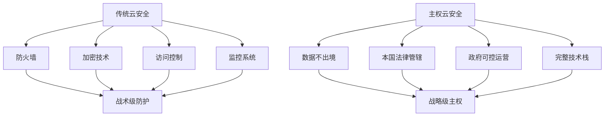
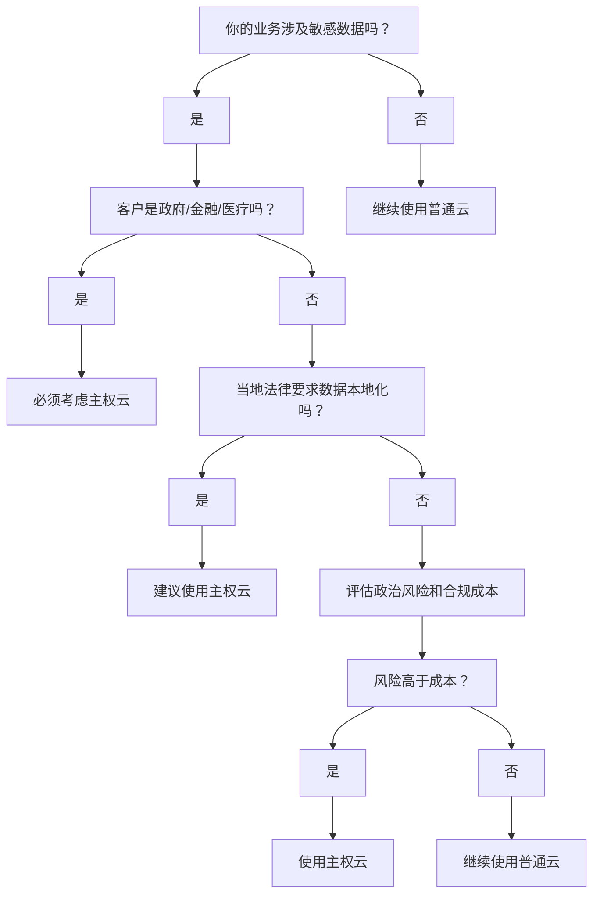

Вы наверняка уже слышали термин "суверенное облако", но не уверены, что это такое, не говоря уже о том, когда его нужно использовать. Если вы занимаетесь облачными технологиями, являетесь ИТ-администратором или принимаете решение о выборе облачных услуг для своей организации, эта статья расскажет вам о суверенном облаке.

<!--more-->

## 主权云到底是什么？

Представьте, что важные данные вашей компании похожи на домашние ценности. Традиционные публичные облака (например, AWS, AliCloud) похожи на международную сеть сейфов - безопасно, дешево, хороший сервис, но ваши вещи могут храниться в любом уголке мира, а в некоторых случаях их даже могут потребовать открыть и проверить правительства других стран.

С другой стороны, суверенное облако - это как отечественный сейф, который можно найти исключительно в своей стране: данные никогда не покидают пределов страны, люди, которые им управляют, являются гражданами вашей страны, и он полностью защищен законами вашей страны. Это может быть дороже, но вы полностью контролируете ситуацию.

**Проще говоря**: суверенное облако = контролируемые государством услуги облачных вычислений

## 传统安全是战术，主权云是战略

В традиционной облачной безопасности мы привыкли защищать данные с помощью брандмауэров, шифрования и контроля доступа на "тактическом уровне". Это все равно что установить в доме двери, систему видеонаблюдения и сейфы - это работает, но дом все равно построен на чужой земле.

Суверенное облако - это совершенно иной способ мышления:** оно напрямую дает вам цифровое "государство "**, где вы владеете землей, домом, законами, полицией и так далее. Это решение стратегического уровня.



## 什么业务必须考虑主权云？

### 1. 政府和军队数据
如果你的客户是政府部门或军队，那么主权云几乎是必需品。

**Реальный пример**: Министерство обороны США выбрало AWS Government Cloud, требуя:
- Все данные должны находиться в США.
- Эксплуатационный персонал должен иметь допуск к государственной безопасности
- Облачный провайдер должен иметь специальные правительственные сертификаты
- Не полагаться на иностранные технологии или персонал

** Почему? ** Последствия утечки государственных секретов катастрофичны, и рисковать нельзя.

### 2. 金融机构的核心数据
银行、证券、保险公司处理的资金和客户信息极其敏感。

**Реальный случай**: дилемма, с которой столкнулся UBS
- FATCA США требует раскрытия информации о клиентах из США
- US FATCA требует раскрытия информации об американских клиентах, но швейцарские законы о банковской тайне запрещают раскрывать данные клиентов.
- Решение: использование локального суверенного швейцарского облака, чтобы данные никогда не покидали пределов страны.
- Инвестиции: 1 млрд швейцарских франков в течение 5 лет
- Результат: Повышение доверия клиентов и возвращение состоятельных клиентов.

### 3. 医疗健康数据
患者隐私保护在全球都有严格要求。

**Немецкая практика**:
- Закон о защите данных пациентов требует, чтобы медицинские данные находились в Германии
- Немецкие больницы не могут напрямую использовать AWS или Azure
- Они должны использовать суверенные облачные сервисы, сертифицированные в Германии
- Нарушителям грозят крупные штрафы и уголовная ответственность

### 4. 关键基础设施
电力、通信、交通等关键基础设施的数据关系国家安全。

**Почему для данных grid необходимо суверенное облако? **
- 2015 г. Энергосистема Украины взломана Россией, что привело к масштабному отключению электроэнергии
- 2021 г. Американский трубопровод атакован программой-вымогателем, что повлияло на энергоснабжение.
- Урок: данные критической инфраструктуры никогда не должны быть доступны иностранным правительствам

## 主权云 vs 普通云：成本和收益对比

### 成本差异（以同等规模为例）

**普通云（AWS）**：
```
计算成本：$10,000/月
存储成本：$2,000/月  
网络成本：$1,500/月
管理成本：$500/月
总计：$14,000/月
```

**主权云**：
```
计算成本：$15,000/月 (+50%)
存储成本：$3,000/月 (+50%)
合规成本：$5,000/月 (新增)
本地运维：$3,000/月 (新增)
总计：$26,000/月 (+86%)
```

### 但是，风险成本呢？

**Случай штрафа по GDPR**:
- В 2019 году British Airways оштрафовали на £183 млн за утечку данных.
- В 2021 году ЕС оштрафовал Amazon на 746 млн евро за нарушение GDPR
- В 2022 году компания Meta была оштрафована на 405 миллионов евро за передачу данных

**Посчитайте**: если вы подвергаетесь риску нарушения нормативных требований к данным, "дополнительные расходы" на суверенное облако могут померкнуть по сравнению со штрафом.

## 中国企业的海外合规挑战

### TikTok的困境就是最好的案例

Проблемы TikTok в США:
- Правительство США опасается, что китайское правительство может получить доступ к данным американских пользователей
- Технически невозможно доказать, что Китай вообще не имеет доступа.
- Политические риски: Первой испытает на себе удар ухудшения отношений между США и Китаем.
- Может быть запрещена или принудительно продана

**Что было бы, если бы TikTok с самого начала использовал суверенное облако США? **
- Все данные американских пользователей находятся в США.
- Все люди, которые управляют и обслуживают его, - граждане США.
- Они полностью защищены американским законодательством.
- Правительство США может провести аудит в любое время.
- Полностью изолирован от китайских систем.

**Результаты**: многие политические вопросы просто не поднимаются.

### 其他中国企业的类似挑战

**Зарубежная облачная стратегия компании Huawei**:
- В Таиланде: строительство местных центров обработки данных
- В Южной Африке: сотрудничество с местными предприятиями
- В Мексике: полностью локализованное хранилище данных
- **Существенные**: вынуждены принять модель "суверенного облака".

**Глобальные потребности ByteHopping**:
- TikTok в Европе: под давлением требований GDPR
- TikTok в Индии: был полностью запрещен.
- Решение: необходимо создать "локальные суверенные облака" в каждой стране

## 什么时候你需要考虑主权云？

### 判断标准：

1. **Тип клиента**: правительство, военные, финансы, здравоохранение, инфраструктура
2. **Чувствительность данных**: национальная безопасность, коммерческая тайна, личная жизнь
3. **Законодательные требования**: местные законы прямо требуют, чтобы данные не экспортировались
4. **Политический риск**: на бизнес может повлиять геополитика
5. **Стоимость соблюдения требований**: штрафы за несоблюдение требований превышают дополнительные расходы на суверенное облако

### 简单的决策流程：



## 实用建议

### 如果你决定采用主权云：

1. **Планировать заранее**: циклы сертификации и развертывания суверенного облака обычно намного длиннее, чем у обычного облака
2. **Бюджетируйте хорошо**: подготовьте бюджет, который на 50-100 % больше, чем у обычного облака.
3. **Выбирайте надежного поставщика**: убедитесь, что провайдер имеет соответствующие сертификаты и истории успеха.
4. **Миграция поэтапно**: не переносите все операции сразу, сначала начните с наиболее чувствительных.

### 如果暂时不需要：

1. **Будьте в курсе**: законы и правила быстро меняются, и если вам это не нужно сегодня, это не значит, что не понадобится завтра.
2. **Будьте готовы**: поймите, что требуется и сколько стоит миграция в суверенное облако.
3. **ОЦЕНКА РИСКА**: регулярно оценивайте соответствие нормативным требованиям и политические риски для вашего бизнеса

## 关键要点总结

1. **Суверенное облако - это не технический вопрос, а политический и вопрос соблюдения нормативных требований**.
2. **Цены высоки, но для конкретных предприятий они являются необходимостью, а не роскошью***.
3. **Суверенное облако может стать неизбежным вариантом для китайских компаний, выходящих за рубеж
4. **Лучше знать и планировать заранее, чем реагировать***.

Когда вы в следующий раз услышите слова "локализация данных", "требования к соответствию", "политический риск", вспомните, что существует вариант суверенного облака. Это не панацея, но при правильном сценарии она может стать оптимальным решением.

Помните: в цифровую эпоху суверенитет данных становится важной частью национального суверенитета. Понимание суверенного облака - это понимание будущего облачных вычислений.