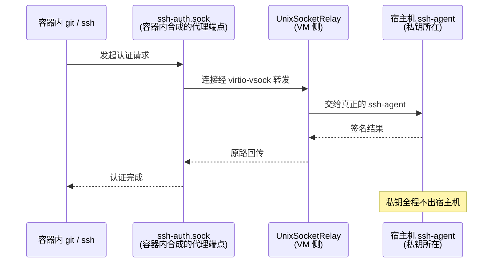

本地开发时 `git clone git@github.com:...` 一切正常；把环境搬进容器后，同一个命令返回 `Permission denied (publickey)`。这不是网络问题——是容器里没有一条通往你 SSH 私钥的路。

一个常见的"解法"是把私钥拷进镜像，这是最不该做的事之一。正确的方式是让容器**借用**宿主机的 ssh-agent：私钥不出门，签名请求进去。这篇文章从 ssh-agent 的三位主角讲起，覆盖容器场景的正确做法，并给出在 apple/container 1.5.0 上逐步实测过的验证流程。

<!--more-->

## 一、先认识三位主角

SSH 认证的世界里有三个总被一起提到的名字，很多人天天用 SSH 却从没搞清它们的分工。用"门禁管家"来记：

- **ssh-agent（管家）**：一个常驻内存的后台进程，唯一职责是保管你的私钥，并替你去跟服务器"对暗号"。
- **ssh-add（交钥匙）**：把私钥递交给管家保管。
- **SSH_AUTH_SOCK（管家办公室的门牌号）**：一个环境变量，值是 Unix socket 的路径。任何程序想找管家，都得通过这个地址。

```bash
echo $SSH_AUTH_SOCK
# /var/run/com.apple.launchd.XXXXXXXX/Listeners  ← macOS 上的典型形态
```

### 为什么你用了多年 SSH，却可能从没见过它们

两种情况会让你完全感知不到 agent 的存在：

1. **你用密码登录**——认证发生在远端服务器的 sshd 上，本地根本不涉及私钥。
2. **你的密钥没设 passphrase**——`ssh` 直接读取本地私钥文件就能完成认证，不需要管家出面。

只有当你**给私钥设了 passphrase、又不想每次连接都输一遍**时，agent 的价值才显现：解锁一次，之后所有认证由管家代劳。写自动化脚本、频繁连跳板机，也是它的主战场。

### 关键设计：私钥不动，签名进来

理解 ssh-agent 只需要抓住一件事：**私钥永远不离开 agent 进程的内存**。认证请求通过 socket 送进来，agent 用私钥完成签名，把签名结果送出去——私钥本身从不外传。

这个设计在容器场景下的价值会被瞬间放大。

## 二、容器带来的新问题

容器里跑 `git clone git@...`，本质上需要两样东西：一个能到达远端的网络，和"用你的私钥完成签名"的能力。网络好解决，密钥是问题。三种做法对比：

**做法一：把私钥 COPY 进镜像** ❌

```dockerfile
COPY id_ed25519 /root/.ssh/id_ed25519   # 千万别
```

哪怕下一行就 `RUN rm` 删掉也没用——镜像层是不可变的，`rm` 只是在新层里记了一笔"已删除"，私钥在历史层里完整保留，`docker save` 一导出就能提取。私钥一旦进了镜像，就等于进了所有拉过这个镜像的机器。

**做法二：运行时挂载私钥文件** ⚠️

```bash
docker run -v ~/.ssh/id_ed25519:/root/.ssh/id_ed25519 ...
```

比做法一好，但私钥文件仍然进入了容器——可被容器内的进程读取、可能被无意写进新镜像。容器一旦被攻破，私钥就是攻击者的。

**做法三：把宿主机 agent "延伸"进容器** ✅

容器内的进程通过一条通道，把认证请求转发给宿主机的 ssh-agent，由它完成签名后把结果送回来。私钥物理上从未进入容器——即使容器完全沦陷，攻击者拿到的也只是"能发起签名请求"，而拿不到私钥本身。

### macOS 上，这条通道曾经是个难题

在 Linux 上一切都简单：容器与宿主机共享内核，Unix socket 不过是文件系统里的一个节点，直接挂载即可：

```bash
docker run -v "$SSH_AUTH_SOCK:/ssh-agent" -e SSH_AUTH_SOCK=/ssh-agent ...
```

但 macOS 上没有 Linux 内核。容器跑在一个轻量虚拟机里——Docker Desktop 把所有容器装在一个共享的 Linux VM 中，apple/container 更进一步，每个容器一个轻量 VM。**Unix socket 是内核对象，无法跨内核边界直接挂载**：文件系统共享层（virtiofs 之类）能传递文件，却传不了 socket。于是这个在 Linux 上屡试不爽的 `-v $SSH_AUTH_SOCK:...` 写法，在 macOS 上很长一段时间里根本行不通——Docker Desktop 为此专门合成了一条"魔法路径"才绕过去。

## 三、apple/container 的答案：一条命令

[apple/container](https://github.com/apple/container) 是 Apple 官方开源的容器工具。它对这个问题给出的回答是一条命令：

```bash
container run -it --rm --ssh alpine:3.21 sh
```

进容器看看环境变量：

```bash
/ # echo $SSH_AUTH_SOCK
/var/host-services/ssh-auth.sock
```

`--ssh` 自动找到宿主机的 `$SSH_AUTH_SOCK`，把它接到容器内的 `/var/host-services/ssh-auth.sock`，并设置好环境变量。装个 openssh-client 验证（以下为 apple/container 1.5.0 实测）：

```bash
/ # apk add --no-cache openssh-client
/ # ssh-add -l
256 SHA256:xxxxxxxxxxxx... your-key-name (ED25519)
```

宿主机 agent 里加载的密钥，在容器里原样可见。

### `--ssh` 到底做了什么

apple/container 的官方文档写得很直接：

> 使用 `--ssh` 等价于 `--volume "${SSH_AUTH_SOCK}:/var/host-services/ssh-auth.sock" --env SSH_AUTH_SOCK=/var/host-services/ssh-auth.sock` 这两条选项。

也就是说它是一层语法糖——加了手动挂载选项也能工作（这一点和 Docker Desktop 不同，稍后详述）。但这层糖有实打实的价值：**macOS 上 `$SSH_AUTH_SOCK` 的路径是会变的**。

路径中间那串随机 ID 由 launchd 生成，**你登出再登录之后，它就是另一个值**。如果你手动 `-v` 挂载了旧路径，重启容器后这条挂载就指向了不存在的 socket；而 `--ssh` 在每次容器启动时重新解析当前值，永远指向正确的门。这不是能力差异，是**路径生命周期的管理**。

## 四、它凭什么能工作：一个"传声筒"

到这里应该有人要问：不是说 macOS 上 socket 无法跨 VM 边界吗？那 apple/container 是怎么做到的？

答案是：它根本没有"挂载"你的 socket。它在容器里**合成**了一个。看一眼挂载类型（实测）：

```bash
/ # mount | grep ssh-auth
tmpfs on /var/host-services/ssh-auth.sock type tmpfs (rw,relatime)
```

`tmpfs`——这个 socket 是容器内凭空造出来的代理端点，不是从宿主机文件系统透传进来的。真实的流量路径是这样的：



源码可以直接佐证：apple/container 的底层框架 [containerization](https://github.com/apple/containerization) 是开源的，其中 `UnixSocketRelay.swift` 明确使用 `VsockListener`——容器内发起的每个连接都被 relay 接管，经 **virtio-vsock**（虚拟机与宿主机之间的通信通道）转发到宿主机，交给真正的 ssh-agent 处理。

有一个反直觉的细节值得记住：**即使你手动 `-v` 挂载 socket，apple/container 也会把它转成同样的 relay**——挂载类型同样是 tmpfs。因为普通的文件共享根本传不了 socket，这是绕不过去的物理约束。理解了这一点，各平台行为的差异就都能解释了。

## 五、各环境对照

| 环境 | 做法 | 说明 |
|------|------|------|
| **Linux 宿主机** | `-v $SSH_AUTH_SOCK:/ssh-agent -e SSH_AUTH_SOCK=/ssh-agent` | 共享内核，socket 直接挂载即可 |
| **Docker Desktop (macOS)** | 挂载 `/run/host-services/ssh-auth.sock` 并设为 `SSH_AUTH_SOCK` | 魔法路径，VM 内合成；它连的是 Docker 启动时捕获的 agent，**不跟随** `$SSH_AUTH_SOCK` 的变化 |
| **apple/container** | `container run --ssh` | 每次启动重新解析当前 socket，登出重登后依然有效 |
| **跳板机（非容器）** | `ssh -A jump-host` | 同一个思想：私钥留在本地，认证请求转发 |

最后一行不是凑数——`ssh -A` 的代理转发和容器里的 agent 转发是同一个思想：**让远端拿到"签名能力"，而不是"私钥"**。理解了容器场景，跳板机场景自然就通了。

不过也要接住它的安全代价：能接触到你转发过去的 agent 的一方，可以在连接期间"以你的身份"完成认证。所以跳板机场景建议用精确的 `Host` 匹配，而不是 `Host *` 一把梭。

## 六、三步验证法：确认它真的在工作

配置完之后怎么确认真的通了？分三步，强度递增，每一步的失败信息恰好指向一种故障位置：

**第一步：列举密钥**

```bash
ssh-add -l
```

- 输出了密钥列表 → 通道通了，继续下一步；
- `The agent has no identities.` → 通道通了，但宿主机 agent 里没加载密钥（回宿主机执行 `ssh-add`）；
- `Could not open a connection to your authentication agent.` → 通道没通，检查 `SSH_AUTH_SOCK` 和环境配置。

**第二步：拿到完整公钥**

```bash
ssh-add -L
```

输出完整的公钥内容，证明 relay 传递的是完整的密钥材料，而不是一个空壳。

**第三步：做一次真实签名**（最强验证）

前两步只证明了"能列出密钥"，不等于"能使用密钥"。真正的判据是密码学操作。实测：

```bash
/ # echo "test" > /tmp/data
/ # ssh-keygen -Y sign -f /tmp/key.pub -n test /tmp/data
Signing file /tmp/data
Write signature to /tmp/data.sig
```

签名成功，意味着容器内的进程通过 relay 请求宿主机的 agent 完成了一次真正的私钥运算。到这一步，`git clone` 私有仓库必然可用——因为它们底层是同一套操作。

## 七、几个真实的坑

1. **非 root 用户的权限**：apple/container 1.0.x 里，`--ssh` 转发的 socket 只有 root 可访问；以非 root 用户运行容器时 `ssh-add -l` 会失败。1.1.0 已修复——检查你的版本。

2. **第三方 agent 工具的配置分裂**：1Password、Secretive 这类工具通过 `~/.ssh/config` 里的 `IdentityAgent` 提供 socket，路径与 launchd 默认位置不同。注意 `SSH_AUTH_SOCK` 环境变量和 `IdentityAgent` 是两套机制，不同的工具可能各读各的——配置不生效时，先确认程序实际读的是哪一个。

3. **Docker Desktop 的魔法路径不跟随环境变量**：它连接的是 Docker Desktop 启动时捕获的那个 agent。如果你后来切换了 agent（比如启用 1Password 的 SSH Agent 并 export 了新的 `SSH_AUTH_SOCK`），容器里可能还连着旧的。

4. **别把 agent 转发给不信任的主机**：能连到 agent 的一方可以使用它（虽然拿不到私钥）。任何转发场景，最小化暴露范围。

---

最后留一个值得想的问题：agent 转发让容器拿到的是**签名能力**而不是**私钥**——凭证留在原地，能力按需借用。把这个思路从 SSH 推广开去，你手上的系统里，还有哪些地方可以让调用方"只拿到能力、拿不到凭证"？
