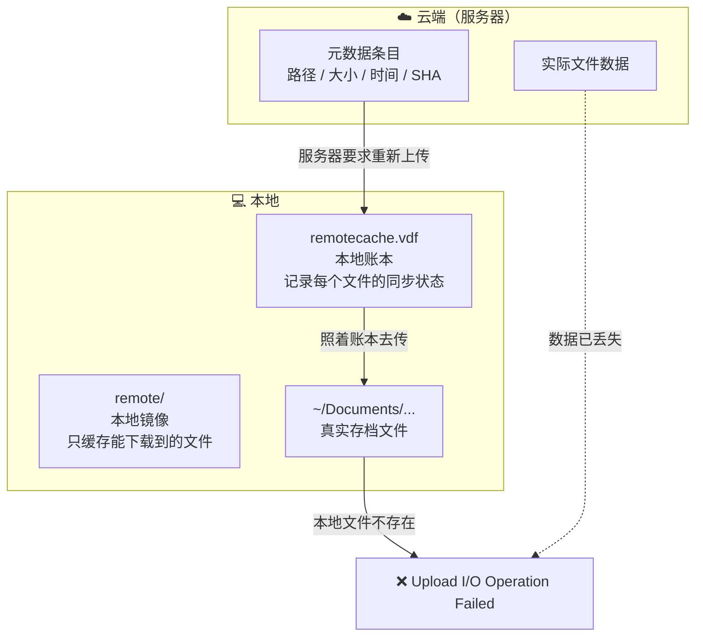

每次退出《神界：原罪2》，Steam 都会弹一个小通知：**云错误**。

关掉云同步？照弹。清缓存？照弹。把本地存档删干净、连 Steam 都重装式地退出重启？照弹。

这场拉锯持续了一个多星期，试过的方法能列出一长串，全部无效。最后是 Valve 客服给了一个**我们从来不知道存在的网址**——那里能直接看到你账号下所有躺在云端的存档文件。问题在十分钟内解决了。

这篇文章把整个过程记下来：那个网址是什么、日志在哪里、死锁是怎么形成的、弯路有哪些，以及关键时刻该怎样跟客服说话。

<!--more-->

## 一、先给结论：五步解决

如果你正被同样的问题卡着，只要照做这五步：

> **前提理解**：Steam 会在"本地和云端不一致"时弹出**云冲突**窗口让你选边。我们要做的就是**让 Steam 做一次全新的全量评估**——而关键是顺序。

**① 关闭该游戏的云同步**
Steam 库 → 右键游戏 → 属性 → 通用 → 取消勾选「为…在 Steam 云中保存游戏」

**② 完全退出 Steam**
macOS 上是 `Cmd+Q`，并确认 Dock 上的图标真的消失了。**关窗口不算退出。**

**③ 删掉本地那份"过期账本"**

```bash
~/Library/Application Support/Steam/userdata/<你的SteamID>/<游戏AppID>/remotecache.vdf
```

顺手把同目录下历史遗留的 `.bak` 也清掉。

**④ 启动 Steam**（此时该游戏的云同步还是关着的）→ **启动游戏 → 退出游戏**

**⑤ 重新开启该游戏的云同步 → 再启动游戏**

这时会弹出「云冲突」提示，以及一个**选择存档**的对话框 → **选择「本地存档」**。

之后 Steam 会给云端那些多余条目发出 `Forget`（删除云端文件）指令，同步就恢复正常了。

> ⚠️ **第 ② 步和第 ③ 步的顺序是关键。** 我们之前在「Steam 正在运行 + 云同步开着」的状态下删过同一个文件——结果一秒就被服务器端的状态重建回去，白忙一场。整整一个星期，就卡在这个顺序上。

## 二、那个你大概不知道的网址

这是这篇文章最想让大家记住的东西：

```
https://store.steampowered.com/account/remotestorageapp/?appid=435150
```

把它理解成 **Steam 云存档的管理后台**。它能做这些事：

| 能力 | 说明 |
| --- | --- |
| 列出云端文件 | 你账号下、这个游戏当前所有躺在云端的文件：**路径、大小、写入时间** |
| 单独下载 | 每个条目后面都有 `Download`，可以只把某一个文件抓下来 |
| 换游戏 | 把 URL 最后的 `appid=435150` 换成别的数字即可（数字在商店页面的网址里） |
| 判断"僵尸条目" | **列表里有、但点 Download 返回 `not found`** → 说明元数据还在、文件数据已经丢了 |

最后一条是这次破案的关键。

它平时能用在什么地方：

- 确认某次存档到底有没有真的上传成功（不用再猜）
- 换电脑之后发现存档对不上，来这儿看一眼就知道云端到底有什么
- 云端有你想要的存档、本地却同步不下来——直接在这里下载抢救
- 排查「明明本地删了，云端还在」这类幽灵问题

**说实话，这个页面藏得挺深的，Steam 客户端里没有任何入口指向它。** 如果不是 Valve 客服在工单里写出来，我们大概永远找不到。所以特此记下。

## 三、排查真正的起点：云同步日志

在找到那个网址之前，真正让排查从"瞎试"变成"推理"的，是这份日志：

```bash
# macOS
~/Library/Application Support/Steam/logs/cloud_log.txt

# Windows
<Steam安装目录>/logs/cloud_log.txt
```

它把每一次云同步都记下来了。我们这次的问题，日志里是这样的：

```
[AppID 435150] _SAVE_<旧档案名>/Savegames/Story/AutoSave_0/AutoSave_0.lsv
               Server has requested re-upload, setting local changes.
               Local/Remote SHA: 0000000000000000000000000000000000000000 / 021b57fc...,
               Timestamps: 0 / 1720806927
...
[AppID 435150] Upload I/O Operation Failed for file _SAVE_<旧档案名>/...
[AppID 435150] Upload complete, result I/O Operation Failed
```

三个关键信号：

1. **`Server has requested re-upload`** —— 服务器在**要求客户端重新上传**这个文件
2. **`Local SHA` 全是 0、`Timestamp` 是 0** —— 客户端认为**本地根本没有这个文件**
3. **`Upload I/O Operation Failed`** —— 于是上传失败

**服务器想要一份文件，客户端手上没有——这就是死锁的形状。**

### 顺手把网络嫌疑洗清

同一个上传批次里，日志还有这些行：

```
[AppID 435150] HTTP upload for file '_SAVE_<当前档案>/Savegames/Story/skeleton.lsv'
               (offset=0, length=3904661) to (..., host: steamcloud-eu-ams.storage.googleapis.com) - success.
[AppID 435150] Upload OK for file _SAVE_<当前档案>/Savegames/Story/skeleton.lsv
```

**我们自己的正常存档（3.9 MB）上传得好好的。** 所以：

- 网络没问题
- DNS、代理、防火墙（我们还专门装了 Little Snitch 去查）、iCloud 私人转发，**全部无罪**
- Steam 云服务本身也正常

**坏的只是那几个特定条目。** 这一步排除非常重要——它把"玄学网络问题"直接砍掉，把范围缩到了"某个具体文件"。

## 四、死锁是怎么形成的

把三层结构画出来就清楚了：



这次的具体情况是：

1. 我们很早以前删掉过一个旧档案（就叫它 `<旧档案名>`），但**云端条目留着**
2. 其中 3 个条目的**数据已经损坏**——在管理后台上点 Download 会返回 `not found`
3. 服务器因此认为"这几个文件坏了，让客户端重新传一份上来修好它"
4. 但客户端本地**确实没有**这些文件（档案都删了）
5. 于是每次同步都失败，弹一次「云错误」

**这里最重要的认知转折是：服务器根本不打算删掉这些条目——它想要的是"重新上传"。**

我们花了很久才明白这一点。在那之前，我们所有努力的方向都是"把这些条目删掉"，包括：

- 用第三方工具 `Steam Cloud File Manager Lite` 从另一个 Steam 客户端删除它们（删了，没用）
- 手工编辑本地账本 `remotecache.vdf`，把它们标记成"已同步"（**被服务器在下次同步时一秒覆盖回去**）
- 在游戏运行中删掉本地文件（Steam 直接从云端又下载回来了）

最后真正有效的是**反过来**：不去删条目，而是**清空本地账本、让 Steam 重新评估一次**，然后借冲突窗口告诉它"以本地为准"。

## 五、走过的弯路（请勿重复）

| 尝试 | 结果 |
| --- | --- |
| 关闭该游戏云同步 | ❌ 无效（旧状态仍在账本里） |
| 清除 `userdata/<SteamID>/<AppID>/` 下的 `remote/` 和 `remotecache.vdf` | ❌ 「云同步开着」时做，一秒被重建 |
| 重建缺失的本地文件（先建空文件，再写入真实容量） | ❌ 客户端判断"本地有没有这个文件"**只读账本，不读硬盘** |
| 手工编辑 `remotecache.vdf` 标记为已同步 | ❌ 被服务器覆盖 |
| 正常启动游戏再退出（想触发目录重扫） | ❌ 日志始终是 `No launch record found`，重扫从未发生 |
| 游戏运行中删掉本地文件 | ❌ Steam 从云端又下载回来 |
| 第三方工具从 Windows 客户端删除云端条目 | ❌ 条目没少，反而把状态升级成了「冲突」 |
| 重装 / 换网络 / 查 DNS / 装防火墙分析工具 | ❌ 方向从一开始就是错的 |

**一句话教训：在没有搞清楚"服务器想要什么"之前，所有的删除操作都是徒劳的。**

## 六、怎么跟客服说话

### 先别走错门

Steam 的客服入口有两类，**差别很大**：

- ❌ `help.steampowered.com/wizard/HelpWithGame/?appid=<AppID>`
  这是**按游戏**走的入口。对于第三方游戏，它会**路由给游戏的发行商**。我们第一次就是这么走的，收到的是游戏发行商客服的回复——他们只能给出"用第三方工具"这类建议，对**平台侧**的云端数据无能为力。
- ✅ `help.steampowered.com/wizard/HelpWithSteamIssue/?issueid=812`
  这是 **Steam 平台（Valve）自己的**问题分类，标题就叫「**我有 Steam 云方面的问题**」。云存档是平台功能，所以问题应该走这里。

> 需要登录 Steam 账号。表单**支持拖拽附件**（截图、日志文件），但**不接受外部链接**——所以日志内容要直接粘进描述里，或者作为文件上传。

### 工单应该怎么写

让工单从"我坏了"升级为"我能证明坏在哪"，有几件事很值：

1. **给出日志原文**，尤其是 `Local SHA` 那一行——它直接说明客户端手上没有文件
2. **主动排除自己的环境**：写清你已经试过什么（关云同步、清缓存、换网络、查防火墙），这样他们不会让你从头再来一遍
3. **给出对比证据**：同一个上传批次里，**别的文件是 `Upload OK` 的**。这一句最有说服力——它证明问题不在网络、也不在游戏，而在**平台侧的某几个具体条目**
4. **明确诉求**：请在**服务端**清除该 AppID 的云数据，让同步从干净状态重建

### Valve 回了什么

Valve 的回复大意是：

> 目前没有官方的云数据删除功能。不过你可以按下面的流程手动覆盖这些数据（**该流程不受官方支持**，操作前请先备份）：
>
> 1. 确认游戏已安装 —— 需要安装状态才能找到文件
> 2. 关闭该游戏的云同步（库 → 右键 → 属性 → 通用 → 取消勾选）
> 3. 打开 `https://store.steampowered.com/account/remotestorageapp/?appid=<AppID>` 查看云端文件列表
> 4. 这些文件对应本地目录 `<Steam安装目录>/userdata/<SteamID>/<AppID>/`，到那里删除你想从云端移除的文件及其子目录
> 5. 启动游戏，至少创建一个新存档
> 6. 关闭游戏，**重新开启**云同步
> 7. 再启动游戏时，会弹出云冲突窗口让你二选一 —— 选「**Upload to the Steam Cloud**」用本地覆盖云端
> 8. 回到第 3 步的网页确认数据已更新

**第 3 步那个网址，就是本文第二节说的管理后台。**

值得一提的是：Valve 给的流程和我们的思路基本一致，但**它没有强调第 2 步与第 4 步之间的顺序关系**（必须先关云同步、并且完全退出 Steam，再去动本地文件）。我们按原流程做过一次，失败了；把它拆成"先关同步 + 退干净 Steam，再清账本，最后重开同步"之后，一次成功。

## 七、成功的瞬间

修好之后，日志里出现了一行我们从没见过的东西：

```
[18:31:18] Upload batch initiated, ID: 7532343584904016566, ChangeNumber: 74
[18:31:18] Forget OK for file _PROFILE_<旧档案名>/InventorySettings.lsb
[18:31:19] Forget OK for file _SAVE_<旧档案名>/Savegames/Story/AutoSave_0/AutoSave_0.lsv
[18:31:19] Forget OK for file _SAVE_<旧档案名>/Savegames/Story/AutoSave_1/AutoSave_1.lsv
[18:31:19] Forget OK for file _SAVE_<旧档案名>/Savegames/Story/AutoSave_1/AutoSave_1.png
[18:31:22] Upload complete, result OK
```

**`Forget OK` 就是 Steam "删除云端文件"的操作。** 那 7 个多余条目被一次性清掉，`Upload complete, result OK` —— 这是整场排查里第一次出现 `OK`。

最终确认：

- 本地账本 `remotecache.vdf` 里，旧档案的条目数：**0**
- 之后再未出现 `I/O Operation Failed`
- 最新一次评估只剩下当前档案的文件，全部 `File is in sync`

## 八、可以带走的经验

**① 云同步出问题，先看日志，别看玄学。**
`logs/cloud_log.txt` 会直接告诉你它在传哪个文件、失败在哪一步。有了它，"网络不好"这种猜测一分钟就能被证伪。

**② 分清"云端条目"和"云端数据"。**
条目（元数据）可能还在，数据却已经丢了。`remotestorageapp` 页面上"列得出来但下不下来"就是这种状态。

**③ 服务器要什么，比你想删什么更重要。**
我们花了大量时间尝试删除条目，而服务器一直想要的是"重新上传"。方向错了，工具再对也没用。

**④ 顺序即成败。**
"关闭云同步 → 完全退出 Steam → 动本地文件 → 重开同步"这套顺序不是仪式，它决定了 Steam 是"读取你改动的状态"还是"用服务器状态覆盖你"。同一个操作，顺序错了就是白做。

**⑤ 客服入口有平台和发行商之分。**
涉及 Steam 平台功能（云存档、成就、好友、支付）的问题，走 `HelpWithSteamIssue`；涉及游戏内容的问题，才走 `HelpWithGame`。走错了不是慢一点，是根本解决不了。

**⑥ 记住这个网址。**
`https://store.steampowered.com/account/remotestorageapp/?appid=<你的AppID>`
这是你唯一能**直接看到并下载**自己 Steam 云存档的地方。收藏它，或者在需要的时候换掉 `appid`。它藏在客户端之外，但它是你的数据。

---

一个留给读者的问题：**除了这个页面，你还有哪些"数据明明是你的，入口却藏得极深"的经历？** 知道入口在哪，和不知道，差别往往就是十分钟和一个星期。
