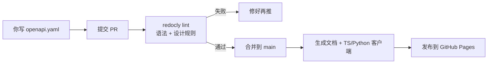

很多人把 Swagger 和 OpenAPI 混着叫，也有人学了 OpenAPI 规范之后仍然设计出让人皱眉的 API。这篇文章讲清楚两者的关系，以及一个更重要的真相：**符合规范 ≠ 设计得好**——前者是语法检查，后者是语义功底。最后搭一套 `openapi.yaml → 校验 → 生成代码 → 文档发布` 的 CI 流水线，让你从「写了份规范文件」直接跳到「它有用了」。

<!--more-->

## Swagger 和 OpenAPI：一句话的关系

**OpenAPI 是标准，Swagger 是围绕这个标准的一套工具。**

- **OpenAPI 规范**（OpenAPI Specification，简称 OAS）是一份**语言无关的 REST API 描述标准**——它定义了一套规则，告诉你用 JSON 或 YAML 怎么写一份「API 说明书」：有哪些端点、接受什么参数、返回什么结构、用什么认证方式
- **Swagger** 是 SmartBear 公司的品牌，旗下有一系列工具帮助开发者创建和消费 OpenAPI 规范文件：**Swagger Editor**（在线编辑器）、**Swagger UI**（交互式文档页面）、**SwaggerHub**（商业协作平台）

混乱的来源是历史：Swagger 这个名字**比 OpenAPI 早出生四年**。2011 年，Wordnik 的工程师 Tony Tam 在开发内部 API 工具时创建了 Swagger 并开源。2015 年，SmartBear 将规范部分捐赠给 Linux 基金会，正式更名为 **OpenAPI 规范**。自此：

```
规范的名字 → OpenAPI
工具的品牌 → Swagger（SmartBear 继续持有）
```

今天生态的实际情况是：OpenAPI 规范是唯一的行业标准，但围绕它的工具已经完全去中心化了——Swagger UI 只是文档方案之一，还有 **Redoc**（另一种风格的文档生成）、**OpenAPI Generator**（社区 fork 出的代码生成器，比原版 Swagger Codegen 活跃得多）、**Stoplight**（可视化设计平台）等。**你可以不用任何带 Swagger 名字的工具，依然完整地走通 OpenAPI 规范的工作流。**

## 为什么符合 OpenAPI 规范 ≠ 好的 API

OpenAPI 规范管的是「怎么写」，不是「写什么」。它只做语法校验，不做设计评判——这是一个新手最容易栽进去的坑。

举个最经典的例子：

```yaml
# OpenAPI 校验：全部绿灯 ✅
# API 设计质量：灾难 ❌
POST /deleteUser         # POST 不是用来删除的
GET  /get-user-by-id     # 动词堆砌在 URL 上——GET 本身就是「获取」
PUT  /users/42/activate  # `activate` 是动作，不是资源
```

规范的校验器会告诉你：路径格式正确、HTTP 方法合法、参数类型匹配。但任何有经验的 API 设计师看到这三行都会重写：

```yaml
GET    /users/42          # 获取
DELETE /users/42          # 删除
PATCH  /users/42          # 部分更新，请求体 {"status": "active"}
```

核心原则只有一条：**URL 指向资源（名词），HTTP 方法负责动作（动词）。** 这条规则不在 OpenAPI 规范的任何一个章节里——它属于 REST 的设计哲学，要额外去学。

OpenAPI 真正擅长的是在**已经做好设计决策之后**，用机器可读的格式把它精确写下来。做到这一点，靠的是 JSON Schema 的数据建模能力：

```yaml
components:
  schemas:
    User:
      type: object
      required: [id, name, email]
      properties:
        id:
          type: integer
          minimum: 1
        name:
          type: string
          minLength: 1
          maxLength: 100
        email:
          type: string
          format: email
        role:
          type: string
          enum: [admin, user, readonly]
```

`minimum`、`minLength`、`format: email`、`enum`——这些不是「文档里的文字描述」，而是**机器可执行的校验规则**。OpenAPI Generator 能自动生成带参数校验的客户端代码，就是因为它解析了这个 JSON Schema。版本方面：**OpenAPI 3.1.0（2021 年发布）**已完全兼容 JSON Schema 2020-12 标准，像 `if/then/else` 条件逻辑这种高级关键字现在都能直接用。

## 为什么规范文件用 YAML，而 API 本身用 JSON？

这是每个初学者都会问的问题——两个都是数据序列化格式，为什么分工？

**YAML 是给人写的设计文件；JSON 是给机器消费的运行时格式。** 它们不竞争，是两段工序。

YAML 做规范文件有几个刚需优势：

```yaml
# 1. 注释——JSON 永远不可能有
# 认证模块：短信验证码接口暂未上线，先用邮箱验证
POST /auth/register:
  ...

# 2. 锚点与引用——一处定义、处处复用
components:
  schemas:
    UserResponse: &user-ref       # 定义一次
      type: object
      properties:
        id:   {type: integer}
        name: {type: string}
    UserList:
      type: object
      properties:
        items:
          type: array
          items: *user-ref        # 引用，不用重复抄
```

一份生产级 OpenAPI 文件动辄几千行。没有注释，维护者三个月后看不懂自己写的；没有锚点，同一个 Schema 在 20 个端点下抄 20 次，改一处漏四处就是线上事故。

而 API 运行时用 JSON 是物理解析效率决定的——JSON 解析器天然内置在浏览器、操作系统、IoT 设备里，空白符极少，是 JavaScript 的原生子集。**YAML 是设计室的绘图桌；JSON 是工厂流水线。**

一个有意思的历史细节：YAML 支持不是在 Swagger 诞生时就有的。**Swagger 1.x（2011-2014）只支持 JSON。YAML 是随 Swagger 2.0 在 2014 年 9 月正式引入的**——不是添头，而是整个设计文档结构化升级的一部分（`$ref`、`definitions` 等模块化体系也是在 2.0 一起出现的）。

## 落地：一条 CI 流水线让规范文件「活」起来

光有 `openapi.yaml` 文件没用，要让它成为 **API 的唯一直相来源**——所有文档和客户端代码都从它编译生成。工具链是三个开源 CLI：

```bash
# 校验工具
npm install -g @redocly/cli

# 代码生成器（社区活跃版本，不是原始的 Swagger Codegen）
brew install openapi-generator

# 文档生成器（和 Swagger UI 不同风格，静态 HTML，更适合作为产品文档发布）
npx @redocly/cli build-docs openapi.yaml -o docs/index.html
```

项目结构：

```
api/
├── openapi.yaml           # 唯一的规范源文件
├── .redocly.yaml          # 校验规则（语法 + 设计规则）
├── .github/workflows/
│   └── api-ci.yaml        # CI 流水线
└── generated/             # 自动生成——不手动编辑
    ├── docs/              # Redoc 文档站点
    └── client/            # TS/Python/... SDK
```

### 关键文件：`.redocly.yaml`——管的不只是语法

```yaml
extends:
  - recommended

rules:
  # 强制所有端点都有 summary
  operation-summary: error

  # 禁止路径中出现动词
  path-declaration-must-match: error

  # 禁止未引用的 components
  no-unused-components: error
```

这些规则就是前面的「设计哲学」变成了自动执行的门禁——`/deleteUser` 这种路径会在 CI 里直接挂掉，不需要有人在代码评审时指出。

### CI 流水线：`.github/workflows/api-ci.yaml`

```yaml
name: API CI
on:
  pull_request:
    paths: ["api/openapi.yaml"]
  push:
    branches: [main]
    paths: ["api/openapi.yaml"]

jobs:
  lint:
    runs-on: ubuntu-latest
    steps:
      - uses: actions/checkout@v4
      - uses: actions/setup-node@v4
        with: { node-version: "22" }
      - run: npm install -g @redocly/cli
      - run: redocly lint api/openapi.yaml

  build-and-publish:
    needs: lint
    if: github.event_name == 'push' && github.ref == 'refs/heads/main'
    runs-on: ubuntu-latest
    steps:
      - uses: actions/checkout@v4

      - name: 生成 Redoc 文档
        run: |
          npx @redocly/cli build-docs api/openapi.yaml \
            --output api/generated/docs/index.html

      - name: 生成 TypeScript 客户端
        run: |
          openapi-generator-cli generate \
            -i api/openapi.yaml -g typescript-fetch \
            -o api/generated/client/typescript

      - name: 生成 Python 客户端
        run: |
          openapi-generator-cli generate \
            -i api/openapi.yaml -g python \
            -o api/generated/client/python

      - name: 发布到 Pages
        uses: peaceiris/actions-gh-pages@v4
        with:
          github_token: ${{ secrets.GITHUB_TOKEN }}
          publish_dir: api/generated/docs
```

每次 PR 自动校验，合并到 main 后自动生成文档发布到 Pages + 更新多语言客户端 SDK：



不是「把 YAML 当源码」这种口号——每一步都有命令可复现，规范文件的每一次修改都会自动触发校验和发布。内外部使用者拿到的文档和 SDK，永远是和你最新的规范文件同步的，不依赖任何人的记忆力。

## 总结

- **Swagger 先有，OpenAPI 后成标准**——2011 年 Swagger 诞生，2015 年规范捐赠给 Linux 基金会并改名为 OpenAPI；今天 OpenAPI 是标准，Swagger 是 SmartBear 的工具品牌，生态已经去中心化
- **规范的语法 ≠ API 的质量**——OpenAPI 校验器只管格式合不合法，不管设计好不好；设计哲学（URL 是名词，HTTP 方法是动词）要额外学、也可以用 `redocly` 规则自动化
- **YAML 写设计文件，JSON 跑线上**——注释和锚点让 YAML 成为写大型规范文件的首选；YAML 是随 Swagger 2.0（2014）引入的，1.x 时代只有 JSON
- **不落地就只是 YAML 文件**——`openapi.yaml` + `redocly lint` + `openapi-generator` + GitHub Actions 四件套，让规范文件成为文档和 SDK 的唯一真相来源

---

留一个动手练习：找一个你已经有的后端项目（或本地起一个 demo 项目），写一份最小化的 `openapi.yaml`（只要一个端点），用 `redocly lint` 校验通过，再用 `npx @redocly/cli build-docs` 生成一份 HTML 文档——感受一下从 YAML 到文档的一键编译过程。
