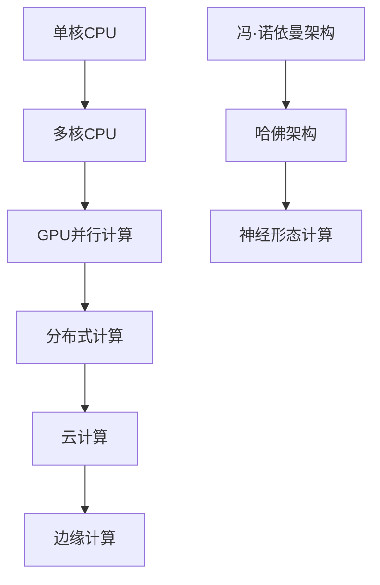
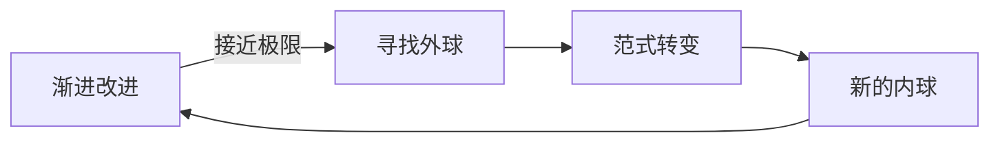

技术发展如何突破瓶颈？为什么有些创新是渐进的，而有些是革命性的？一个来自俄罗斯方块游戏的思维模型，可能为我们理解技术演进提供全新的视角。

<!--more-->

## 俄罗斯方块的启示

想象你正在玩俄罗斯方块。底部是已经堆积的方块，代表现有的技术基础。新掉下来的方块是新的技术或解决方案。大部分时候，你在做的是"消除降熵"——通过巧妙的排列组合，让新方块与旧方块完美契合，消除那些即将爆满的行。

但是，无论你多么努力地消除，游戏总有一个基本限制：方块会越堆越高，最终到达顶部。这时候，你需要的不是更好的方块排列技巧，而是一个全新的游戏规则。

## 中国鬼工球的递归智慧

传统的中国鬼工球是一个精巧的艺术品：大球套小球，层层嵌套，环环相扣。每一层都是一个完整的结构，但又被外层包围和保护。

当我们把俄罗斯方块和鬼工球结合起来思考时，一个强大的技术发展模型就出现了：

- **内球**：当前的技术框架和解决方案
- **外球**：更高层次的新范式，包住并超越内球
- **递归性**：每一层的"外球"解决方案，在下一层又变成了"内球"

## 技术发展的层次递归模式

### 第一层：算法和工艺优化

这是我们看得最清楚的层面，就像俄罗斯方块中的"消除降熵"：

**软件优化实例**：
- 更高效的排序算法
- 更快的数据库查询
- 更优雅的用户界面设计

**硬件改进实例**：
- 更小的制程工艺
- 更好的散热设计
- 更高的集成度

这些改进都是在现有框架内的优化，就像在俄罗斯方块中找到更好的方块摆放方式。

### 第二层：架构和范式转变

当第一层的优化接近极限时，就需要"外球"来包住现有的解决方案：

**计算架构的演进**：

每一次架构转变，都是用新的"外球"包住了前一代的"内球"。

### 第三层：认知和理念革命

更深层的变革来自于对问题本身的重新定义：

**从个人电脑到互联网**：
- 内球：提高单机性能
- 外球：连接所有计算机
- 结果：计算能力从硬件转向网络

**从软件产品到服务平台**：
- 内球：开发更好的软件
- 外球：构建生态系统
- 结果：价值创造从产品转向平台

## 历史案例分析

### 通信技术的层次演进

**第一层优化阶段**：
- 提高信号质量
- 扩大覆盖范围
- 降低设备成本

**第二层架构转变**：
- 从模拟到数字
- 从电路交换到分组交换
- 从语音到数据

**第三层理念革命**：
- 从通信工具到信息平台
- 从点对点到网络效应
- 从功能机到智能生态

### AI技术的递归发展

**当前的内球（2025年）**：
- 算法优化：Transformer改进、量化技术
- 硬件提升：专用AI芯片、更大内存
- 应用优化：更好的提示工程、精调技术

**可能的外球（2030年）**：
- 全新的计算范式：神经形态计算、量子-经典混合
- 不同的问题定义：从生成内容到理解世界
- 革命性的交互方式：直接的脑机接口

**未来的外球（2040年？）**：
- 重新定义"智能"本身
- 人机融合的新形态
- 超越个体认知的集体智慧

## 模型的核心洞察

### 1. 优化有极限，突破需要升维

在任何一个技术层面内，优化都会遇到理论或实践的极限：
- 摩尔定律接近物理极限
- 算法复杂度有数学边界
- 用户体验有认知限制

这时候需要的不是更努力的优化，而是跳出当前框架的"外球"思维。

### 2. 真正的创新是不连续的

**渐进式创新**：在现有框架内改进
**颠覆式创新**：引入新的框架来包住旧框架

### 3. 每一层都有自己的时间尺度

- **算法优化**：月或年的时间尺度
- **架构转变**：年或十年的时间尺度  
- **理念革命**：十年或几十年的时间尺度

理解这个时间差异，有助于我们在正确的层面投入资源和注意力。

### 4. 预测需要多层思维

单纯的线性外推往往失效，因为它忽略了层次跳跃的可能性。

**错误的预测方式**：
"按照当前速度，这个技术还需要X年才能实现"

**正确的预测方式**：
"在当前框架内，这需要X年；但如果出现框架转变，可能只需要Y年"

## 实践应用指南

### 对技术从业者

**识别当前层次**：
- 你在哪一层工作？算法优化？架构设计？还是理念创新？
- 这一层还有多大的改进空间？
- 什么时候需要考虑跳到更高层次？

**培养多层思维**：
- 不要只关注手头的技术细节
- 思考更高层次的架构可能性
- 关注其他领域的范式转变

### 对投资决策者

**时间尺度匹配**：
- 短期投资关注算法和工艺优化
- 中期投资关注架构和平台转变
- 长期投资关注理念和范式革命

**风险评估重新框定**：
- 渐进式技术的风险相对可控
- 架构转变的风险和回报都更高
- 范式革命往往改变整个游戏规则

### 对政策制定者

**政策的层次性**：
- 短期政策支持现有产业优化
- 中期政策鼓励技术架构创新
- 长期政策为范式转变做准备

**避免路径依赖**：
- 不要过度投资即将被超越的技术
- 为新范式的出现预留空间
- 建立能够适应变化的制度框架

## 哲学思考：熵与创新

从物理学角度看，这个模型还有更深层的含义。

### 热力学第二定律的启示

宇宙的熵总是趋向增加，这意味着：
- 任何封闭系统都会趋向混乱
- 维持秩序需要持续的能量输入
- 局部的熵减需要更大范围的熵增

### 技术系统的熵特性

**技术债务**：
- 系统随时间变得复杂和混乱
- 维护成本不断增加
- 最终需要重构或重写

**创新的本质**：
- 通过引入新的组织原理来减少熵
- 用更高层次的秩序包住低层次的混乱
- 每次成功的"外球"都是一次熵的重新分配

### 能量守恒与注意力经济

在信息时代，注意力和认知能力是有限资源：
- 我们不能在所有层次上同时创新
- 需要战略性地选择投入重点
- 社会的创新能力需要合理分配

## 对未来的预测框架

使用这个模型，我们可以更好地思考未来的技术发展：

### 当前正在发生的"外球"

**AI领域**：
- 内球：Transformer架构的优化
- 外球：多模态融合、具身智能、神经符号计算

**计算领域**：
- 内球：硅基芯片的性能提升
- 外球：光子计算、量子计算、生物计算

**能源领域**：
- 内球：提高太阳能板效率
- 外球：聚变能源、太空太阳能、人工光合作用

### 可能出现的"外球"

**材料科学**：
- 内球：改良现有材料性能
- 外球：可编程物质、自组装材料、智能材料

**生物技术**：
- 内球：基因编辑技术改进
- 外球：合成生物学、人工生命、意识上传

**认知科学**：
- 内球：理解大脑工作机制
- 外球：扩展现实、集体智慧、人机融合

## 应用边界与局限性

### 模型的适用范围

这个模型特别适用于：
- 技术密集型领域
- 复杂系统的演进
- 长期趋势的分析

但可能不适用于：
- 社会文化变迁（时间尺度不同）
- 自然生态系统（规律不同）
- 艺术创作（评价标准不同）

### 预测的局限性

**黑天鹅事件**：
- 某些"外球"的出现是不可预测的
- 跨领域的技术融合往往超出预期
- 社会接受度可能改变技术发展路径

**路径依赖**：
- 既得利益可能阻止范式转变
- 沉没成本让人们坚持旧范式
- 制度惯性影响创新速度

## 结语：拥抱层次化思维

俄罗斯方块告诉我们，无论多么努力地优化，总会遇到游戏的基本限制。鬼工球告诉我们，解决方案往往来自更高的层次，通过包住而不是替换现有的结构。

这个模型提醒我们：
- 在专注于当前问题的同时，保持对更高层次的敏感
- 真正的突破往往来自框架的转变，而不是框架内的优化
- 技术发展是一个层次递归的过程，每一层都有自己的价值和局限

当我们面对看似无解的技术瓶颈时，也许答案不在于更努力地"消除方块"，而在于寻找那个能够包住当前困境的"外球"。

这种思维方式不仅适用于技术发展，也适用于个人成长、组织管理、社会治理。当我们学会在不同层次间灵活切换时，我们就拥有了应对复杂世界的强大工具。

技术的未来不是线性的延伸，而是层次的跃迁。在这个过程中，保持开放的心态和多层次的思维，比预测具体的技术路线更加重要。

---

*真正的智慧不在于预测下一个方块会是什么形状，而在于认识到游戏规则本身是可以改变的。*
