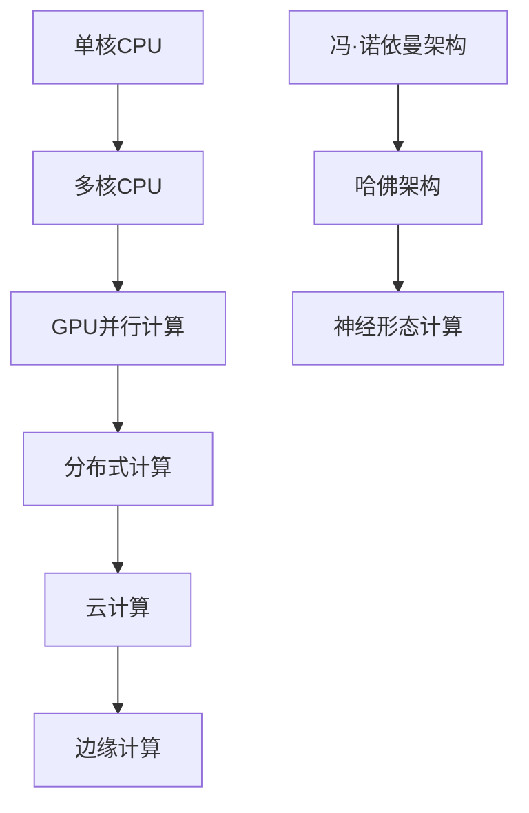
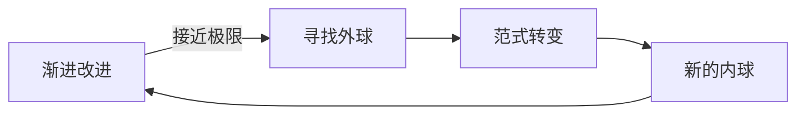

Как технологическое развитие преодолевает узкие места? Почему одни инновации являются постепенными, а другие - революционными? Модель мышления из игры "Тетрис" может дать новый взгляд на понимание технологической эволюции.

<!--more-->

## 俄罗斯方块的启示

Представьте, что вы играете в "Тетрис". В нижней части находятся уже сложенные квадраты, представляющие существующую технологическую базу. Новые блоки, которые падают, - это новые технологии или решения. В большинстве случаев вы занимаетесь "устранением энтропии" - ликвидируете ряды, которые вот-вот заполнятся, ловко расставляя и комбинируя новые блоки так, чтобы они идеально сочетались со старыми.

Но как бы вы ни старались, игра всегда имеет одно основное ограничение: блоки будут громоздиться все выше и выше и в конце концов достигнут вершины. В этот момент вам нужны не лучшие навыки расстановки кубиков, а совершенно новый набор правил для игры.

## 中国鬼工球的递归智慧

Традиционный китайский шар Ghostwork - это тонкое произведение искусства: большой шар, уложенный слоями шариков поменьше. Каждый слой представляет собой законченную структуру, но при этом окружен и защищен внешним слоем.

Когда мы думаем о "Тетрисе" и шариках GhostWorks вместе, возникает мощная модель технологического развития:

- **Внутренняя сфера**: современные технологические рамки и решения
- **Внешняя сфера**: новые парадигмы на более высоком уровне, охватывающие и превосходящие внутреннюю сферу.
- **Рекурсивность**: решение "внешнего шара" на каждом уровне становится "внутренним шаром" на следующем уровне.

## 技术发展的层次递归模式

### 第一层：算法和工艺优化

Это уровень, который мы видим наиболее четко, как "устранение энтропии" в "Тетрисе":

**Пример оптимизации программного обеспечения**:
- Более эффективные алгоритмы сортировки
- Более быстрые запросы к базе данных
- Более элегантный дизайн пользовательского интерфейса

**Примеры усовершенствования оборудования**:
- Более компактный производственный процесс
- Лучшая тепловая конструкция
- Более высокая интеграция

Все эти улучшения - оптимизация в рамках существующей структуры, как, например, поиск лучшего способа расположения квадратов в Tetris.

### 第二层：架构和范式转变

Когда оптимизация первого слоя близка к своему пределу, необходим "внешний шар", чтобы обернуть существующее решение:

**计算架构的演进**：

Каждый архитектурный сдвиг - это новый "внешний шар", обернутый вокруг "внутреннего шара" предыдущего поколения.

### 第三层：认知和理念革命

Глубокие изменения происходят за счет переопределения самой проблемы:

**От персональных компьютеров к Интернету**:
- Внутренняя сфера: повышение производительности одного компьютера
- Внешний шар: соединить все компьютеры
- Результат: вычислительная мощность переместилась с аппаратного обеспечения в сеть

**От программных продуктов к сервисным платформам**:
- Внутренний шар: разработка лучшего программного обеспечения
- Внешний шар: создание экосистем
- Результат: создание стоимости переходит от продуктов к платформам

## 历史案例分析

### 通信技术的层次演进

**Этап оптимизации первого уровня**:
- Улучшение качества сигнала
- Расширенное покрытие
- Снижение затрат на оборудование

**Сдвиг архитектуры второго уровня**:
- От аналоговой к цифровой
- От коммутации каналов к коммутации пакетов
- От голоса к данным

**Третий уровень концептуальной революции**:
- От средств коммуникации к информационным платформам
- От одноранговых сетей к сетевым эффектам
- От мобильных телефонов к интеллектуальным экосистемам

### AI技术的递归发展

**Текущая Внутренняя Сфера (2025)**:
- Оптимизация алгоритмов: улучшение трансформатора, методы квантования
- Аппаратные улучшения: специальный чип ИИ, больший объем памяти
- Оптимизация приложений: улучшенная инженерия подсказок, техники тонкой настройки

**Возможная экзосфера (2030 год)**:
- Новые вычислительные парадигмы: нейроморфные вычисления, квантово-классические гибриды
- Иная постановка задач: от генерирования контента к пониманию мира
- Революционное взаимодействие: прямые интерфейсы мозг-компьютер

**Будущее Внешней Сферы (2040?). **:
- Переосмысление самого понятия "интеллект".
- Новая форма человеко-машинной интеграции.
- Коллективный интеллект за пределами индивидуального восприятия.

## 模型的核心洞察

### 1. 优化有极限，突破需要升维

На любом уровне технологии оптимизация наталкивается на теоретические или практические ограничения:
- Закон Мура приближается к физическим пределам
- Сложность алгоритмов имеет математические границы
- Пользовательский опыт имеет когнитивные границы

Нужно не пытаться оптимизировать, а мыслить шире.

### 2. 真正的创新是不连续的

**Инкрементные инновации**: совершенствование в существующих рамках
**Деструктивные инновации**: введение новой структуры, которая будет опираться на старую.

### 3. 每一层都有自己的时间尺度

- **Алгоритмическая оптимизация**: месячные или годовые временные рамки
- **Архитектурные преобразования**: временные масштабы в годы или десятилетия
- **Философская революция**: временные масштабы в десятилетия или десятилетия

Понимание этой разницы во времени помогает нам инвестировать наши ресурсы и внимание на нужном уровне.

### 4. 预测需要多层思维

Линейная экстраполяция часто не работает, потому что не учитывает возможность иерархических скачков.

**Неправильный способ прогнозирования**:
"При нынешних темпах развития этой технологии потребуется еще X лет для ее реализации".

**Правильный способ прогнозирования**:
"В текущих рамках это займет X лет; но если произойдет изменение рамок, это может занять только Y лет".

## 实践应用指南

### 对技术从业者

**Укажите текущий уровень**:
- На каком уровне вы работаете? Оптимизация алгоритмов? Проектирование архитектуры? Или концептуальные инновации?
- Насколько велики возможности для совершенствования на этом уровне?
- Когда вам стоит задуматься о переходе на более высокий уровень?

**Культивируйте многослойное мышление**:
- Не концентрируйтесь только на технических деталях.
- Думайте об архитектурных возможностях более высокого уровня
- Сосредоточьтесь на изменении парадигмы в других областях

### 对投资决策者

**Соответствие временной шкале**:
- Краткосрочные инвестиции направлены на оптимизацию алгоритмов и процессов
- Среднесрочные инвестиции сосредоточены на архитектурных и платформенных изменениях
- Долгосрочные инвестиции сосредоточены на концептуальных и парадигмальных революциях

**Оценка рисков переосмыслена**:
- Риски инкрементных технологий относительно управляемы
- Архитектурные сдвиги имеют более высокие риски и вознаграждения
- Революции в парадигме, как правило, меняют ход событий

### 对政策制定者

**Иерархия политик**:
- Краткосрочная политика поддерживает оптимизацию существующих производств
- Среднесрочная политика поощряет инновации в технологической архитектуре
- Долгосрочная политика готовит к смене парадигм

**Избегайте зависимости от пути**:
- Не вкладывайте слишком много средств в технологии, которые скоро будут превзойдены.
- Обеспечьте пространство для появления новых парадигм
- Создавайте институциональные структуры, способные адаптироваться к изменениям

## 哲学思考：熵与创新

С точки зрения физики модель имеет более глубокие последствия.

### 热力学第二定律的启示

Энтропия Вселенной всегда стремится к увеличению, а это значит:
- Любая замкнутая система стремится к хаосу.
- Для поддержания порядка требуется постоянный приток энергии.
- Локальное уменьшение энтропии требует более широкого увеличения энтропии.

### 技术系统的熵特性

**Технический долг**:
- Системы со временем становятся сложными и неорганизованными
- Увеличиваются расходы на обслуживание
- В конечном счете, требуется рефакторинг или переписывание.

**Природа инноваций**:
- Уменьшение энтропии путем внедрения новых организационных принципов
- Обертывание низших уровней хаоса в высшие уровни порядка.
- Каждый успешный "внешний шар" - это перераспределение энтропии.

### 能量守恒与注意力经济

В информационную эпоху внимание и когнитивные способности являются ограниченными ресурсами:
- Мы не можем внедрять инновации на всех уровнях одновременно
- Необходимо стратегически выбирать, на чем сосредоточить наши усилия.
- Потенциал общества для инноваций должен быть распределен соответствующим образом

## 对未来的预测框架

Используя эту модель, мы можем лучше представить себе будущее развитие технологий:

### 当前正在发生的"外球"

Область **AI**:
- Внутренняя сфера: оптимизация архитектуры Transformer
- Внешняя сфера: мультимодальное слияние, воплощенный интеллект, нейросимвольные вычисления

**Компьютерная область**:
- Внутренняя сфера: повышение производительности чипов на основе кремния
- Внешняя сфера: фотонные вычисления, квантовые вычисления, биовычисления

**Энергетический сектор**:
- Внутренняя сфера: повышение эффективности солнечных батарей
- Внешняя сфера: термоядерная энергия, космическая солнечная энергия, искусственный фотосинтез

### 可能出现的"外球"

**Материаловедение**:
- Внутренняя сфера: улучшение свойств существующих материалов
- Внешняя сфера: программируемая материя, самособирающиеся материалы, умные материалы

**Биотехнологии**:
- Внутренняя сфера: усовершенствование технологии редактирования генов
- Внешняя сфера: синтетическая биология, искусственная жизнь, загрузка сознания

**Когнитивная наука**:
- Внутренняя сфера: понимание механизмов работы мозга
- Внешняя сфера: расширенная реальность, коллективный разум, человеко-компьютерная интеграция

## 应用边界与局限性

### 模型的适用范围

Эта модель особенно применима:
- Техноемкие отрасли
- Эволюция сложных систем
- Анализ долгосрочных тенденций

Но может и не применяться:
- Социально-культурные изменения (разные временные масштабы)
- Природные экосистемы (разные законы)
- Художественное творчество (разные критерии оценки)

### 预测的局限性

**События "черного лебедя "**:
- Появление определенных "внешних сфер" непредсказуемо.
- Междоменная технологическая конвергенция часто превосходит ожидания.
- Социальное признание может изменить путь развития технологий

**Зависимость от пути**:
- Корыстные интересы могут препятствовать смене парадигм
- Непомерные затраты удерживают людей в старых парадигмах
- Институциональная инерция влияет на скорость инноваций

## 结语：拥抱层次化思维

Тетрис учит нас, что, как бы мы ни старались оптимизировать игру, мы всегда будем наталкиваться на ее фундаментальные ограничения. Ghostworker's Ball учит нас, что решения часто приходят с более высокого уровня, обволакивая, а не заменяя существующие структуры.

Модель напоминает нам:
- Оставайтесь чувствительными к более высоким уровням, концентрируясь на текущей проблеме
- Настоящие прорывы часто происходят за счет смещения рамок, а не за счет оптимизации внутри них.
- Развитие технологий - это иерархический рекурсивный процесс, каждый слой которого имеет свою ценность и ограничения

Когда мы сталкиваемся с, казалось бы, неразрешимыми технологическими узкими местами, возможно, ответ заключается не в том, чтобы изо всех сил пытаться "устранить квадраты", а в том, чтобы найти "внешний шар", который сможет охватить текущую дилемму.

Этот способ мышления применим не только к технологическому развитию, но и к личностному росту, организационному менеджменту и социальному управлению. Когда мы научимся гибко переключаться между разными уровнями, у нас появится мощный инструмент для работы со сложным миром.

Будущее технологий - это не линейное развитие, а скачок в иерархии. В этом процессе важнее сохранять открытость и многоуровневое мышление, чем предсказывать конкретные технологические маршруты.

---

* Истинная мудрость заключается не в том, чтобы предсказать, какой формы будет следующий квадрат, а в том, чтобы понять, что сами правила игры можно изменить. *