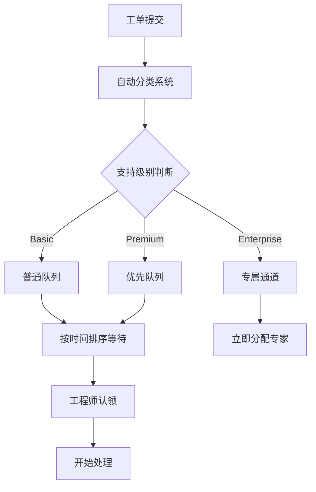

当你刚进入软件开发行业时，可能会经常听到"triage"这个词。你的项目经理说要对bug做triage，开源项目的PR被标记为triage状态，云服务的工单也在triage队列中等待处理。这个来自医疗领域的词汇，在IT世界里到底意味着什么？

<!--more-->

## Triage的本质：稀缺资源的智慧分配

想象一下急诊科的场景：护士需要快速判断哪个病人需要立即抢救，哪个可以稍等，哪个只需要简单处理。这就是triage的核心思想——在资源有限的情况下，通过优先级排序来最大化整体效益。

在软件开发中，这个"稀缺资源"通常是：
- 开发人员的时间和精力
- 代码审查者的注意力
- 技术支持工程师的专业知识
- 服务器资源和计算能力

而需要处理的"患者"则包括：
- Bug报告和功能请求
- 代码提交和拉取请求
- 用户工单和技术支持请求
- 系统告警和性能问题

## 从需求方视角：当你是"患者"

### 场景一：云服务工单的漫长等待

小李是一家创业公司的后端开发，某天发现Azure上的虚拟机突然无法创建。他按照标准流程提交了技术支持工单，详细描述了错误信息和复现步骤。

提交工单后，小李发现自己进入了一个看不见的队列。系统自动回复说"我们已收到您的请求，工程师将在4-8小时内回复"。但实际上，这背后发生的是：

小李的工单在系统中被打上了标签：服务类型、严重程度、影响范围。如果他是Basic用户，工单会进入普通队列；如果公司购买了Premium支持，就能享受更高优先级。

6小时后，一位熟悉Azure计算服务的工程师终于"捡起"了小李的工单。这不是偶然，而是triage系统运作的结果——系统确保了具备相关专业知识的人员来处理对应的问题。

### 场景二：开源贡献的命运轮盘

作为一名热爱技术的开发者，小王向PyTorch项目贡献了一个性能优化的Pull Request。他满怀期待地等待着维护者的反馈，但随后发现PR被标记为"triage"状态。

在大型开源项目中，每天都有数十个PR提交。维护者面临的现实是：
- Meta员工提交的与公司业务相关的PR通常会被优先审查
- 修复关键安全漏洞的PR享有最高优先级
- 新功能需要更仔细的设计review，耗时更长
- 文档更新和小的bug修复往往被延后处理

小王的性能优化虽然有价值，但在当前的项目优先级中并不紧急。他的PR可能需要等待几周甚至几个月，直到有维护者有时间深入审查。

## 从供给方视角：当你是"医生"

### 场景三：Scrum团队的Bug优先级之争

在一家软件公司里，Scrum Master张华正在主持每周的bug triage会议。测试团队报告了15个新发现的bug，产品经理希望都能在下个Sprint修复，但开发团队队长李工却表示时间不够。

张华需要协调各方，进行triage决策：

- **Critical级别**：影响核心功能，导致用户无法正常使用的bug，必须立即修复。
- **High级别**：影响重要功能但有workaround的bug，安排在当前Sprint处理。
- **Medium级别**：功能缺陷但不影响主流程，可以延后到下个Sprint。
- *Low级别**：UI小问题或边缘情况，放入backlog待有时间时处理。

这个过程中，张华需要平衡多个因素：客户反馈的严重程度、修复难度评估、开发资源分配、发布时间压力。每个决定都关系到产品质量和团队效率。

### 场景四：开源维护者的日常挑战

作为一个中等规模开源项目的维护者，李明每天都要面对triage决策。他的GitHub仓库里有50个未处理的issue和20个待审查的PR。

他的triage标准包括：
- **安全漏洞**：无论大小都要立即处理
- **破坏性bug**：影响现有用户的问题优先修复
- **热门需求**：社区讨论热度高的功能请求
- **代码质量**：PR是否符合项目规范和架构原则
- **维护成本**：新功能是否会增加长期维护负担

李明发现，那些在PR描述中清楚说明问题背景、提供完整测试用例、并主动参与讨论的贡献者，更容易获得他的关注和快速反馈。

## Triage的隐性规则

在实际工作中，triage并不完全是客观的技术决策，还包含许多"潜规则"：

**关系网络效应**：内部员工的需求往往比外部用户的请求更容易得到响应。这不完全是偏见，而是沟通成本和责任归属的现实考量。

**表达能力差异**：能够清楚描述问题、提供详细重现步骤、甚至提出解决方案的人，更容易获得技术人员的重视。

**时机因素**：相同的问题在不同时间提出可能得到截然不同的处理优先级。项目发布前的紧急bug修复期，所有非关键需求都会被暂时搁置。

**商业考量**：付费用户的问题通常比免费用户的需求得到更快处理，这是商业可持续性的必然要求。

## 如何在Triage游戏中提高胜率

作为新人开发者，了解这些规则可以帮助你更有效地与系统互动：

**当你提交工单时**：
- 清楚描述问题的业务影响，不只是技术细节
- 提供完整的错误日志和重现步骤
- 合理设置严重程度，不要过度夸大
- 如果有workaround，也要说明，这有助于优先级判断

**当你贡献开源代码时**：
- 在PR描述中说明这个改动解决了什么实际问题
- 提供充分的测试用例和文档更新
- 主动参与讨论，展示你对项目的理解和承诺
- 考虑从小的改动开始，建立在社区中的信誉

**当你参与团队triage时**：
- 理解不同角色的关注点：产品关注用户体验，开发关注技术债务，运维关注系统稳定性
- 学会从商业价值角度论证技术决策
- 培养同理心，理解资源限制下的艰难选择

## 现实与理想的平衡

Triage机制虽然有其合理性，但也确实存在一些问题。优秀的想法可能因为表达不当而被忽视，重要的技术债务可能因为不够紧急而被一再推迟。

作为行业新人，重要的是既要理解这个现实，也要努力改善它。当你有了话语权时，记住那些曾经在队列中等待的经历，尽量让triage过程更加公平和透明。

软件开发本质上是一个协作的过程，而triage是这个协作中不可避免的资源分配机制。掌握了这个游戏的规则，你就能更好地在这个行业中发挥自己的价值，同时也为整个生态系统的健康发展做出贡献。

当下次你的PR被标记为triage，或者工单在队列中等待时，你就知道背后发生了什么。这不仅仅是等待，而是一个复杂系统在为数千个需求寻找最优分配方案的过程。理解这一点，会让你在软件开发的道路上走得更加从容和智慧。
