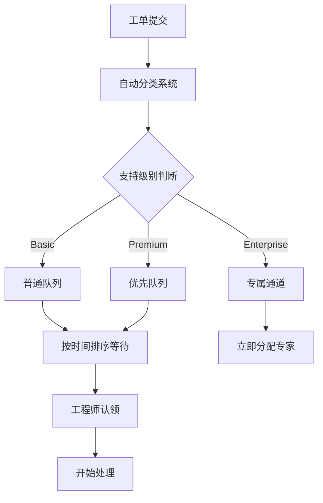

Когда вы только начинали работать в сфере разработки программного обеспечения, вы, вероятно, часто слышали слово "сортировка". Ваш руководитель проекта говорит о сортировке ошибок, PR для проектов с открытым исходным кодом помечаются статусом сортировки, а рабочие заказы для облачных сервисов стоят в очереди на сортировку в ожидании обработки. Что означает это слово из области медицины в мире ИТ?

<!--more-->

## Triage的本质：稀缺资源的智慧分配

Представьте себе сценарий отделения неотложной помощи: медсестре нужно быстро определить, кто из пациентов нуждается в немедленной реанимации, кто может подождать, а кто нуждается лишь в кратком лечении. В этом и заключается основная идея сортировки - определение приоритетов для достижения максимальной эффективности в условиях ограниченных ресурсов.

При разработке программного обеспечения таким "дефицитным ресурсом" обычно является:
- Время и усилия разработчика
- Внимание рецензентов кода
- Экспертиза инженеров технической поддержки
- Ресурсы сервера и вычислительная мощность

К "пациентам", с которыми нужно работать, относятся:
- Сообщения об ошибках и запросы на разработку функций
- Фиксы кода и запросы на исправление
- Рабочие заказы пользователей и запросы на техническую поддержку
- Системные предупреждения и проблемы с производительностью

## 从需求方视角：当你是"患者"

### 场景一：云服务工单的漫长等待

Ли, back-end-разработчик в стартапе, однажды обнаружил, что виртуальная машина в Azure внезапно не может быть создана. Он отправил заявку в службу технической поддержки, следуя стандартной процедуре, подробно описав сообщение об ошибке и шаги по ее воспроизведению.

Отправив заявку на выполнение работ, Ли попал в невидимую очередь. Система автоматически ответила: "Мы получили ваш запрос, и инженер ответит на него в течение 4-8 часов". Но на самом деле все происходило за кулисами:

Рабочий заказ Ли помечается в системе: тип услуги, степень серьезности и область воздействия. Если он является пользователем Basic, заявка попадает в обычную очередь; если компания приобретает поддержку Premium, она получает более высокий приоритет.

Шесть часов спустя инженер, знакомый с Azure Compute Services, наконец "взял" заказ Ли. Это не совпадение, а результат работы системы сортировки - система обеспечивает наличие людей с соответствующим опытом для решения проблемы.

### 场景二：开源贡献的命运轮盘

Будучи разработчиком, увлеченным технологиями, Сяо Ванг подает Pull Request на оптимизацию производительности в проект PyTorch и с нетерпением ждет ответа от сопровождающего, но обнаруживает, что PR помечен как "triage".

В крупных проектах с открытым исходным кодом каждый день появляются десятки PR-коммитов. Реальность, с которой сталкиваются сопровождающие, такова:
- PR, присланные сотрудниками Meta и имеющие отношение к бизнесу компании, обычно приоритетны для рассмотрения
- PR, устраняющие критические уязвимости безопасности, имеют наивысший приоритет.
- Новые функции требуют более тщательной проверки дизайна, что занимает больше времени
- Обновление документации и исправление мелких ошибок часто откладывается.

Оптимизация производительности, предложенная Сяо Ваном, хоть и ценна, но не является срочной в текущих приоритетах проекта. Возможно, его PR придется подождать несколько недель или даже месяцев, пока у сопровождающего не появится время для ее глубокого изучения.

## 从供给方视角：当你是"医生"

### 场景三：Scrum团队的Bug优先级之争

В компании, занимающейся разработкой программного обеспечения, скрам-мастер Чжан Хуа возглавляет еженедельное совещание по устранению ошибок. Команда тестирования сообщила о 15 новых обнаруженных ошибках, и менеджер по продукту хочет, чтобы все они были исправлены в следующем спринте, но руководитель группы разработки Ли Гун говорит, что у него недостаточно времени.

Чжан Хуа должен координировать действия всех сторон и принимать ТРИ решения:

- **Критический уровень**: ошибки, которые влияют на основные функции и приводят к тому, что пользователи не могут нормально использовать их, должны быть исправлены немедленно.
- **Высокий уровень**: ошибки, влияющие на важные функции, но имеющие обходные пути, должны быть устранены в текущем спринте.
- **Средний уровень**: функциональные дефекты, не влияющие на основной процесс, могут быть отложены до следующего спринта.
- **Низкий уровень**: небольшие проблемы с пользовательским интерфейсом или крайние случаи, которые помещаются в бэклог, чтобы быть рассмотренными, когда будет время.

В ходе этого процесса Чжан Хуа приходилось балансировать между множеством факторов: серьезностью отзывов покупателей, оценкой сложности исправлений, распределением ресурсов разработки и давлением времени выпуска. Каждое решение связано с качеством продукта и эффективностью работы команды.

### 场景四：开源维护者的日常挑战

Как сопровождающий среднего проекта с открытым исходным кодом, Минг Ли каждый день сталкивается с ТРИЯДЦАТЬЮ решениями. В его репозитории на GitHub есть 50 необработанных проблем и 20 PR, ожидающих рассмотрения.

Его критерии TRIAGE включают:
- **Безопасные ошибки**: большие или маленькие устраняются немедленно.
- **Деструктивные ошибки**: проблемы, затрагивающие существующих пользователей, являются приоритетными для исправления
- **Горячие запросы**: запросы функций, которые горячо обсуждаются в сообществе
- **Качество кода**: соответствие PR спецификациям проекта и архитектурным принципам
- **Стоимость обслуживания**: увеличат ли новые функции долгосрочное бремя обслуживания.

Ли Минг обнаружил, что участники, которые четко излагали контекст проблемы в своих PR-описаниях, предоставляли полные тестовые примеры и активно участвовали в обсуждениях, имели больше шансов привлечь его внимание и получить быструю обратную связь.

## Triage的隐性规则

На практике сортировка - это не только объективное техническое решение, но и множество "негласных правил":

**Эффект реляционной сети**: потребности внутренних сотрудников зачастую удовлетворяются с большей вероятностью, чем запросы внешних пользователей. Это не совсем предубеждение, а реалистичный учет затрат на коммуникацию и распределение ответственности.

**Различия в выражении**: Люди, которые могут четко описать проблему, предоставить подробные шаги по ее воспроизведению и даже предложить решение, с большей вероятностью будут оценены техническими специалистами.

**Фактор времени**: одна и та же проблема, поднятая в разное время, может получить совершенно разные приоритеты обработки. Все некритичные требования откладываются на период срочного исправления ошибок перед выпуском проекта.

**Коммерческие соображения**: Тот факт, что проблемы платящих пользователей обычно решаются быстрее, чем потребности бесплатных пользователей, является необходимым условием для коммерческой устойчивости.

## 如何在Triage游戏中提高胜率

Знание этих правил поможет вам, как начинающему разработчику, более эффективно взаимодействовать с системой:

**При подаче заявки на выполнение работ**:
- Четко описывайте влияние проблемы на бизнес, а не только технические детали.
- Предоставьте полные журналы ошибок и шаги по их воспроизведению
- Устанавливайте уровень серьезности в разумных пределах, не завышайте его.
- Если есть обходной путь, укажите и его, это поможет определить приоритет.

**Когда вы вносите открытый код**:
- Укажите в описании PR, какую реальную проблему решает изменение.
- Предоставляйте адекватные тестовые примеры и обновления документации
- Будьте активны в обсуждениях и демонстрируйте свое понимание и приверженность проекту.
- Рассмотрите возможность начать с небольших изменений, чтобы укрепить доверие к сообществу

**Когда вы участвуете в командной сортировке**:
- Поймите, что волнует разные роли: продукт фокусируется на пользовательском опыте, dev - на техническом долге, ops - на стабильности системы.
- Научитесь обосновывать технические решения с точки зрения ценности для бизнеса.
- Воспитывайте в себе эмпатию и понимание необходимости сложного выбора в условиях ограниченности ресурсов.

## 现实与理想的平衡

Хотя механизм Triage имеет свои оправдания, у него есть и некоторые проблемы. Отличные идеи могут быть пропущены из-за того, что они плохо выражены, а важные технические долги могут неоднократно откладываться из-за того, что они недостаточно срочны.

Новичкам в индустрии важно понимать эту реальность и работать над ее улучшением. Когда у вас появится право голоса, вспомните те времена, когда вы ждали в очереди, и постарайтесь сделать процесс TRIAGE как можно более справедливым и прозрачным.

Разработка программного обеспечения - это, по сути, совместный процесс, а сортировка - неизбежный механизм распределения ресурсов в этом сотрудничестве. Освоив правила этой игры, вы сможете лучше использовать свою ценность в этой отрасли, способствуя здоровью всей экосистемы.

Когда в следующий раз ваш PR будет помечен на TRIPY или заказ на работу будет ожидать своей очереди, вы узнаете, что происходит за кулисами. Это не просто ожидание, это процесс поиска сложной системой оптимального решения по распределению ресурсов для тысяч требований. Понимание этого позволит вам идти по пути разработки программного обеспечения с большей легкостью и мудростью.