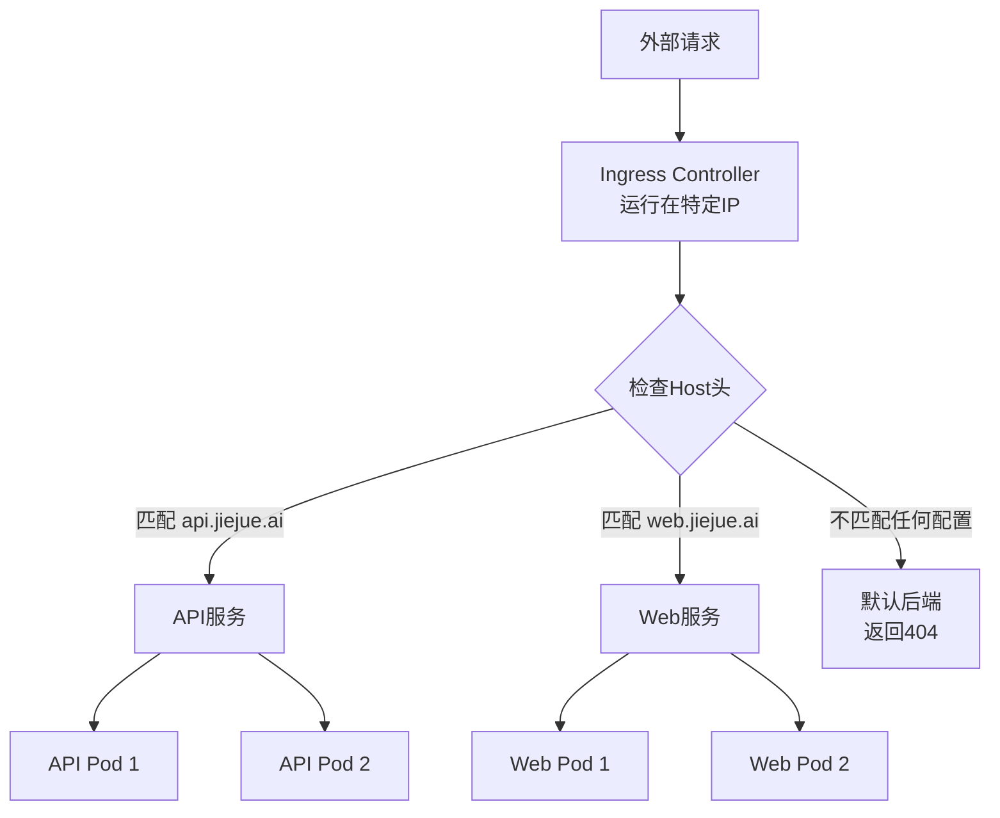

作为一名开发工程师，你是否曾经遇到过这样的情况：你的应用在Kubernetes上部署，却不知为何直接访问服务的IP地址总是返回404错误？本文将通过一个实际案例，用通俗易懂的方式解释Kubernetes中Ingress的工作原理及其使用方法。

<!--more-->

## 问题场景：直接访问IP地址为何总是404？

想象一下这个场景：你的团队开发了一个REST API服务，部署在Kubernetes集群中。测试环境通过某个域名（如`api.jiejue.ai`）访问一切正常，但有时为了快速测试，你想直接使用IP地址访问，结果却总是得到404错误。

比如，你执行以下命令：

```bash
curl http://10.18.17.64/request
```

结果返回：

```html
<html>
<head><title>404 Not Found</title></head>
<body>
<center><h1>404 Not Found</h1></center>
<hr><center>nginx</center>
</body>
</html>
```

这是怎么回事？为什么同样的服务，通过域名访问正常，但直接用IP地址就不行呢？

## 什么是Ingress？把它想象成一个"智能门卫"

在解释具体原因前，我们需要理解Kubernetes中的Ingress概念。

如果你之前只做过本地开发，可以将Ingress理解为一个"智能门卫"或"接待员"。想象你去一栋有多家公司的写字楼：

- **写字楼大门口的保安** = Ingress控制器（拥有固定IP地址）
- **不同楼层的多家公司** = 集群内的不同服务
- **访客登记表** = Ingress规则配置

当你去写字楼时，保安（Ingress）会先问："请问您要找哪家公司？"你回答后，保安才会告诉你具体的楼层和房间号。如果你不说清楚要去哪家公司，保安就会拒绝你进入（返回404）。

**这就是为什么直接访问IP地址会返回404**：因为你只敲了大门（IP地址），但没告诉门卫（Ingress）你想去哪家公司（Host头）。

## Ingress如何工作？一图胜千言

下面这张图展示了Ingress的基本工作流程：



当请求到达Ingress控制器时，它会检查请求中的"Host"头（即域名信息），然后根据这个信息将请求路由到正确的后端服务。如果没有提供Host头，或者提供的Host头没有匹配任何已配置的规则，Ingress就会返回404错误。

## 实际解决方法

如果你需要直接使用IP地址进行测试，有以下几种方法：

### 方法1：使用Host头指定目标服务

```bash
curl -H "Host: api.jiejue.ai" http://10.18.17.64/request
```

这样，即使使用IP地址，你也告诉了Ingress你要访问哪个服务。

### 方法2：使用--resolve参数（DNS欺骗）

```bash
curl https://api.jiejue.ai/request --resolve api.jiejue.ai:443:10.18.17.64
```

这个命令告诉curl将`api.jiejue.ai`解析到`10.18.17.64`，同时保持正确的Host头。

### 方法3：修改本地hosts文件

在本地hosts文件中添加一行：

```
10.18.17.64 api.jiejue.ai
```

然后可以直接使用域名访问：

```bash
curl https://api.jiejue.ai/request
```

## 绕过Ingress直接访问服务的方法

有时候，你可能希望完全绕过Ingress，直接访问内部服务进行测试。在Kubernetes中，你可以使用`kubectl port-forward`命令：

```bash
kubectl -n 命名空间 port-forward service/服务名称 80:80
```

然后在本地访问：

```bash
curl http://localhost/path
```

这种方法建立了一个从本地计算机到Kubernetes集群内特定服务的直接通道，完全绕过了Ingress。

## 为什么要这样设计？

你可能会问：为什么要设计得这么复杂？直接用IP不就完了吗？

这是因为在现代微服务架构中，一个IP地址上可能需要托管多个不同的服务（称为"虚拟主机"）。基于域名的路由允许：

1. **有效利用资源**：多个服务共享同一个IP和负载均衡器
2. **灵活的路由规则**：基于路径、Headers等灵活路由
3. **集中式管理**：统一的入口点管理所有流量

这就像一个电话总机：虽然公司只有一个总机号码，但根据你要找的部门不同，总机会将你转接到不同的分机。

## 小结

现在，你应该理解了为什么直接访问Kubernetes Ingress的IP地址会返回404错误了。这不是一个bug，而是其设计使然：Ingress需要知道你要访问哪个"虚拟主机"才能正确路由你的请求。

在开发和测试过程中，记住以下几点：

1. 使用正确的Host头或域名访问服务
2. 如果使用IP地址，添加合适的Host头
3. 需要绕过Ingress时，考虑使用`kubectl port-forward`

希望这篇文章能帮助你更好地理解Kubernetes中的网络路由机制，特别是对于那些刚刚开始接触Kubernetes的开发人员。

## 思考练习

尝试在你的开发环境中执行以下实验：使用相同的URL路径，但不同的Host头访问你的Ingress控制器，观察是否能够路由到不同的服务上。这将帮助你更直观地理解基于Host的路由机制。
