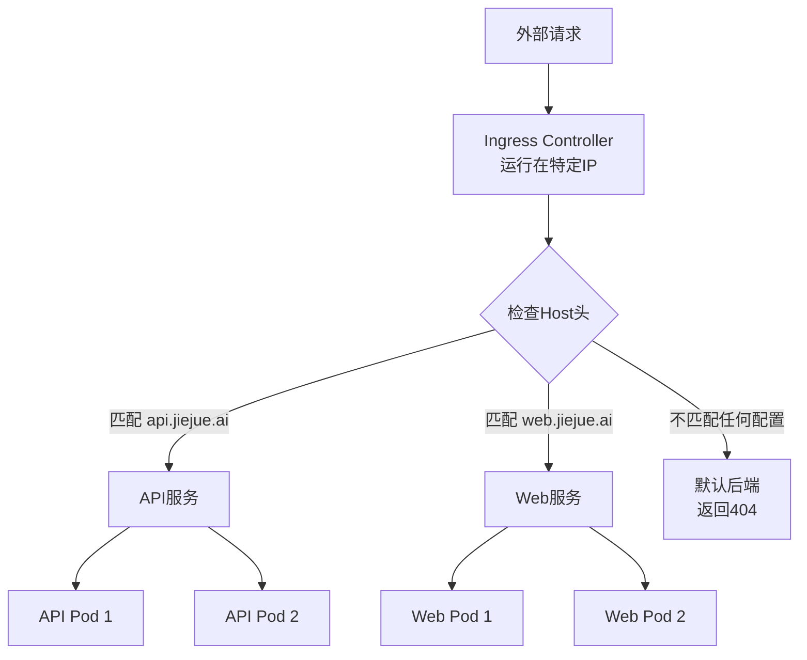

Как инженер-разработчик, вы когда-нибудь сталкивались с ситуацией, когда ваше приложение развернуто на Kubernetes, но почему-то прямой доступ к IP-адресу сервиса всегда возвращает ошибку 404? В этой статье мы расскажем о принципе работы Ingress в Kubernetes и его использовании в доступной форме на практическом примере.

<!--more-->

## 问题场景：直接访问IP地址为何总是404？

Представьте себе такой сценарий: ваша команда разработала сервис REST API, развернутый в кластере Kubernetes. В тестовой среде все работает хорошо, если обращаться к нему через определенное доменное имя (например, `api.jiejue.ai`), но иногда, для быстрого тестирования, вы хотите обратиться к нему напрямую, используя IP-адрес, и в итоге всегда получаете ошибку 404.

Например, вы выполняете следующую команду:

```bash
curl http://10.18.17.64/request
```

Полученные результаты:

```html
<html>
<head><title>404 Not Found</title></head>
<body>
<center><h1>404 Not Found</h1></center>
<hr><center>nginx</center>
</body>
</html>
```

Что здесь происходит? Почему одна и та же служба работает нормально при доступе через доменное имя, но не работает напрямую с IP-адресом?

## 什么是Ingress？把它想象成一个"智能门卫"

Прежде чем объяснить, почему именно так, нам нужно понять концепцию Ingress в Kubernetes.

Если до этого вы занимались только локальными разработками, считайте, что Ingress - это "умный швейцар" или "секретарь". Представьте, что вы пришли в офисное здание с несколькими компаниями:

- **Охранник на входе в офисное здание** = контроллер входа (с фиксированным IP-адресом)
- **Многочисленные компании на разных этажах** = различные службы в кластере
- **Форма регистрации посетителей** = конфигурация правила входа

Когда вы приходите в офисное здание, охранник (Ingress) сначала спросит: "Могу я узнать, какую компанию вы ищете?". Только после вашего ответа охранник назовет вам конкретный этаж и номер комнаты. Если вы не уточните, какая компания вам нужна, охранник откажет вам во входе (Back to 404).

**Вот почему прямой доступ к IP-адресу возвращает 404**: потому что вы только постучали в дверь (IP-адрес), но не сообщили швейцару (Ingress), в какую компанию вы хотите пойти (заголовок Host).

## Ingress如何工作？一图胜千言

На следующей схеме показан основной рабочий процесс Ingress:



Когда запрос поступает на контроллер Ingress, он проверяет заголовок "Host" (т. е. информацию о доменном имени) в запросе и на основе этой информации направляет запрос на нужную внутреннюю службу. Если заголовок Host не предоставлен или если предоставленный заголовок Host не соответствует ни одному из настроенных правил, Ingress возвращает ошибку 404.

## 实际解决方法

Если вам нужно протестировать непосредственно IP-адрес, есть несколько способов сделать это:

### 方法1：使用Host头指定目标服务

```bash
curl -H "Host: api.jiejue.ai" http://10.18.17.64/request
```

Таким образом, даже имея IP-адрес, вы сообщаете Ingress, к какому сервису хотите получить доступ.

### 方法2：使用--resolve参数（DNS欺骗）

```bash
curl https://api.jiejue.ai/request --resolve api.jiejue.ai:443:10.18.17.64
```

Эта команда указывает curl разрешить `api.jiejue.ai` в `10.18.17.64`, сохраняя правильный заголовок Host.

### 方法3：修改本地hosts文件

Добавьте строку в локальный файл hosts:

```
10.18.17.64 api.jiejue.ai
```

Затем к нему можно получить прямой доступ, используя доменное имя:

```bash
curl https://api.jiejue.ai/request
```

## 绕过Ingress直接访问服务的方法

Иногда вы можете захотеть обойти Ingress и получить доступ к внутренним сервисам напрямую для тестирования. В Kubernetes для этого можно использовать команду `kubectl port-forward`:

```bash
kubectl -n 命名空间 port-forward service/服务名称 80:80
```

Затем получите доступ к нему локально:

```bash
curl http://localhost/path
```

Такой подход позволяет создать прямой канал от локального компьютера к определенному сервису в кластере Kubernetes, минуя Ingress.

## 为什么要这样设计？

Вы можете спросить: зачем так усложнять конструкцию? Не лучше ли просто использовать IP?

Это связано с тем, что в современных архитектурах микросервисов на одном IP-адресе может быть размещено несколько различных сервисов (так называемых "виртуальных хостов"). Маршрутизация на основе домена позволяет это сделать:

1. **Эффективное использование ресурсов**: несколько сервисов используют один IP-адрес и балансировщик нагрузки
2. **Гибкие правила маршрутизации**: гибкая маршрутизация на основе путей, заголовков и т. д.
3. **Централизованное управление**: единая точка входа для управления всем трафиком

Это похоже на телефонный коммутатор: хотя у компании только один номер коммутатора, в зависимости от того, какой отдел вы ищете, коммутатор переводит вас на другой внутренний номер.

## 小结

Теперь вы должны понимать, почему прямой доступ к IP-адресу Kubernetes Ingress возвращает ошибку 404. Это не ошибка, это сделано специально: Ingress должен знать, к какому "виртуальному хосту" вы пытаетесь обратиться, чтобы правильно направить ваш запрос.

Помните о следующих моментах во время разработки и тестирования:

1. используйте правильный заголовок Host или доменное имя для доступа к службе
2. если используется IP-адрес, добавьте соответствующий заголовок Host.
3. рассмотрите возможность использования `kubectl port-forward`, если вам нужно обойти Ingress.

Надеемся, эта статья поможет вам лучше понять механизм сетевой маршрутизации в Kubernetes, особенно тем разработчикам, которые только начинают работать с Kubernetes.

## 思考练习

Попробуйте провести следующий эксперимент в своей среде разработки: обратитесь к контроллеру Ingress, используя один и тот же путь URL, но разные заголовки Host, и посмотрите, сможете ли вы маршрутизировать к различным сервисам. Это поможет вам лучше понять механизм маршрутизации на основе хостов.