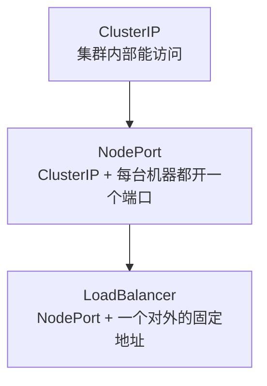

你的应用在 Kubernetes 上跑起来了，同事在群里问：“给我个地址，我访问一下？”

你敲下 `kubectl get svc`，看到 `TYPE` 那一列：ClusterIP、NodePort、LoadBalancer。三选一，选哪个？

多数人以为这是三个并列的套餐。但它们真正的关系是**一层套一层**——选 NodePort 的时候，ClusterIP 已经自动配好了；选 LoadBalancer 的时候，NodePort 和 ClusterIP 也都已经在里面了。

<!--more-->

## 先问对问题：谁需要访问这个服务？

在纠结选哪个之前，先回答一个问题：**谁来访问，从哪访问？**

- 只有集群内部的其他程序要调用 → **ClusterIP**
- 集群外面的人也要访问，而且地址你可以口头告诉对方 → **NodePort**
- 集群外面的人要访问，而且这个地址得**固定、不用维护、背后坏了能自动绕开** → **LoadBalancer**

三种类型的差别，全部落在这三句话里。

## 一层套一层的结构

不是三个并列的门，而是同一扇门越装越厚。下面逐层拆开看。

### ClusterIP：公司内部的分机号

这是默认类型。Kubernetes 会给它分配一个**集群内部的虚拟 IP**，集群里的其他 Pod 可以直接用它调用——但它对外完全不可见。

**类比**：公司内部的分机号。楼里的人拨 8001 就能找到前台，但外面的客户打不进来，因为压根没有这条外线。

**你得到什么**：一个稳定的内部地址。Pod 的 IP 会随重启变化，Service 的这个虚拟 IP 不会。

### NodePort：给每台机器都开一扇门

在 ClusterIP 的基础上，Kubernetes 会在**集群里每一台机器**上都打开同一个端口（默认从 30000–32767 里挑一个）。于是外部的人可以通过 `<任意一台机器的IP>:<这个端口>` 访问到你的服务。

**类比**：给写字楼的每一面墙都开了一扇门，门牌号都是 30080。访客从东门、南门、西门进来，最后都会被带到同一间办公室。

**你得到什么**：一个从外部能访问的入口。不需要云平台支持，任何集群都能用。

**你还缺什么**：访客得自己知道“从哪扇门进”。你有 8 台机器，就得告诉他 8 个地址，让他自己挑一个。

### LoadBalancer：正门大堂加一个前台

在 NodePort 的基础上，Kubernetes 再向云平台申请一个**对外的固定地址**（通常是一个公网 IP），并把背后那些机器登记成一个池子。

**类比**：写字楼的正门大堂。访客只需要知道“XX 大厦正门”这一个地址，至于他会被引导到哪部电梯、哪一层，前台自己安排；哪面墙的门坏了，前台也知道该绕开。

**你得到什么**：一个不变的地址；背后有机器故障时，访客完全无感。

> 补充一句：这个能力依赖云平台。如果你的集群跑在不提供负载均衡的云上，LoadBalancer 类型的服务会一直卡在 `pending` 状态，不会有地址分配下来。

## 所以，NodePort 能替代 LoadBalancer 吗？

**不能。** 但原因不是它“转发不了请求”——恰恰相反，NodePort 完全能把你送到正确的 Pod 上。它缺的是**对访客的那一层承诺**：

| 访客需要什么 | NodePort | LoadBalancer |
| :--- | :--- | :--- |
| 一个不变的地址 | ❌ 有 8 台机器就有 8 个地址 | ✅ 只有一个 |
| 故障无感 | ❌ 访问的那台机器挂了，连接就断 | ✅ 自动绕开 |
| 不用关心成员变化 | ❌ 机器加一台减一台，你给的地址列表就过期了 | ✅ 它自己维护 |

换个说法：NodePort 是**把每一面的后门都打开**，LoadBalancer 是**在前门安排了一个前台**。后门当然能进人，但访客不会知道后门在哪；后门锁了，也没人替他指路。

所以更准确的说法是：NodePort 缺的那一块，**不在它自己身上**。想让访客只记一个地址、想让故障被自动绕开，你得另外在前门安排一个“前台”。这台前台是独立的角色，NodePort 自己变不出来。

## 那我到底该选哪个？

| 你的情况 | 选什么 |
| :--- | :--- |
| 只有集群内部的程序要调用 | ClusterIP（默认，什么都不用写） |
| 临时调试、内网自用，访问方能自己记住多个地址 | NodePort |
| 对外提供服务，地址要稳定、要能扛住机器故障 | LoadBalancer |
| 有多个网站或接口要对外，不想每个都占一个 LoadBalancer | 1 个 LoadBalancer + Ingress |

最后一行值得展开一点：如果每个对外服务都申请一个 LoadBalancer，成本和地址都会迅速膨胀。更常见的做法是只留一个对外入口，在它后面用 Ingress 按域名和路径把流量分给内部的服务——内部服务本身只声明 ClusterIP 就够了。

关于 Ingress 的工作方式（以及为什么直接访问它的 IP 会返回 404），可以看这篇：[为开发者解释：为什么直接访问 Kubernetes Ingress 的 IP 地址会返回 404]()。

## 小结

- 三种类型不是三选一，而是**一层套一层**：选外层的，内层自动就有了
- ClusterIP 解决“集群内部能互相找到”，NodePort 解决“从外面能进来”，LoadBalancer 解决“从外面进来时，有一个稳定且会自我维护的门面”
- NodePort 替代不了 LoadBalancer，因为它缺的那部分不在它自己身上

## 思考练习

在你的集群里执行 `kubectl get svc -A`，观察 `TYPE` 那一列：

1. 哪些服务是内部用的（ClusterIP）？哪些是给外部用的？
2. 那些给外部用的服务，分别是哪一层？
3. 然后问自己一个问题：如果你只开了一个 NodePort 服务，而集群有 8 台机器，你的用户手册该怎么写？“请从以下 8 个地址中任选一个访问”——这句话你能接受吗？

第三个问题没有标准答案，但你怎么回答它，基本就决定了你该选 NodePort 还是 LoadBalancer。
