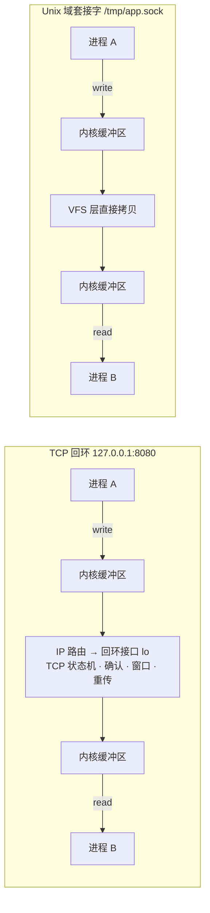

同一台机器上的两个进程要通信，你几乎总要面对一个选择：开一个 TCP 端口（`127.0.0.1:8080`），还是挂一个 `.sock` 文件（Unix 域套接字）。很多基础设施已经用脚投了票——Docker、MySQL、PostgreSQL、systemd 在本机通信时都默认走后者。但"为什么"和"快多少"，多数人只有一个模糊的印象：「Unix 域套接字更快一点」。

「更快一点」到底是多少？这篇文章给出一次可复现的实测：同一台机器、同一份代码、三种负载形态，量出三个差距悬殊的数字，最后给出一张把场景直接映射到选择的清单。

<!--more-->

## 一、先看结论：三个数字

实测环境：macOS（Darwin 25.6）、Apple Silicon M4 Max、`clang -O2`。方法见第三节。

| 负载形态 | Unix 域套接字 | TCP 回环 | 差距 |
|---|---|---|---|
| 小消息往返（1 B – 4 KiB，ping-pong） | ≈ 4 µs / 次 | ≈ 53–59 µs / 次 | **13–14×** |
| 连接建立（socket + connect） | 1.7 µs | 80.5 µs | **47×** |
| 大块流吞吐（1 GiB，1 MiB 块） | 1.48 GiB/s | 1.19 GiB/s | 1.25× |

一句话读法：**UDS 的优势全部集中在「每消息开销」上——消息越小、建连越频繁，差距越大；一到大块流传输，两者收敛到只差 25%。**

## 二、30 秒原理：UDS 不是「更快的端口」，是另一条路

Unix 域套接字（Unix Domain Socket，UDS）的端点挂在文件系统上，名字就是一个路径。它和 TCP 回环最关键的区别不是快慢，而是**数据走不走网络协议栈**：

TCP 回环虽然不碰网卡，但依然要走完整协议栈：IP 路由 → 回环接口 → TCP 状态机（握手、确认、窗口、重传）。UDS 走的是文件系统一侧（VFS 层）：数据从一个内核 socket 缓冲区直接拷贝到另一个。

一个贴切的模型：**UDS = 文件系统里的一张门牌 + 内核里的一对缓冲区**。门牌（那个 `.sock` 文件）只负责让双方「找得到」（connect）；连接建立后，真正搬数据的是内核里配对的两个缓冲区——此时把门牌删掉，已有连接都不受影响。

| 维度 | TCP 回环 `127.0.0.1:port` | Unix 域套接字 |
|---|---|---|
| 地址 | IP:端口（传输层命名空间） | 文件路径（文件系统命名空间） |
| 数据路径 | 完整网络协议栈 | VFS 层，内核缓冲区直拷 |
| 访问控制 | 防火墙 / 绑定地址 | 文件权限（Linux：connect 需对 socket 文件有写权限） |
| 对端身份 | 只能看到 IP | `SO_PEERCRED` 直接给出 PID/UID/GID |
| 传文件描述符 | 不能 | 能（`SCM_RIGHTS`） |
| 冲突形式 | 端口被占用 | 路径已存在（陈旧文件还会挡路，见第七节） |
| 连接关闭 | 有 TIME_WAIT 状态 | 没有 |

最后两行是「为什么容器生态全押它」的伏笔，第五节展开。

## 三、怎么测的：公平性三原则

三段测试都用同一份代码的两条路径，只有「建地址」的部分不同：

1. **同一份代码**：读写的缓冲、循环、计时点完全一致，唯一差异是 `AF_UNIX` + `sun_path` 与 `AF_INET` + `127.0.0.1:port`；
2. **TCP 一律设置 `TCP_NODELAY`**：这是公平基线——不设置的话，小消息还会撞上 Nagle 与延迟确认的额外惩罚，TCP 的数字会比 53 µs 更难看；
3. **统计口径**：延迟取中位数与 p99（小消息 20,000 轮往返），吞吐为 1 GiB 连续流，建连为 1,000 次 connect 计时（含 socket 创建，不含 close）。

诚实声明：以上是本机单线程、单连接、默认 socket 缓冲的数字。macOS 的 TCP 回环路径本身偏慢，会放大差距的绝对值；换平台后具体倍数会变，但**形状不变**——第一节那个「按负载分档」的结论在各平台都成立。建议用自己的真实负载复测，第八节给了可以直接跑的代码。

## 四、把数字读透

### 4.1 小消息：4 µs 是「两次进程唤醒」的价格

注意 UDS 那一列的「平」：从 1 B 到 4 KiB，往返耗时始终钉在 4 µs 左右。这说明 4 µs 里数据拷贝的占比可以忽略——它就是**两次进程唤醒**的价格（写端唤醒读端，响应回来再唤醒一次）。

TCP 那一列同样是平的（52–59 µs），多出来的约 49 µs 与消息大小无关：它是每消息都要支付的协议栈处理费——IP/TCP 处理、回环接口的入队出队、确认与窗口机制。

| 消息大小 | UDS p50 / p99（µs） | TCP p50 / p99（µs） | 倍数 |
|---|---|---|---|
| 1 B | 4.2 / 8.4 | 59.0 / 104.2 | 14.0× |
| 64 B | 4.0 / 8.0 | 52.0 / 66.9 | 13.0× |
| 4 KiB | 4.2 / 8.3 | 53.5 / 70.4 | 12.8× |
| 64 KiB | 75.5 / 121.0 | 132.1 / 184.4 | 1.8× |
| 256 KiB | 315.6 / 470.9 | 332.5 / 1095.4 | 1.1× |

### 4.2 大消息：差距收敛，但注意 p99

从 64 KiB 开始，每轮往返变成「拷贝带宽」主导，UDS 的优势迅速缩小；256 KiB 时中位数已基本打平（315 vs 332 µs）。但看 p99：UDS 471 µs，TCP 1095 µs——**中位数打平的时候，尾部才是真实体验**。流控往返与调度抖动会在 TCP 的长尾上叠加，对延迟敏感的系统要盯着这一列看。

### 4.3 建连 47×：每请求新建连接的架构直接兑现

TCP 的 80.5 µs 买的是三次握手加内核状态机的完整建立流程；UDS 的 1.7 µs 买的是内核里「把一对 socket 配上」的操作。这条差距在「每次请求都新建连接」的架构里直接兑现——Docker CLI 就是典型：你敲的每一条 `docker` 命令，都是一次全新的建连。

### 4.4 吞吐只有 1.25×：拷贝带宽主导

1 GiB 连续流里，两边拼的是内存拷贝带宽，协议栈的固定开销被摊薄。所以「UDS 更快」这句话必须带着负载说：**高频小消息 / 频繁建连差一个数量级；大块吞吐只差 25%。**

## 五、为什么容器生态全押 UDS

Docker（`/var/run/docker.sock`）、containerd、systemd、PostgreSQL、MySQL……这些软件在本机通信场景清一色选择 UDS。除了上面量化的性能，至少还有三条和数字无关的理由：

1. **权限模型是免费的**：文件权限就是门禁，不需要额外造一层认证；`SO_PEERCRED` 还能让服务端直接拿到对端的 PID/UID/GID，用于审计或鉴权；
2. **不占端口**：不进入端口空间，永远不会和网络服务抢 8080，也不存在防火墙规则要维护；
3. **没有 TIME_WAIT**：高频建连场景不会在连接表里堆积 TIME_WAIT 状态。

顺带一个安全事实：把 `/var/run/docker.sock` 挂进容器，等于把宿主机 root 权限交出去——挂进去的不是一个普通文件，而是「通往 daemon 的完整通行证」。这从反面印证了 UDS 的权限设计：**它的安全性完全等于文件权限的严谨程度**，权限给多了，门就是敞开的。

## 六、选型清单

| 你的场景 | 建议 |
|---|---|
| 同机 IPC、小消息、每请求新建连接 | **UDS**，收益 10 倍级 |
| 需要按用户/组控制访问、需要验证对端身份 | **UDS**（文件权限 + `SO_PEERCRED`） |
| 需要传文件描述符或凭证 | **UDS**（唯一选择） |
| 同机大块数据搬运（备份、日志转发） | 两者都行；UDS 略快，按其他因素决定 |
| 未来可能拆到另一台机器 | TCP，或双栈（先 UDS，迁移时只改建地址的几行） |
| 需要 tcpdump / Wireshark 抓包调试协议 | TCP 回环（UDS 的流量根本不进网络栈，抓不到） |
| 所用库只支持 IP 套接字 | TCP |
| 需要跑在旧版 Windows 上 | TCP（AF_UNIX 从 Windows 10 1803 起才支持） |

## 七、四个实战坑

1. **陈旧的 socket 文件**：进程退出后 `.sock` 文件**不会自动消失**，下次 `bind` 直接 `EADDRINUSE`。标准做法是启动时先 `unlink()` 再 `bind()`。注意：很多教程说它「会自动清理」，那是错的——唯一真的不落盘、随进程消失的是 Linux 抽象命名空间，那种形态根本不在文件系统里。
2. **路径长度上限**：`sun_path` 在 Linux 是 108 字节、macOS/BSD 是 104 字节，超了直接报错。这也是 socket 文件普遍放在浅路径下的原因。
3. **权限在哪一层**：连接方需要对 socket 文件有写权限，且需要对路径上每一级目录有执行权限。把 socket 放在 `/tmp` 下共享有安全隐患（符号链接 / TOCTOU 攻击面），优先放私有目录或 [XDG 基础目录规范]( "XDG 基础目录规范：7 个环境变量，和三个常见误解")里说的 `XDG_RUNTIME_DIR`——它本来就是为「socket、命名管道、PID 文件」这类运行时对象设计的。
4. **平台差异**：抽象命名空间是 Linux 独有；macOS / BSD 只支持路径形态；Windows 的 AF_UNIX 较新且细节有别。跨平台项目需要薄薄一层地址封装。

## 八、复现：10 秒自测

跑出本文全部数据的测试代码在 [GitHub Gist](https://gist.github.com/donghao1393/0394f1991e2971089ac2044937ceb17d)，含编译与运行说明，可直接取用。

一个顺手的观察：UDS 与 TCP 的代码差异只有「建地址」的十来行。这意味着**选型不是架构承诺**——先用 UDS，将来真要拆到两台机器上，改建地址几行即可。反过来说，如果你现在就需要 `tcpdump` 看得见的流量、或者要跑在旧 Windows 上，用 TCP 回环也完全合理——「13×」听起来吓人，但 53 µs 在大多数请求处理链路里只是零头。

最后一个开放问题留给你：你手上的同机 IPC 属于哪一档——高频小消息、频繁建连，还是大块搬运？如果你从没量过，那个数字通常和直觉不一样。把 gist 里的代码跑一遍，10 秒就有答案。
