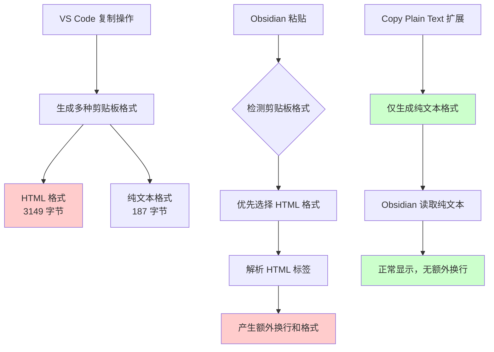

你是否遇到过这样的困扰：在 VS Code 中复制代码或文档，粘贴到 Obsidian、Notion 或其他 Markdown 编辑器时，每一行都莫名其妙地多出了额外的空行？明明在 VS Code 中看起来格式正常，一粘贴就变得参差不齐。

这个看似小问题，实际上困扰着众多开发者和文档工作者。今天我们就来彻底解决这个问题，并深入了解其背后的技术原理。

<!--more-->

## 问题现象

假设你是一名产品经理，需要将开发团队在 VS Code 中编写的配置文件内容复制到团队的 Obsidian 知识库中。你复制了这样的内容：

```yaml
- 功能点5
- 功能点11  
- 功能点13
- 功能点15
```

但粘贴到 Obsidian 后却变成了：

```yaml
- 功能点5

- 功能点11

- 功能点13

- 功能点15
```

每行之间都多出了一个空行，严重影响了文档的可读性。

## 三步解决方案

### 第1步：安装 Copy Plain Text 扩展

1. 打开 VS Code
2. 点击左侧的扩展图标（Extensions）或按 `Cmd+Shift+X`
3. 在搜索框中输入 "Copy Plain Text"
4. 找到 "Copy Plain Text" 扩展并点击安装

### 第2步：选择要复制的文本

在 VS Code 中选中你需要复制的文本内容，就像平时复制一样。

### 第3步：使用纯文本复制

有两种方式可以使用纯文本复制：

**方法一：右键菜单**
- 选中文本后右键
- 选择 "Copy Plain Text" 选项

**方法二：快捷键**
- 选中文本后按 `Ctrl+Option+C`（Mac）或 `Ctrl+Alt+C`（Windows）

完成！现在粘贴到 Obsidian 或其他编辑器中就不会有额外的换行了。

## 深入理解：为什么会出现这个问题？

### 剪贴板的秘密

当你在 VS Code 中使用常规复制（`Ctrl+C`）时，系统实际上在剪贴板中存储了多种格式的数据。我们可以通过一个简单的实验来看到这点：

在 macOS 上，你可以在终端中运行以下命令来查看剪贴板内容：

```bash
# 从 VS Code 复制后查看剪贴板
osascript -e 'clipboard info'
```

你会看到类似这样的输出：
```
«class HTML», 3149, «class utf8», 187, «class ut16», 376, string, 187, Unicode text, 374
```

而如果使用纯文本复制或命令行工具：
```bash
# 使用纯文本方式复制后查看
cat file.txt | pbcopy
osascript -e 'clipboard info'
```

输出变为：
```
«class utf8», 187, «class ut16», 376, string, 187, Unicode text, 374
```

**关键差异**：VS Code 的常规复制包含了 `«class HTML»` 格式，大小为 3149 字节，而纯文本只有 187 字节！

### 问题根源分析



1. **VS Code 的"好意"**：为了支持语法高亮和格式保持，VS Code 在复制时会生成包含 HTML 标签的富文本格式
2. **Obsidian 的选择**：当剪贴板中同时存在多种格式时，Obsidian 会优先选择 HTML 格式
3. **格式冲突**：HTML 中的标签信息在 Markdown 渲染过程中被解释为额外的换行和格式

### 技术细节：剪贴板数据结构

当 VS Code 执行复制操作时，实际上是这样的：

```javascript
// VS Code 内部逻辑（简化版）
clipboard.write({
    'text/html': generateHTMLWithSyntaxHighlighting(selectedText),
    'text/plain': selectedText
});
```

而 Copy Plain Text 扩展的逻辑是：

```javascript
// Copy Plain Text 扩展逻辑（简化版）
clipboard.writeText(selectedText); // 仅写入纯文本
```

## 其他解决方案

如果你不想安装扩展，还有几种替代方案：

### 方案一：命令行中转
```bash
# 将文件内容复制到剪贴板
cat your-file.txt | pbcopy  # macOS
cat your-file.txt | xclip -selection clipboard  # Linux
```

### 方案二：VS Code 设置调整
在 VS Code 设置中搜索 "copy"，查看是否有相关的复制格式选项可以调整。

### 方案三：文本清理工具
创建一个简单的文本清理脚本来处理已经产生问题的文本。

## 适用场景

这个解决方案特别适用于：

- **技术文档编写者**：需要在代码编辑器和文档工具间频繁复制
- **产品经理**：整理开发团队的技术资料到知识库
- **学生和研究者**：在不同工具间整理学习资料
- **内容创作者**：需要保持文本格式的一致性

## 总结

VS Code 复制粘贴产生额外换行的问题，本质上是富文本格式（HTML）与纯文本格式在不同应用间传输时的兼容性问题。通过使用 Copy Plain Text 扩展，我们可以强制以纯文本格式进行复制，从根源上解决这个问题。

这个看似简单的解决方案背后，体现了现代软件设计中"功能丰富性"与"兼容性"之间的平衡考量。了解这些原理不仅帮助我们解决当前问题，也为处理类似的跨应用数据传输问题提供了思路。

---

*需要更多技术细节或遇到其他相关问题？欢迎在评论区讨论交流。*
