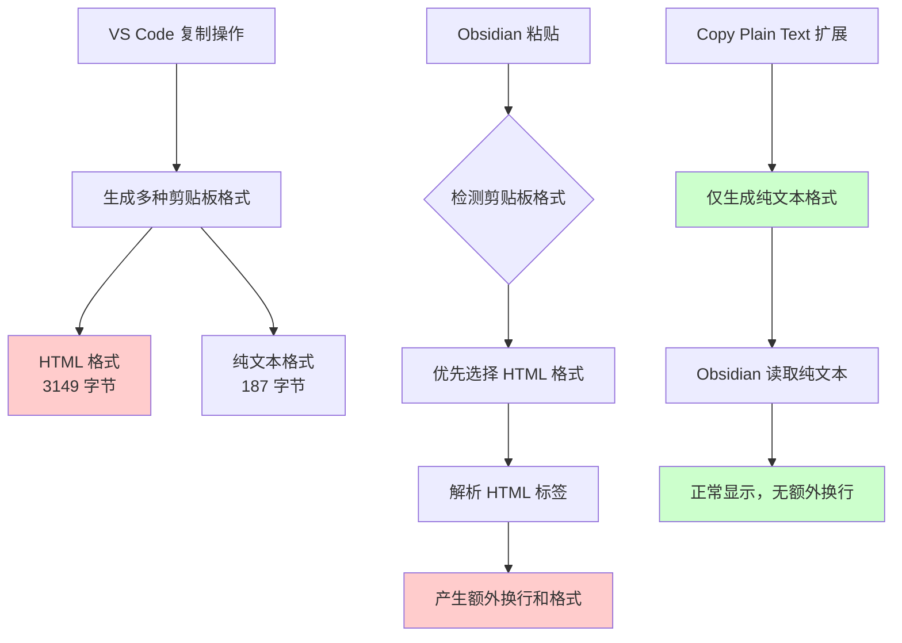

Вы когда-нибудь сталкивались с проблемой копирования кода или документов в VS Code и вставки их в Obsidian, Notion или другие редакторы Markdown, где к каждой строке необъяснимым образом добавляются дополнительные пустые строки? Форматирование выглядит нормально в VS Code, но когда вы вставляете его, оно становится неровным.

Это может показаться незначительной проблемой, но на самом деле она беспокоит многих разработчиков и документоведов. Сегодня мы решим эту проблему и подробно разберем технические принципы, лежащие в ее основе.

<! ---далее-->

## Проблемное явление

Предположим, вы менеджер по продуктам, и вам нужно скопировать содержимое файла конфигурации, написанного командой разработчиков в VS Code, в базу знаний Obsidian этой команды. Вы копируете содержимое следующим образом:

```yaml
- 功能点5
- 功能点11  
- 功能点13
- 功能点15
```.

но после вставки в Obsidian оно становится таким:

```yaml
- 功能点5

- 功能点11

- 功能点13

- 功能点15
```.

Между каждой строкой есть лишняя пустая строка, что сильно влияет на читабельность документа.

## Трехшаговое решение

### Шаг 1: Установите расширение Copy Plain Text.

1. Откройте VS Code
2. Щелкните на значке расширений слева или нажмите `Cmd+Shift+X`.
3. Введите "Copy Plain Text" в поле поиска.
4. Найдите расширение "Copy Plain Text" и нажмите на кнопку "Установить".

### Шаг 2: Выберите текст для копирования

Выберите текст, который вы хотите скопировать, в VS Code, как вы обычно это делаете.

### Шаг 3: Копирование с помощью обычного текста

Существует два способа использования копирования обычного текста:

**Метод 1: Меню правой кнопки мыши**.
- Выделите текст и щелкните правой кнопкой мыши.
- Выберите опцию "Копировать обычный текст

**Метод 2: клавиши быстрого доступа
- Нажмите `Ctrl+Option+C` (Mac) или `Ctrl+Alt+C` (Windows) после выделения текста.

Готово! Теперь вставьте текст в Obsidian или другие редакторы без лишних переносов строк.

## Более глубокое понимание: почему возникает эта проблема?

### Секреты буфера обмена

Когда вы используете обычное копирование (`Ctrl+C`) в VS Code, система на самом деле сохраняет данные в нескольких форматах в буфере обмена. Мы можем убедиться в этом с помощью простого эксперимента:

На macOS вы можете выполнить следующую команду в Терминале, чтобы увидеть содержимое буфера обмена:

```bash
# 从 VS Code 复制后查看剪贴板
osascript -e 'clipboard info'
```

Вы увидите вывод, похожий на этот:
```
«class HTML», 3149, «class utf8», 187, «class ut16», 376, string, 187, Unicode text, 374
```.

А если вы используете копирование обычного текста или инструменты командной строки:
```bash
# 使用纯文本方式复制后查看
cat file.txt | pbcopy
osascript -e 'clipboard info'
```

вывод изменится на:
```
«class utf8», 187, «class ut16», 376, string, 187, Unicode text, 374
```.

**Ключевое отличие**: обычная копия VS Code содержит формат `«class HTML»`, размер которого составляет 3149 байт, по сравнению с 187 байтами для обычного текста!

### Анализ первопричины проблемы



1. **Благие намерения VS Code**: для поддержки подсветки синтаксиса и форматирования VS Code генерирует форматирование насыщенного текста с HTML-тегами при копировании.
2. **Выбор Obsidian**: когда в буфере обмена одновременно присутствуют несколько форматов, Obsidian предпочтет HTML-форматирование.
3. **Конфликт форматирования**: информация о тегах в HTML интерпретируется как дополнительные разрывы строк и форматирование при рендеринге Markdown.

### Технические подробности: Структуры данных буфера обмена

Когда VS Code выполняет операцию копирования, на самом деле это выглядит следующим образом:

```javascript
// VS Code 内部逻辑（简化版）
clipboard.write({
    'text/html': generateHTMLWithSyntaxHighlighting(selectedText),
    'text/plain': selectedText
});
```.

А логика работы расширения Copy Plain Text такова:

```javascript
// Copy Plain Text 扩展逻辑（简化版）
clipboard.writeText(selectedText); // 仅写入纯文本
```.

## Другие решения

Если вы не хотите устанавливать расширения, есть несколько альтернатив:

### Вариант 1: Транзит из командной строки
```bash
# 将文件内容复制到剪贴板
cat your-file.txt | pbcopy  # macOS
cat your-file.txt | xclip -selection clipboard  # Linux
```

### Вариант 2: Настройки VS Code
Найдите "copy" в настройках VS Code, чтобы узнать, есть ли там соответствующий параметр формата копирования, который можно настроить.

### Вариант 3: Инструмент очистки текста
Создайте простой скрипт для очистки текста, чтобы справиться с текстом, который создает проблемы.

### Сценарий

Это решение особенно подходит для:

- **Составителей технической документации**: им необходимо часто копировать информацию между редакторами кода и инструментами документирования.
- **Менеджеров продуктов**: организация технической информации команды разработчиков в базе знаний.
- **Студенты и исследователи**: организуют учебные материалы между различными инструментами.
- **Создатели контента**: необходимо поддерживать согласованность форматирования текста

## Резюме

Проблема лишних разрывов строк при копировании и вставке в VS Code - это, по сути, проблема совместимости между форматированием насыщенного текста (HTML) и обычного текста при переносе между приложениями. Используя расширение Copy Plain Text, мы можем заставить копировать текст в формате обычного текста и добраться до корня проблемы.

За этим простым на первый взгляд решением стоит баланс между "богатством возможностей" и "совместимостью" в современном программном обеспечении. Понимание этих принципов не только поможет нам решить проблему, но и даст идеи для решения аналогичных проблем с передачей данных между приложениями.

---

*Нужны дополнительные технические подробности или возникли другие проблемы? Не стесняйтесь обсуждать и обмениваться мнениями в разделе комментариев. *
