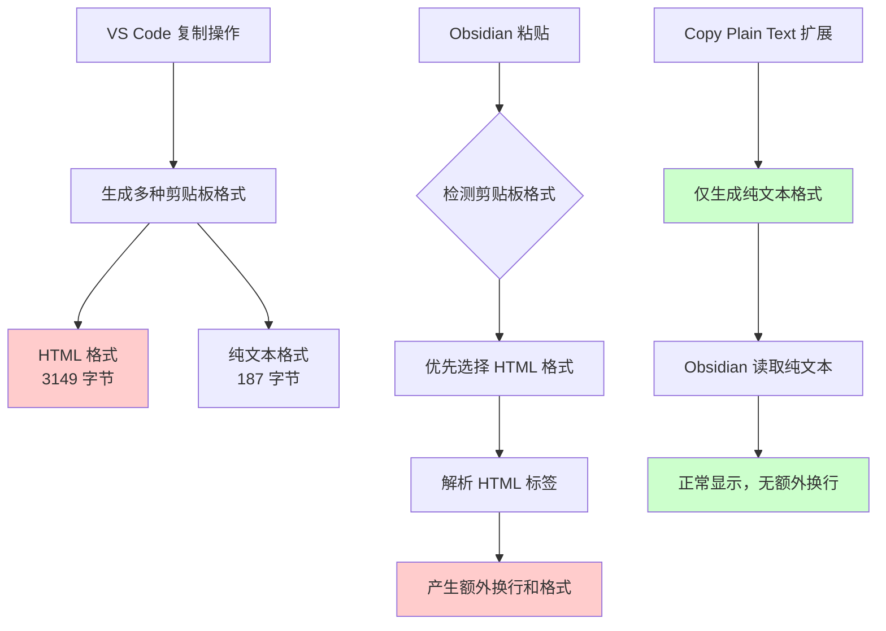

Вы когда-нибудь сталкивались с проблемой копирования кода или документов в VS Code и вставки их в Obsidian, Notion или другие редакторы Markdown, где к каждой строке необъяснимым образом добавляются дополнительные пустые строки? Форматирование выглядит нормально в VS Code, но когда вы вставляете его, оно становится неровным.

Эта, казалось бы, небольшая проблема на самом деле мучает многих разработчиков и документоведов. Сегодня мы собираемся решить эту проблему раз и навсегда и погрузиться в технические принципы, лежащие в ее основе.

<!--more-->

## 问题现象

Допустим, вы менеджер по продуктам, которому нужно скопировать содержимое файла конфигурации, написанного командой разработчиков в VS Code, в базу знаний Obsidian. Вы копируете что-то вроде этого:

```yaml
- 功能点5
- 功能点11  
- 功能点13
- 功能点15
```

Но если вставить его в Obsidian, он превратится в:

```yaml
- 功能点5

- Функциональная точка 11

- Функциональная точка 13

- 功能点15
```

Между каждой строкой есть лишняя пустая строка, что сильно ухудшает читабельность документа.

## 三步解决方案

### 第1步：安装 Copy Plain Text 扩展

1. Откройте VS Code
2. Щелкните на значке расширений слева или нажмите `Cmd+Shift+X`.
3. Введите "Copy Plain Text" в поле поиска.
4. Найдите расширение "Copy Plain Text" и нажмите на кнопку "Установить".

### 第2步：选择要复制的文本

Выберите текст, который нужно скопировать в VS Code, так же, как вы обычно копируете его.

### 第3步：使用纯文本复制

Существует два способа использования копирования обычного текста:

**Метод 1: Меню правой кнопки мыши**.
- Щелкните правой кнопкой мыши после выделения текста
- Выберите опцию "Копировать обычный текст

**Метод 2: клавиши быстрого доступа**
- Нажмите `Ctrl+Option+C` (Mac) или `Ctrl+Alt+C` (Windows), когда текст выделен.

Готово! Теперь вставьте в Obsidian или другие редакторы без лишних переносов строк.

## 深入理解：为什么会出现这个问题？

### 剪贴板的秘密

Когда вы используете обычное копирование (`Ctrl+C`) в VS Code, система на самом деле сохраняет данные в нескольких форматах в буфере обмена. Мы можем убедиться в этом с помощью простого эксперимента:

В macOS для просмотра содержимого буфера обмена можно выполнить следующую команду в Терминале:

```bash
# 从 VS Code 复制后查看剪贴板
osascript -e 'clipboard info'
```

你会看到类似这样的输出：
```
«class HTML», 3149, «class utf8», 187, «class ut16», 376, string, 187, Unicode text, 374
```

而如果使用纯文本复制或命令行工具：
```bash
# 使用纯文本方式复制后查看
cat file.txt | pbcopy
osascript -e 'clipboard info'
```

输出变为：
```
«class utf8», 187, «class ut16», 376, string, 187, Unicode text, 374
```

**Ключевое отличие**: обычная копия VS Code содержит формат ``класса HTML``, размер которого составляет 3 149 байт, в то время как обычный текст - всего 187 байт!

### 问题根源分析



1. **VS Code "приятное прикосновение "**: для поддержки подсветки синтаксиса и сохранения форматирования VS Code генерирует формат насыщенного текста с HTML-тегами при копировании.
2. **Выбор Obsidian**: когда в буфере обмена присутствует несколько форматов, Obsidian предпочитает формат HTML.
3. **Конфликт форматирования**: информация о тегах в HTML интерпретируется как дополнительные переносы строк и форматирование при рендеринге Markdown.

### 技术细节：剪贴板数据结构

Когда VS Code выполняет операцию копирования, это выглядит следующим образом:

```javascript
// VS Code 内部逻辑（简化版）
clipboard.write({
    'text/html': generateHTMLWithSyntaxHighlighting(selectedText),
    'text/plain': selectedText
});
```

Логика работы расширения Copy Plain Text такова:

```javascript
// Copy Plain Text 扩展逻辑（简化版）
clipboard.writeText(selectedText); // 仅写入纯文本
```

## 其他解决方案

Если вы не хотите устанавливать расширения, есть несколько альтернатив:

### 方案一：命令行中转
```bash
# 将文件内容复制到剪贴板
cat your-file.txt | pbcopy  # macOS
cat your-file.txt | xclip -selection clipboard  # Linux
```

### 方案二：VS Code 设置调整
在 VS Code 设置中搜索 "copy"，查看是否有相关的复制格式选项可以调整。

### 方案三：文本清理工具
创建一个简单的文本清理脚本来处理已经产生问题的文本。

## 适用场景

Это решение особенно подходит для:

- **Написатель технической документации**: требуется частое копирование между редакторами кода и средствами документирования
- **Менеджеры продуктов**: организация технической информации от команды разработчиков в базу знаний
- **Студенты и исследователи**: организация учебных материалов в различных инструментах
- **Создатели контента**: необходимо поддерживать последовательность в форматировании текста

## 总结

Проблема лишних разрывов строк при копировании и вставке в VS Code - это, по сути, проблема совместимости между форматом насыщенного текста (HTML) и обычным текстовым форматом при передаче данных между различными приложениями. Используя расширение Copy Plain Text, мы можем заставить копирование выполняться в формате обычного текста и добраться до корня проблемы.

За этим простым на первый взгляд решением стоит баланс между "богатством возможностей" и "совместимостью" в современном программном обеспечении. Понимание этих принципов не только поможет нам решить текущую проблему, но и даст идеи для решения аналогичных проблем с передачей данных между приложениями.

---

* Нужны дополнительные технические подробности или вы сталкивались с другими проблемами? Не стесняйтесь обсуждать и обмениваться идеями в разделе комментариев. *