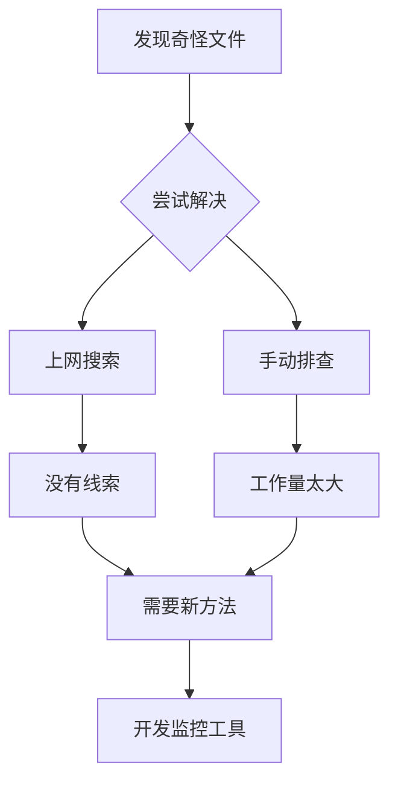
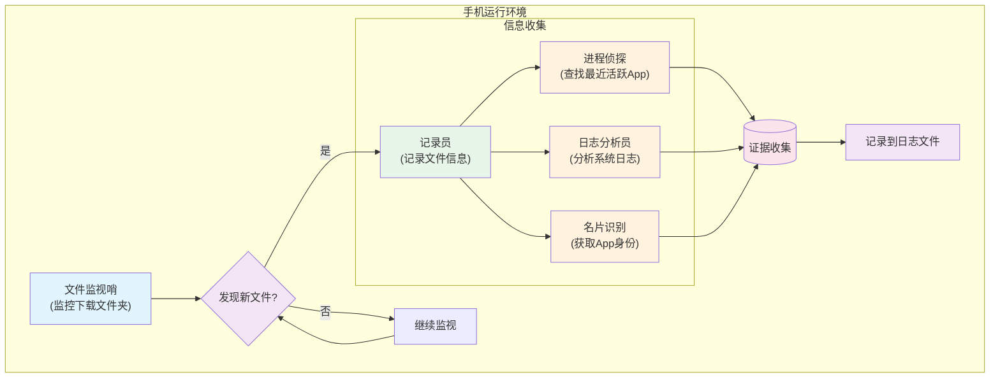
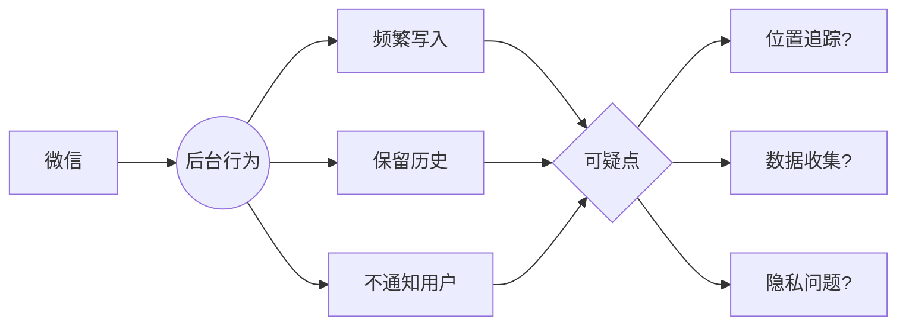

最近，我发现手机里的"下载"文件夹悄悄积累了很多奇怪的文件，它们都有一个共同特点：文件名要么是"flag"，要么是"mobiloc"。更奇怪的是，这些文件会不断生成新的版本，然后被压缩存档，日积月累竟然有二三十个之多！

<!--more-->


## 一个普通用户的烦恼

相信很多朋友和我一样，时不时会整理手机里的文件，删删照片、清理缓存，让手机保持整洁。但是在某一天整理文件时，我发现了一些让人困惑的现象：在"下载"文件夹里，总会出现一些莫名其妙的文件。

它们的特征很明显：
- 名字要么叫"flag"，要么叫"mobiloc"
- 大小非常固定，"flag"总是2.2MB，"mobiloc"总是4.9MB
- 这些文件会被压缩成zip包，但旧的zip包不会被删除
- 即使删掉这些文件，过不了多久又会重新出现

## 寻找真相

作为一个对技术感兴趣的普通用户，我开始了一段侦探之旅。

首先，我尝试在网上搜索这些文件的来源，但是几乎找不到有用的信息。于是我想到一个笨办法：把这些文件都删掉，然后一个一个打开手机里的App，看看是哪个App在偷偷生成这些文件。但是转念一想，我手机里装了几百个App，这样排查得累死人啊！



正好我认识一些程序员朋友，他们帮我开发了一个简单的监控工具。这个工具的原理很简单：

- 监控"下载"文件夹里的所有文件变动
- 记录是哪个App在操作这些文件
- 把发现的线索记录在日志里



## 真相大白

经过一晚上的监控，第二天一看日志，真相终于浮出水面！

```
TIMESTAMP               | EVENT        | PATH     | APP                | PACKAGE
------------------------------------------------------------------------------------------
2025-02-23 09:53:13.497 | CREATE       | flag     | 微信               | com.tencent.mm
2025-02-23 09:53:13.508 | CLOSE_WRITE  | flag     | 微信               | com.tencent.mm
2025-02-23 09:53:13.512 | CREATE       | mobiloc  | 微信               | com.tencent.mm
2025-02-23 09:53:13.517 | CLOSE_WRITE  | mobiloc  | 微信               | com.tencent.mm
```

没想到，这些文件竟然是微信在偷偷生成的！从日志中我们可以看到：
- 微信在后台同时创建了flag和mobiloc两个文件
- 这个过程是自动化的，用户完全不知情
- 文件生成非常频繁，而且不会主动清理

## 这意味着什么？

作为一个普通用户，看到这个发现，我不禁有些担忧：

1. 为什么微信要在我不使用的时候，频繁地生成这些文件？
2. "mobiloc"这个名字，看起来很像"mobile location"（移动位置）的缩写，难道是在记录我的位置信息？
3. 为什么要保留这么多历史文件，而不是只保留最新的？
4. 这些行为都是在后台悄悄进行的，用户完全不知情，这样合适吗？



## 我们能做什么？

如果你也发现了类似的情况，这里有一些建议：

1. 检查微信的位置权限设置：
   - 进入系统设置
   - 找到微信的权限管理
   - 关闭"位置信息"权限，尤其是"后台定位"权限

2. 定期清理：
   - 进入"下载"文件夹
   - 搜索"flag"和"mobiloc"
   - 删除这些文件和zip包

3. 提高警惕：
   - 注意App的后台行为
   - 经常检查手机存储
   - 关注隐私保护设置

这个发现让我意识到，在这个移动互联网时代，我们的隐私保护意识需要进一步提高。即使是每天都在使用的常用App，也可能在默默收集着我们不知道的信息。作为用户，我们有权利也有必要了解这些行为，并作出自己的选择。
