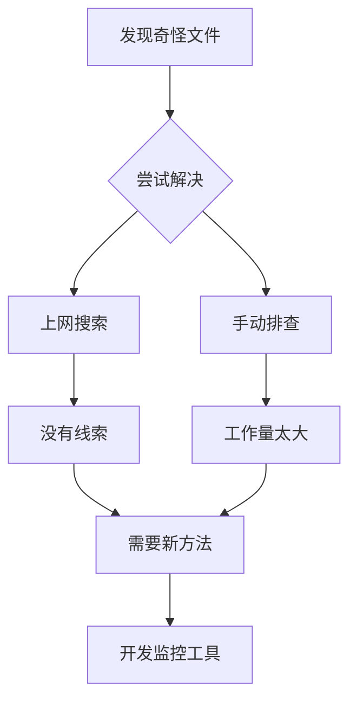
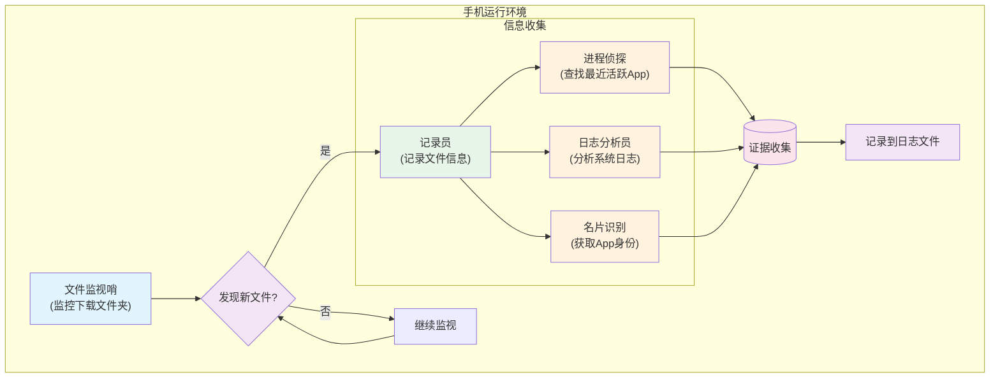
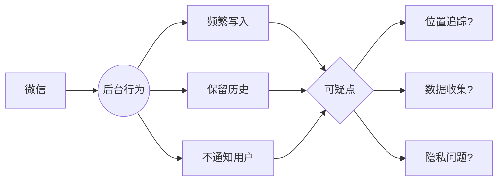

Недавно я обнаружил, что в папке "Загрузки" моего мобильного телефона незаметно скопилось множество странных файлов, все они имеют общую черту: имя файла либо "flag", либо "mobiloc". Что еще более странно, эти файлы будут продолжать генерировать новые версии, а затем сжимать архивы, день за днем, их уже двадцать или тридцать!

<!--more-->


## 一个普通用户的烦恼

Думаю, что многие друзья, как и я, время от времени разбираются с файлами в телефоне, удаляют фотографии, очищают кэш, чтобы телефон оставался чистым. Но однажды, наводя порядок в файлах, я обнаружил несколько непонятных явлений: в папке "Загрузки" постоянно находятся какие-то непонятные файлы.

Их характеристики очевидны:
- Название - либо "flag", либо "mobiloc".
- Размер очень постоянен, "flag" всегда 2,2 МБ, "mobiloc" всегда 4,9 МБ.
- Файлы сжимаются в zip-архив, но старый zip-архив не удаляется.
- Даже если файлы будут удалены, они появятся вновь через некоторое время.

## 寻找真相

Будучи случайным пользователем, интересующимся технологиями, я отправился в небольшое детективное путешествие.

Сначала я попытался найти в Интернете источник этих файлов, но практически не смог найти никакой полезной информации. Тогда я придумал глупый способ: удалить все эти файлы, а затем по очереди открывать приложения в телефоне, чтобы узнать, какое из них тайно генерирует эти файлы. Но если подумать, у меня в телефоне установлены сотни приложений, так что проверять их будет утомительно!



Так получилось, что у меня есть знакомые программисты, которые помогли мне разработать простой инструмент мониторинга. Принцип работы этого инструмента прост:

- Отслеживайте все изменения файлов в папке "Загрузки".
- Запишите, какое приложение управляет этими файлами.
- Запишите все улики, которые вы найдете в журналах.



## 真相大白

После ночи наблюдения и просмотра журналов на следующий день правда наконец-то всплыла!

```
TIMESTAMP               | EVENT        | PATH     | APP                | PACKAGE
------------------------------------------------------------------------------------------
2025-02-23 09:53:13.497 | CREATE       | flag     | 微信               | com.tencent.mm
2025-02-23 09:53:13.508 | CLOSE_WRITE  | flag     | 微信               | com.tencent.mm
2025-02-23 09:53:13.512 | CREATE       | mobiloc  | 微信               | com.tencent.mm
2025-02-23 09:53:13.517 | CLOSE_WRITE  | mobiloc  | 微信               | com.tencent.mm
```

Неожиданно оказалось, что эти файлы были тайно сгенерированы WeChat! Мы можем видеть это из журнала:
- WeChat создал файлы flag и mobiloc в фоновом режиме.
- Этот процесс автоматизирован, и пользователь о нем совершенно не знает.
- Этот процесс автоматизирован, и пользователь о нем не знает. Файлы создаются очень часто и не подвергаются активной очистке.

## 这意味着什么？

Будучи обычным пользователем, я не могу не быть немного обеспокоенным, когда вижу это открытие:

1. почему WeChat генерирует эти файлы так часто, когда я не пользуюсь им?
2. название "mobiloc" похоже на аббревиатуру "мобильное местоположение", записывает ли оно информацию о моем местоположении?
3. почему он хранит так много файлов истории, а не только последние?
4. уместно ли, что все эти действия выполняются беззвучно в фоновом режиме без ведома пользователя?



## 我们能做什么？

Если вы столкнулись с подобной ситуацией, вот несколько предложений:

1. Проверьте настройки разрешения местоположения в WeChat:
   - Перейдите в Системные настройки
   - Найдите управление разрешениями WeChat
   - Отключите разрешение "информация о местоположении", особенно разрешение "фоновое местоположение".

2. Регулярно проводите очистку:
   - Перейдите в папку "Загрузки".
   - Найдите "flag" и "mobiloc".
   - Удалите эти файлы и zip-пакеты

3. бдительность:
   - Следите за фоновым поведением приложений
   - Часто проверяйте хранилище телефона
   - Обращайте внимание на настройки конфиденциальности

Это открытие заставило меня понять, что в эпоху мобильного Интернета необходимо повышать нашу осведомленность о защите частной жизни. Даже обычные приложения, которыми мы пользуемся каждый день, могут бесшумно собирать информацию, о которой мы не подозреваем. Как пользователи, мы имеем право и должны быть осведомлены о таком поведении и делать свой собственный выбор.