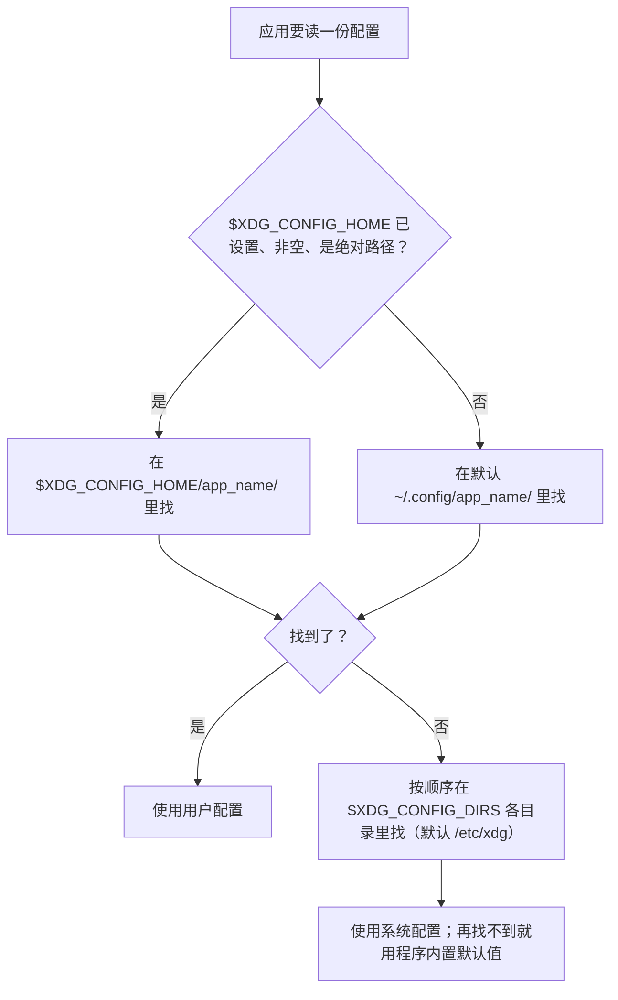

打开你的家目录看一眼（`ls -a ~`，或者用 `fd -H -d 1 . ~`），你大概率会看到两种秩序同时存在：

- 一批程序规规矩矩：配置放进 `~/.config`，数据放进 `~/.local/share`，缓存放进 `~/.cache`；
- 另一批程序我行我素：`.bashrc`、`.vimrc`、`.ssh`、`.mozilla`……直接占据家目录。

为什么前一种做法被叫做「XDG 标准」？XDG 是什么意思？这个约定到底规定了什么？

如果你拿这些问题去搜索，最流行的回答大致是：XDG 是 freedesktop.org 的旧名 **X Desktop Group** 的缩写，该组织 2003 年发布了 XDG 基础目录规范，定义了四个目录，用来终结家目录里点文件横飞的乱局。

<!--more-->

这个回答——对，但只答了一半。这篇文章把这份规范完整打开：7 个环境变量、4 条容易被跳过的行为细则、3 个常见误解，最后是把它们用起来的实操：审计自己的家目录，以及让自己写的工具遵守规范。

## 一、先回答"为什么叫 XDG"

先把名字的来历讲清楚，因为它能顺带解释一串你见过的工具名。

freedesktop.org 成立于 2000 年 3 月，发起人是 GNOME 开发者 Havoc Pennington。它的**最初名字就是 X Desktop Group（缩写 XDG）**——目标很朴素：让 GNOME、KDE、Xfce 这些各自为战的桌面环境，在互操作和共享基础技术上坐下来协作。后来组织改名为 freedesktop.org，但「XDG」这个前缀留了下来，挂在它产出的规范和工具上：XDG 基础目录规范、`xdg-utils`（里面的 `xdg-open` 你几乎肯定用过）、`xdg-user-dirs`、`xdg-desktop-portal`……

所以「XDG 标准」这个名字，本质是**组织旧名留下的化石**。

还有一个值得知道的事实：**freedesktop.org 不是正式的标准组织**（not a formal standards body）。它没有 ISO/IEEE 那样的编号与强制力，规范靠生态采用——GNOME、KDE 和主流发行版都实现了它，于是它成了**事实标准（de facto standard）**。这一点解释了后面很多现象：为什么规范里 "should" 多、"MUST" 少；为什么有的程序认真遵守、有的至今不理你。

而规范要解决的问题，在 2003 年发布时是这样的：最早的程序习惯把配置写成一个点文件（`.bashrc`、`.vimrc`），后来功能变多，一个文件装不下，就变成点目录（`.mozilla`、`.gimp-2.8`）。每个程序都这么干，家目录就变成了杂物间——备份不知道备哪些、迁移时四处漏文件、`ls -a` 的输出越滚越长。XDG 基础目录规范的第一句话就是冲着这个来的：给"什么文件放哪里"定一套统一的逻辑。

## 二、规范的全部家当：7 个环境变量

先把完整清单摆出来，这是全文的核心：

| 环境变量 | 默认值 | 存什么 |
|---------|--------|--------|
| `$XDG_CONFIG_HOME` | `~/.config` | 配置 |
| `$XDG_DATA_HOME` | `~/.local/share` | 值得长期保留的用户数据（数据库、插件、下载的模型…） |
| `$XDG_STATE_HOME` | `~/.local/state` | 跨重启要保留、但不如数据重要的状态（历史、最近打开、日志） |
| `$XDG_CACHE_HOME` | `~/.cache` | 可随时删、丢了能重建的缓存 |
| `$XDG_RUNTIME_DIR` | 无默认值 | 会话级运行时对象：socket、命名管道、PID 文件 |
| `$XDG_DATA_DIRS` | `/usr/local/share/:/usr/share/` | 系统级数据查找路径（只读） |
| `$XDG_CONFIG_DIRS` | `/etc/xdg` | 系统级配置查找路径（只读） |

按角色分成三组看：

- **4 个 `*_HOME`**：用户级、单一目录。你自己产生、自己管理的东西放这里。
- **2 个 `*_DIRS`**：系统级、冒号分隔的**有序列表**，表示"按顺序在这些目录里找"。用户级目录里的同名文件遮蔽系统级——这就给应用提供了「系统默认 + 用户覆盖」的两层模型。
- **1 个 `RUNTIME_DIR`**：角色特殊，没有默认值，下一节细说。

然后是那个具体的写法——`~/.config/app_name` 之类的子目录从哪来？规范定义的是**基目录**（base directory），惯例是每个应用在基目录下建一个以自己命名的子目录：配置放 `~/.config/app_name/`，数据放 `~/.local/share/app_name/`。这样"哪个程序放了什么"一目了然。

顺手记一个小彩蛋：规范还在"基础概念"里规定了一件事——**用户自己的可执行文件放在 `~/.local/bin`**，且发行版应当确保它在 `$PATH` 里。它是整套规范里唯一"指定了位置、却没有对应环境变量"的目录，也是很多工具安装脚本（以及 `pip install --user`）默认投放的地方。

一个完全遵守规范的家目录大致长这样：

```text
~/
├── .config/
│   └── app_name/          # 配置          → $XDG_CONFIG_HOME
├── .local/
│   ├── share/
│   │   └── app_name/      # 数据          → $XDG_DATA_HOME
│   ├── state/
│   │   └── app_name/      # 状态          → $XDG_STATE_HOME
│   └── bin/               # 可执行文件（规范规定，无环境变量）
├── .cache/
│   └── app_name/          # 缓存          → $XDG_CACHE_HOME
└── .bashrc / .vimrc / …   # 规范之外的历史遗留
```

## 三、4 条容易被跳过的细则

只看变量表还不够。规范里还有几条行为要求，决定了"规范友好的程序"到底长什么样。

**1. "变量没设置或为空"就回退默认值。** 规范的措辞是 "if not set or empty"——所以你在终端里 `echo $XDG_CONFIG_HOME` 大概率是空的，这是常态，不是配置出了问题。实际上，绝大多数系统里 7 个变量中只有 `$XDG_RUNTIME_DIR` 是主动设置的（Linux 上通常由 pam_systemd 在登录时设为 `/run/user/<uid>`），其余全靠**应用自己回退到默认值**。这带来一个推论：只要应用写得好，你什么都不配置就有整洁的家目录；只有当你想换位置时，才需要显式设置变量。

**2. 必须是绝对路径。** 规范明确：这些变量里出现的路径必须是绝对路径；应用如果读到相对路径，应当**视为无效并忽略**。原因很直接——相对路径的解析依赖当前工作目录，一个每次启动位置都可能不同的程序没法用它定位配置。

**3. 查找顺序：用户级优先，DIRS 从左到右。** 应用要读一份配置时，先查 `$XDG_CONFIG_HOME`（默认 `~/.config`），找不到再依次查 `$XDG_CONFIG_DIRS`（默认 `/etc/xdg`）。数据目录同理：



**4. `$XDG_RUNTIME_DIR` 有一串硬性要求。** 它是规范里 "MUST" 最密集的地方：目录必须归用户所有、只有该用户能读写、权限必须是 `0700`、生命周期绑定登录会话（登录创建、注销清除）、必须位于本地文件系统（通常是 tmpfs，不落磁盘）。它用来放 socket、锁文件、PID 这些"只在本次会话里活着"的东西——大文件不要放这里，因为它可能从未被写进磁盘，重启即消失。

## 四、三个常见误解

**误解一："XDG 标准 = 四个目录。"** 四个 `*_HOME` 只是用户级的半边天，完整清单是 7 个变量。而且这四个 `*_HOME` 不是同时诞生的：`$XDG_STATE_HOME` 是 **2021 年 5 月**、规范 **0.8 版**才补上的新成员。它出现之前，"状态"没有专属位置，只能被勉强塞进 cache（可能被清理工具误删）或 data（混在真正的数据里）——**这就是为什么直到今天，很多程序仍然把 history、日志写在 `~/.cache` 或 `~/.local/share`**。不是它们不守规矩，是分给它们的规矩出现得晚。

**误解二："freedesktop.org 的规范都叫 XDG。"** XDG 前缀沿用自组织的旧名，今天主要挂在一组相关规范和工具上：Base Directory、user-dirs、xdg-utils、xdg-desktop-portal。freedesktop.org 的规范家族远不止这些，名字也不都带这个前缀。真正值得记住的结论是：**在 `~/.config` 的语境里，「XDG 标准」指的就是《XDG 基础目录规范》这一个文件**。

**误解三："这是 Linux 标准。"** 规范面向的是一类场景——**UNIX-like 系统的桌面环境**，它是桌面约定，不是内核特性。Linux 是主战场；macOS 上主流应用遵循的是 Apple 自己的一套（`~/Library/Application Support`、`~/Library/Caches`…）；Windows 是 `%APPDATA%` 一套。所以 macOS 上出现 `~/.config`，通常意味着某个跨平台工具"选择了 Unix 风格的默认值"——你的家目录里会不会出现 `~/.config`，取决于那个工具的实现选择，而不是系统替你决定。

## 五、动手：审计你的家目录

原理讲完，看怎么用。分两个视角。

### 5.1 用户视角：把"钉子户"请进规范目录

**第一步：看一眼现状。**

```bash
ls -a ~            # 家目录全景
env | grep XDG     # 甚至可能一个变量都没设置——正常
```

**第二步：扫描 + 迁移建议，交给 xdg-ninja。** 这是一个 shell script，内置一个由社区维护的程序数据库：逐项检查你 `$HOME` 里"不应该在这里"的文件和目录，告诉你能不能迁、迁到哪里、怎么迁。比如它会告诉你：git 的 `.gitconfig` 可以迁到 `~/.config/git/config`；而 `.bashrc` 仍然迁不了（bash 至今没有官方 XDG 支持）。

```bash
git clone https://github.com/b3nj5m1n/xdg-ninja
cd xdg-ninja && ./xdg-ninja.sh
```

（注：Homebrew 上的版本落后于仓库，官方建议直接从 git HEAD 使用。它同时提供 ignore 机制，可以把不想迁的条目排除在报告之外。）

**第三步：接受一部分"钉子户"。** 规范是事实标准，不是强制标准——`.ssh` 这类目录至今没有官方迁移方式，`.gnupg` 的迁移也有自己的讲究。xdg-ninja 的价值是让你**知道哪些在规范外、为什么**，而不是 100% 清零。

最后，一般**不需要**手动设置任何 XDG 变量：应用会自己回退默认值。只有当你想改变位置时才显式设置，比如把缓存改到另一块盘：

```bash
export XDG_CACHE_HOME=~/fast-disk/.cache
```

### 5.2 开发者视角：让自己写的工具守规矩

如果你的工具还在往 `~/.yourapp` 写配置，劝你花十分钟迁进规范——各语言几乎都有现成库：

```python
from platformdirs import user_config_dir, user_cache_dir, user_state_dir

config_dir = user_config_dir("my-app")   # Linux: ~/.config/my-app
cache_dir  = user_cache_dir("my-app")    # Linux: ~/.cache/my-app
state_dir  = user_state_dir("my-app")    # Linux: ~/.local/state/my-app
# macOS 上同一段代码会返回 ~/Library/Application Support/my-app 等 Apple 目录
```

（Python 用 `platformdirs`；Rust 是 `directories` / `dirs` 系列 crate；其他语言也都有对应实现。同一套思路：Linux 走 XDG，macOS 走 Apple 目录，Windows 走 `%APPDATA%`。）

自己实现的话，三个最容易犯的错：

1. **把该持久的东西写进 cache。** 清理工具会心安理得地删掉 cache——历史记录、会话状态属于 state，不属于 cache。
2. **把程序自写的状态混进 config。** config 目录的定位是"用户可编辑的配置"；程序运行时自己写的视图、布局、undo 历史属于 state。
3. **只检查"变量存在"，不检查"非空 / 绝对路径"。** 规范要求两条都判（"not set **or empty**"；相对路径视为无效），漏判会在容器、CI 这类会把变量设成空值的环境里翻车。

写入时还有一条容易忽略的规范要求：创建基目录时应当使用 `0700` 权限——以用户为中心的目录，不需要对同机其他用户开放。

## 最后

回到开头的问题。「XDG 标准」这个名字，是一个组织旧名留下的化石；它真正的实体是一份 2003 年发布、2021 年仍在更新的规范——7 个环境变量、一套"用户级优先、系统级兜底"的查找规则，以及"程序的文件按用途各归其位"的设计哲学。

留一个问题给你：**打开你的家目录，数一数有多少个文件和目录不在 XDG 目录里？其中有没有哪个，是你今天就可以用 xdg-ninja 的建议请进去的？**
