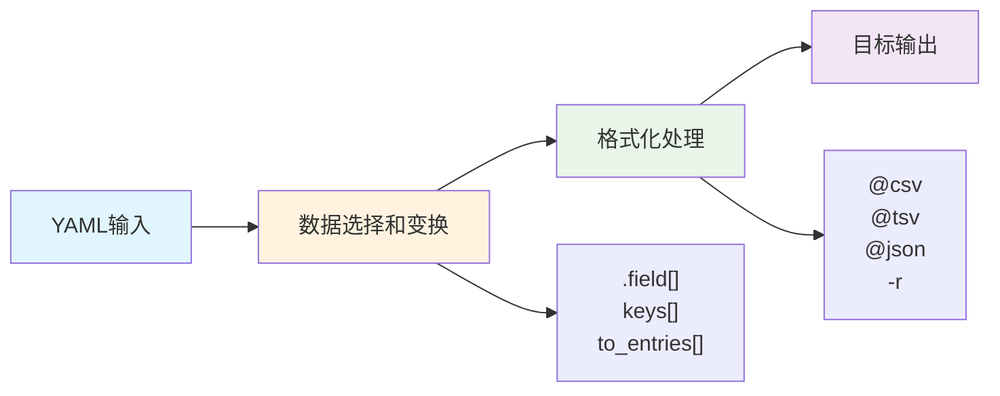
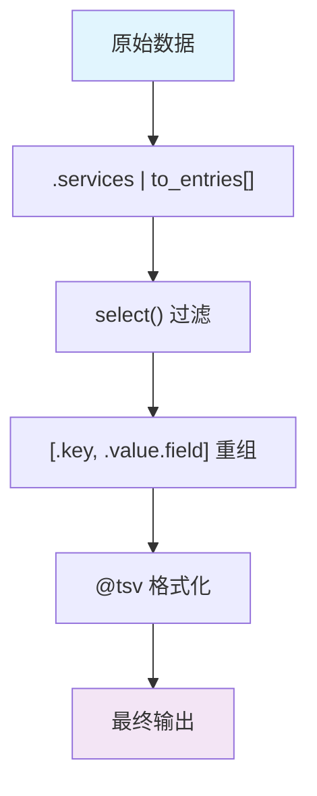

Представьте, что вы - инженер DevOps, у которого под рукой сложный конфигурационный файл Kubernetes, содержащий информацию о конфигурации десятков сервисов. Внезапно руководство просит вас извлечь таблицу Excel с именами, номерами версий и конфигурациями ресурсов всех сервисов. Использование традиционных методов может потребовать многочасового ручного копирования и вставки, но, овладев навыками управления выводом yq, эту задачу можно решить с помощью всего одной строки команды.

<!--more-->

## 为什么输出控制如此重要？

YAML стал стандартом де-факто для конфигурационных файлов в современных средах DevOps. От Kubernetes до конвейеров CI/CD, от конфигурации микросервисов до кода инфраструктуры - YAML присутствует везде. Однако оригинальная структура YAML часто не соответствует нашим потребностям:

- **Оперативному и обслуживающему персоналу** необходимо генерировать отчеты о мониторинге, требуется импорт Excel в формате CSV
- **Разработчику** необходимо извлечь переменные окружения, требуется формат Shell-скрипта
- **Менеджеру проекта** необходим список сервисов в виде краткой таблицы.
- **Аудитору безопасности** необходимо настроить разрешения, требуется формат JSON для обработки другими инструментами

yq - это не только инструмент для создания запросов на языке YAML, но и мощный конвертер форматов данных. Освоить управление его выводом - все равно что овладеть магией преобразования данных.

## yq输出控制的核心理念

### 数据流转的三个阶段

Обработка данных в yq происходит по четкой схеме: ** входная структура → логика преобразования → выходной формат**.



### 序列化：理解yq的数据观

yq рассматривает все данные как **последовательность**. Это ключ к пониманию управления выводом:

- Массивы сами являются последовательностями: `["a", "b", "c"]`.
- Массивы объектов - это последовательности последовательностей: значения свойств каждого объекта образуют последовательность.
- Оператор `[]` - это сердце сериализации: он "сплющивает" структурированные данные в последовательность.

## 实战场景：从基础到高级

Давайте освоим различные техники управления выходом yq на примере распространенных реальных сценариев в DevOps.

### 场景1：服务配置管理

Предположим, у вас есть такой профиль обслуживания:

```yaml
services:
  web-app:
    image: "nginx:1.21"
    replicas: 3
    resources:
      cpu: "500m"
      memory: "512Mi"
    ports: [80, 443]
  api-service:
    image: "node:16-alpine"
    replicas: 2
    resources:
      cpu: "1000m"
      memory: "1Gi"
    ports: [3000, 9090]
  database:
    image: "postgres:14"
    replicas: 1
    resources:
      cpu: "2000m" 
      memory: "2Gi"
    ports: [5432]
```

#### 基础查询：获取服务列表

```bash
# 获取所有服务名称
yq 'keys[]' services.yaml
```

输出：
```
web-app
api-service
database
```

#### 表格化输出：生成资源配置报告

```bash
# 生成TSV格式的资源配置表
yq '.services | to_entries[] | [.key, .value.image, .value.replicas, .value.resources.cpu, .value.resources.memory] | @tsv' services.yaml
```

输出：
```
web-app        nginx:1.21      3   500m    512Mi
api-service    node:16-alpine  2   1000m   1Gi
database       postgres:14     1   2000m   2Gi
```

Полученные результаты можно импортировать непосредственно в Excel или другие инструменты для работы с электронными таблицами.

#### 自定义格式：生成Shell配置

```bash
# 生成环境变量格式
yq '.services | to_entries[] | .key + "_IMAGE=" + .value.image' services.yaml
```

输出：
```
web-app_IMAGE=nginx:1.21
api-service_IMAGE=node:16-alpine
database_IMAGE=postgres:14
```

### 场景2：复杂嵌套结构的处理

В реальных корпоративных средах конфигурация часто бывает более сложной. Ниже приведен пример конфигурации с несколькими окружениями и несколькими арендаторами:

```yaml
environments:
  production:
    tenants:
      customer-a:
        services:
          - name: "web"
            version: "v1.2.3"
            resources: {cpu: "1000m", memory: "1Gi"}
          - name: "api"
            version: "v2.1.0"
            resources: {cpu: "500m", memory: "512Mi"}
      customer-b:
        services:
          - name: "web"
            version: "v1.2.1" 
            resources: {cpu: "2000m", memory: "2Gi"}
  staging:
    tenants:
      customer-a:
        services:
          - name: "web"
            version: "v1.3.0-beta"
            resources: {cpu: "500m", memory: "512Mi"}
```

#### 展开多层嵌套数据

```bash
# 生成完整的服务部署清单
yq '.environments | to_entries[] | .key as $env | .value.tenants | to_entries[] | .key as $tenant | .value.services[] | [$env, $tenant, .name, .version, .resources.cpu, .resources.memory] | @tsv' complex.yaml
```

输出：
```
production  customer-a  web  v1.2.3      1000m  1Gi
production  customer-a  api  v2.1.0      500m   512Mi
production  customer-b  web  v1.2.1      2000m  2Gi
staging     customer-a  web  v1.3.0-beta 500m   512Mi
```

Этот формат вывода особенно удобен для импорта в инструменты управления проектами или системы мониторинга.

### 场景3：日志和监控数据处理

Усилия DevOps часто требуют извлечения информации, связанной с мониторингом, из конфигураций:

```yaml
monitoring:
  alerts:
    cpu_usage:
      threshold: 80
      severity: "warning"
      targets: ["web-app", "api-service"]
    memory_usage:
      threshold: 90
      severity: "critical" 
      targets: ["database"]
    disk_usage:
      threshold: 85
      severity: "warning"
      targets: ["web-app", "database"]
```

#### 生成监控配置JSON

```bash
# 生成Prometheus告警规则格式
yq '.monitoring.alerts | to_entries[] | {"alert": .key, "expr": (.key + " > " + (.value.threshold | tostring) + "%"), "severity": .value.severity, "targets": .value.targets} | @json' monitoring.yaml
```

输出：
```json
{"alert":"cpu_usage","expr":"cpu_usage > 80%","severity":"warning","targets":["web-app","api-service"]}
{"alert":"memory_usage","expr":"memory_usage > 90%","severity":"critical","targets":["database"]}
{"alert":"disk_usage","expr":"disk_usage > 85%","severity":"warning","targets":["web-app","database"]}
```

## 格式化选项详解

### 表格格式家族

#### @tsv (Tab-Separated Values)
- **适用场景**：数据包含逗号或需要Excel导入
- **特点**：制表符分隔，处理特殊字符能力强

```bash
yq '.data[] | [.field1, .field2] | @tsv'
```

#### @csv (Comma-Separated Values) 
- **适用场景**：标准CSV文件需求
- **特点**：自动处理引号转义

```bash
yq '.data[] | [.field1, .field2] | @csv'
```

#### @html (HTML Table)
- **适用场景**：Web报告或文档嵌入
- **特点**：直接生成HTML表格

```bash
yq '.data[] | [.field1, .field2] | @html'
```

### 结构化格式

#### @json
- **适用场景**：API调用、配置文件生成
- **特点**：标准JSON格式，适合程序处理

```bash
yq '.config | @json'
```

#### @yaml
- **适用场景**：配置文件转换、备份
- **特点**：YAML格式输出

```bash
yq '.subset | @yaml'
```

### 编程友好格式

#### @sh (Shell Variables)
- **适用场景**：生成Shell脚本、环境变量
- **特点**：自动处理特殊字符转义

```bash
yq '.config | to_entries[] | .key + "=" + (.value | tostring | @sh)'
```

#### @base64/@uri
- **适用场景**：数据编码、URL参数
- **特点**：自动编码处理

```bash
yq '.secret | @base64'
```

## 高级技巧和最佳实践

### 条件输出和过滤

```bash
# 只输出高CPU使用的服务
yq '.services | to_entries[] | select(.value.resources.cpu | tonumber > 1000) | [.key, .value.resources.cpu] | @tsv'

# 按环境分组输出
yq '.environments.production | keys[] | select(. | contains("customer"))'
```

### 数据重构和计算

```bash
# 计算总资源使用量
yq '.services[] | .resources.cpu | sub("m"; "") | tonumber' services.yaml | awk '{sum+=$1} END {print sum "m"}'

# 生成摘要报告
yq '.services | length as $total | "Total services: " + ($total | tostring)' services.yaml
```

### 管道组合的艺术

Настоящая мощь yq заключается в комбинациях операций на конвейере. Несколько мощных режимов комбинирования показаны ниже:



## 性能优化和注意事项

### 大文件处理

При работе с большими файлами YAML учитывайте следующие стратегии оптимизации:

1. **Используйте потоковую передачу**: избегайте загрузки всего файла в память за один раз
2. **Точный запрос**: используйте конкретные пути вместо глобального поиска
3. **Пакетная обработка**: разбиение больших файлов на более мелкие логические единицы

### 错误处理

```bash
# 安全的字段访问
yq '.field // "default_value"' data.yaml

# 类型检查
yq '.field | type' data.yaml

# 存在性检查  
yq 'has("field")' data.yaml
```

### 调试技巧

```bash
# 查看中间结果
yq '.data | debug' input.yaml

# 类型分析
yq '.[] | [., type] | @csv' input.yaml

# 结构探索
yq 'paths' input.yaml
```

## 与其他工具的集成

Контроль выхода yq позволяет идеально интегрироваться в существующие цепочки инструментов DevOps:

### 与Excel/Google Sheets集成

```bash
# 生成带表头的TSV文件
echo -e "Service\tImage\tReplicas\tCPU\tMemory" > report.tsv
yq '.services | to_entries[] | [.key, .value.image, .value.replicas, .value.resources.cpu, .value.resources.memory] | @tsv' services.yaml >> report.tsv
```

### 与数据库集成

```bash
# 生成SQL插入语句
yq '.services | to_entries[] | "INSERT INTO services VALUES ('\''" + .key + "'\', '\'' " + .value.image + "'\');"'
```

### 与监控工具集成

```bash
# 生成Prometheus配置
yq '.monitoring.targets[] | "  - targets: [\"" + .host + ":" + (.port | tostring) + "\"]"' monitoring.yaml
```

## 实际应用案例分析

### 案例：微服务配置审计

Компании необходимо провести аудит конфигурации безопасности в архитектуре микросервисов. Ключевая информация может быть быстро извлечена с помощью yq:

```bash
# 提取所有对外暴露的服务和端口
yq '.services | to_entries[] | select(.value.expose == true) | [.key, .value.ports[]] | @csv' services.yaml

# 检查镜像版本一致性
yq '.services[].image | sub(":.*"; "") | unique' services.yaml

# 生成安全扫描清单
yq '.services | to_entries[] | {"service": .key, "image": .value.image, "ports": .value.ports} | @json' services.yaml
```

### 案例：环境配置对比

Командам DevOps необходимо сравнивать различия в конфигурации между производственными и тестовыми средами:

```bash
# 生成环境配置对比表
yq eval-all '. as $item ireduce ({}; . * $item)' prod.yaml staging.yaml | \
yq 'to_entries[] | [.key, (.value.prod.replicas // "N/A"), (.value.staging.replicas // "N/A")] | @csv'
```

## 总结与展望

Возможности управления выводом в yq выходят далеко за рамки преобразования форматов; это полноценная экосистема обработки данных. Овладейте этими навыками и вы сможете:

- **Повышенная производительность**: автоматизируйте задачи работы с данными, которые в противном случае выполнялись бы вручную
- **Улучшенная визуализация данных**: преобразуйте сложные конфигурации в интуитивно понятные таблицы и графики
- **Улучшение интеграции инструментов**: устранение барьеров для передачи данных между различными системами
- **Оптимизация процессов эксплуатации и обслуживания**: создание стандартизированных процессов управления конфигурацией и мониторинга

По мере развития облачных нативных технологий конфигурационные файлы YAML будут становиться все сложнее. Овладение навыками управления выводом yq позволит вам не только решить текущие проблемы, но и подготовиться к будущему развитию технологий.

В эпоху искусственного интеллекта и автоматизации операций возможности обработки данных станут основной конкурентоспособностью технических специалистов. yq, как швейцарский армейский нож в экосистеме YAML, заслуживает глубокого освоения каждым инженером DevOps.