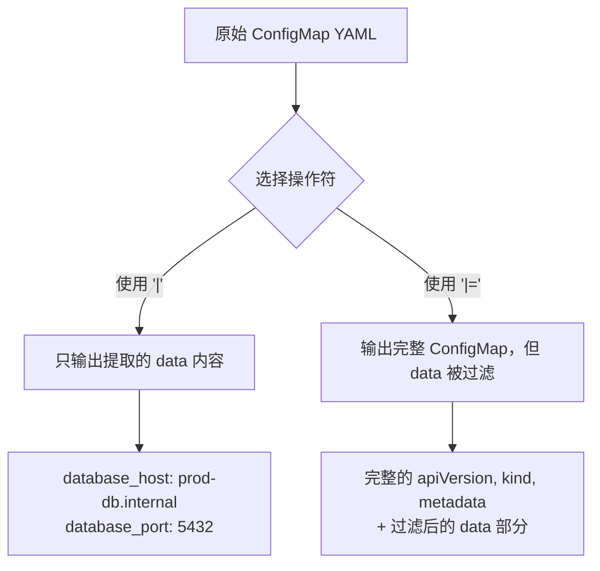
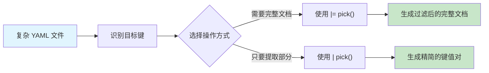

在日常的 DevOps 工作中，我们经常需要从复杂的 YAML 配置文件中提取特定的键值对。无论是处理 Kubernetes ConfigMap、Helm values 文件，还是各种应用配置，精确地选择所需的配置项是一项常见但重要的任务。

<!--more-->

## 问题场景

想象一下，你正在维护一个微服务架构的应用，有一个包含数十个配置项的 ConfigMap：

```yaml
apiVersion: v1
kind: ConfigMap
metadata:
  name: app-config
  namespace: production
data:
  # 数据库配置
  database_host: "prod-db.internal"
  database_port: "5432"
  database_name: "app_prod"
  database_username: "app_user"
  database_password_ref: "db-secret"
  
  # 缓存配置
  redis_host: "redis-cluster.internal"
  redis_port: "6379"
  redis_cluster_mode: "true"
  
  # 应用设置
  app_debug: "false"
  app_log_level: "info"
  app_timeout: "30s"
  
  # 监控配置
  metrics_enabled: "true"
  metrics_port: "9090"
  
  # 其他配置项...
  feature_flag_new_ui: "true"
  maintenance_mode: "false"
```

现在你只想提取数据库相关的配置项进行单独管理或迁移，传统的做法可能需要手动复制粘贴，或者写复杂的脚本。

## yq pick 操作符：优雅的解决方案

`yq` 的 `pick` 操作符专为这种场景设计，它能够从 map（映射）中筛选出指定的键列表，保持键的顺序，并自动跳过不存在的键。

### 基本语法

```bash
# 提取特定键并返回新的 YAML 结构
yq '.data | pick(["key1", "key2", "key3"])' file.yaml

# 更新原始文档中的特定部分
yq '.data |= pick(["key1", "key2", "key3"])' file.yaml
```

### 操作符对比：`|` vs `|=`

理解这两个操作符的区别对于正确使用 `pick` 至关重要：



**示例对比：**

使用 `|` 操作符（管道）：
```bash
yq '.data | pick(["database_host", "database_port", "database_name"])' config.yaml
```
输出：
```yaml
database_host: "prod-db.internal"
database_port: "5432"
database_name: "app_prod"
```

使用 `|=` 操作符（更新赋值）：
```bash
yq '.data |= pick(["database_host", "database_port", "database_name"])' config.yaml
```
输出：
```yaml
apiVersion: v1
kind: ConfigMap
metadata:
  name: app-config
  namespace: production
data:
  database_host: "prod-db.internal"
  database_port: "5432"
  database_name: "app_prod"
```

## 实际应用场景

### 场景 1：环境配置迁移

当你需要将生产环境的配置迁移到测试环境，但只需要部分配置项：

```bash
# 提取数据库和缓存配置用于测试环境
yq '.data |= pick([
  "database_host", "database_port", "database_name",
  "redis_host", "redis_port"
])' prod-config.yaml > test-config.yaml
```

### 场景 2：创建专用配置文件

为特定组件创建精简的配置文件：

```bash
# 为监控组件提取相关配置
yq '.data | pick(["metrics_enabled", "metrics_port", "app_log_level"])' app-config.yaml \
  | yq '. as $data | {"apiVersion": "v1", "kind": "ConfigMap", "metadata": {"name": "monitoring-config"}, "data": $data}'
```

### 场景 3：Helm Values 处理

在 Helm chart 中，经常需要从复杂的 values.yaml 中提取特定部分：

```bash
# 从 Helm values 中提取数据库配置
yq '.database | pick(["host", "port", "credentials"])' values.yaml
```

### 场景 4：批量配置管理

处理多个配置文件时，统一提取相同的键：

```bash
# 批量处理多个环境的配置文件
for env in dev staging prod; do
  yq '.data |= pick(["app_name", "app_version", "replicas"])' "${env}-config.yaml"
done
```

## 高级技巧

### 1. 动态键选择

结合其他 yq 操作符，可以实现动态的键选择：

```bash
# 选择所有以 "database_" 开头的键
yq '.data | with_entries(select(.key | test("^database_")))' config.yaml

# 或者使用 pick 结合 keys 过滤
yq '.data | pick(.data | keys | map(select(. | test("^database_"))))' config.yaml
```

### 2. 保持原有键的顺序

如果需要保持原始文件中键的顺序，可以这样做：

```bash
# 先获取所有键，然后与目标键取交集
yq '.data |= pick((keys | map(select(. as $k | ["database_host", "redis_host", "app_debug"] | index($k)))))' config.yaml
```

### 3. 条件性键选择

根据值的内容选择键：

```bash
# 只选择值为 "true" 的布尔配置
yq '.data | with_entries(select(.value == "true"))' config.yaml
```

## 可视化工作流程



## 与其他工具的对比

| 工具/方法 | 优势 | 劣势 |
|----------|------|------|
| **yq pick** | 语法简洁，保持键顺序，自动跳过不存在的键 | 需要安装 yq |
| **jq + yq** | 功能强大，可处理复杂逻辑 | 语法复杂，需要两个工具 |
| **手动编辑** | 无需工具 | 容易出错，不适合批量处理 |
| **自定义脚本** | 高度定制化 | 开发成本高，维护困难 |

## 性能考量

对于大型 YAML 文件（如包含数千个配置项的企业级配置），`pick` 操作符的性能表现：

- **内存使用**：yq 会将整个 YAML 加载到内存，对于超大文件需要注意内存限制
- **处理速度**：pick 操作是 O(n) 复杂度，其中 n 是目标键的数量
- **建议**：对于超过 100MB 的 YAML 文件，建议先进行分块处理

## 最佳实践

1. **键名验证**：在生产环境中使用前，先验证目标键是否存在：
   ```bash
   yq '.data | keys | map(select(. == "target_key"))' config.yaml
   ```

2. **备份原文件**：在使用 `-i` 选项修改文件前，务必备份：
   ```bash
   cp config.yaml config.yaml.backup
   yq -i '.data |= pick(["key1", "key2"])' config.yaml
   ```

3. **版本兼容性**：确保使用 yq v4+ 版本，语法与 v3 不兼容

4. **错误处理**：在脚本中加入错误检查：
   ```bash
   if ! yq '.data | pick(["key1"])' config.yaml > output.yaml; then
     echo "Error processing YAML file"
     exit 1
   fi
   ```

## 总结

`yq pick` 操作符为 YAML 配置管理提供了一个强大而优雅的解决方案。它不仅简化了从复杂配置文件中提取特定键值的过程，还保证了操作的准确性和可重复性。

通过掌握 `pick` 操作符及其与其他 yq 操作符的组合使用，DevOps 工程师可以显著提升配置管理的效率，减少手动操作的错误率，并建立更加自动化的配置处理流程。

在 Kubernetes、微服务架构和基础设施即代码的时代，这样的工具技能不仅能提升日常工作效率，更是构建可维护、可扩展系统的基础能力。

---

*你是否在实际工作中遇到过需要频繁从复杂 YAML 配置中提取特定配置项的场景？尝试使用 `yq pick` 来改造你现有的配置管理脚本，看看能带来怎样的效率提升。*
