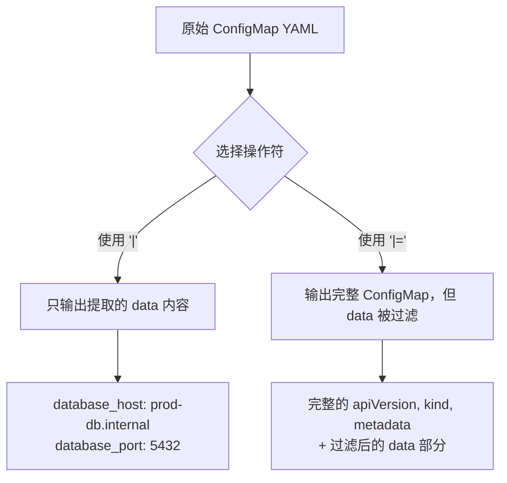

В повседневной работе DevOps нам часто приходится извлекать определенные пары ключ-значение из сложных конфигурационных файлов YAML. Работаете ли вы с Kubernetes ConfigMap, файлами значений Helm или различными конфигурациями приложений, точный выбор необходимых элементов конфигурации является распространенной, но важной задачей.

<! --подробнее-->

## Сценарий проблемы

Представьте, что вы поддерживаете приложение с архитектурой микросервисов с ConfigMap, содержащим десятки элементов конфигурации:

```yaml
apiVersion: v1
kind: ConfigMap
metadata:
  name: app-config
  namespace: production
data:
  # 数据库配置
  database_host: "prod-db.internal"
  database_port: "5432"
  database_name: "app_prod"
  database_username: "app_user"
  database_password_ref: "db-secret"
  
  # 缓存配置
  redis_host: "redis-cluster.internal"
  redis_port: "6379"
  redis_cluster_mode: "true"
  
  # 应用设置
  app_debug: "false"
  app_log_level: "info"
  app_timeout: "30s"
  
  # 监控配置
  metrics_enabled: "true"
  metrics_port: "9090"
  
  # 其他配置项...
  feature_flag_new_ui: "true"
  maintenance_mode: "false"
```.

Теперь вы хотите извлечь только элементы конфигурации, связанные с базой данных, для индивидуального управления или миграции, что традиционно требует копирования и вставки вручную или написания сложных сценариев.

## Оператор yq pick: элегантное решение

Оператор `pick` из `yq` предназначен для этого сценария, фильтруя заданный список ключей из карты, сохраняя порядок ключей и автоматически пропуская несуществующие ключи.

### Основной синтаксис

```bash
# 提取特定键并返回新的 YAML 结构
yq '.data | pick(["key1", "key2", "key3"])' file.yaml

# 更新原始文档中的特定部分
yq '.data |= pick(["key1", "key2", "key3"])' file.yaml
```

### Сравнение операторов: `|` против `|=`.

Понимание разницы между этими двумя операторами очень важно для правильного использования `pick`:



```mermaid
graph TD
    A[原始 ConfigMap YAML] --> B{选择操作符}
    B -->|"使用 '|'"| C[只输出提取的 data 内容]
    B -->|"使用 '|='"| D[输出完整 ConfigMap，但 data 被过滤]
    
    C --> E[database_host: prod-db.internal<br/>database_port: 5432]
    D --> F[完整的 apiVersion, kind, metadata<br/>+ 过滤后的 data 部分]
``` **Пример сравнения: **

Используйте оператор `|` (конвейер):
```bash
yq '.data | pick(["database_host", "database_port", "database_name"])' config.yaml
```
Выход:
```yaml
database_host: "prod-db.internal"
database_port: "5432"
database_name: "app_prod"
```.

Использование оператора `|=` (назначение обновления):
```bash
yq '.data |= pick(["database_host", "database_port", "database_name"])' config.yaml
```
Выход:
```yaml
apiVersion: v1
kind: ConfigMap
metadata:
  name: app-config
  namespace: production
data:
  database_host: "prod-db.internal"
  database_port: "5432"
  database_name: "app_prod"
```.

## Практические сценарии применения

### Сценарий 1: Миграция среды

Когда вам необходимо перенести конфигурацию производственной среды в тестовую среду, но нужны только некоторые элементы конфигурации:

```bash
# 提取数据库和缓存配置用于测试环境
yq '.data |= pick([
  "database_host", "database_port", "database_name",
  "redis_host", "redis_port"
])' prod-config.yaml > test-config.yaml
```.

### Сценарий 2: Создание специального файла конфигурации

Создание оптимизированных конфигурационных файлов для определенных компонентов:

```bash
# 为监控组件提取相关配置
yq '.data | pick(["metrics_enabled", "metrics_port", "app_log_level"])' app-config.yaml \
  | yq '. as $data | {"apiVersion": "v1", "kind": "ConfigMap", "metadata": {"name": "monitoring-config"}, "data": $data}'
```.

### Сценарий 3: Обработка значений Helm

В диаграммах Helm часто требуется извлечь определенные части сложного файла values.yaml:

```bash
# 从 Helm values 中提取数据库配置
yq '.database | pick(["host", "port", "credentials"])' values.yaml
```

### Сценарий 4: Управление массовыми конфигурациями

При обработке нескольких файлов конфигурации извлекайте одни и те же ключи одинаково:

```bash
# 批量处理多个环境的配置文件
for env in dev staging prod; do
  yq '.data |= pick(["app_name", "app_version", "replicas"])' "${env}-config.yaml"
done
```.

## Дополнительные советы

### 1. Динамический выбор клавиш

В сочетании с другими операторами yq можно добиться динамического выбора клавиш:

```bash
# 选择所有以 "database_" 开头的键
yq '.data | with_entries(select(.key | test("^database_")))' config.yaml

# 或者使用 pick 结合 keys 过滤
yq '.data | pick(.data | keys | map(select(. | test("^database_"))))' config.yaml
```.

### 2. Сохранение исходного порядка ключей

Если вам нужно сохранить порядок ключей в исходном файле, вы можете сделать следующее:

```bash
# 先获取所有键，然后与目标键取交集
yq '.data |= pick((keys | map(select(. as $k | ["database_host", "redis_host", "app_debug"] | index($k)))))' config.yaml
```.

### 3. Условный выбор ключа

Выбор ключа на основе содержимого значения:

```bash
# 只选择值为 "true" 的布尔配置
yq '.data | with_entries(select(.value == "true"))' config.yaml
```.

## Рабочий процесс визуализации


## Сравнение с другими инструментами

| Инструменты/методы | Сильные стороны | Слабые стороны |
| ----------|------|------|
| **yq pick** | Лаконичный синтаксис, сохраняет порядок ключей, автоматически пропускает несуществующие ключи | Требуется установка yq |
| **jq + yq** | Мощный, может обрабатывать сложную логику | Сложный синтаксис, нужны два инструмента |
| **Ручное редактирование** | Не требует никаких инструментов | Склонен к ошибкам, не подходит для пакетной обработки |
| **Настраиваемые скрипты** | Высокая настраиваемость | Высокая стоимость разработки, сложно поддерживать |

## Оценка производительности

Производительность оператора `pick` для больших файлов YAML, таких как конфигурации корпоративного класса, содержащие тысячи элементов конфигурации:

- **Использование памяти**: yq загружает весь YAML в память, поэтому помните об ограничениях памяти для очень больших файлов.
- **Скорость обработки**: операция pick имеет сложность O(n), где n - количество целевых ключей.
- **Рекомендация**: для YAML-файлов размером более 100 МБ рекомендуется сначала выполнить чанкинг.

## Лучшие практики

1. **Проверка имени ключа**: Убедитесь, что целевой ключ существует, прежде чем использовать его в производственной среде:
   ```bash
   yq '.data | keys | map(select(. == "target_key"))' config.yaml
   ```.

2. **Бакап исходного файла**: Перед модификацией файла с помощью опции `-i` обязательно создайте его резервную копию:
   ```bash
   cp config.yaml config.yaml.backup
   yq -i '.data |= pick(["key1", "key2"])' config.yaml
   ```

3. **Совместимость версий**: Убедитесь, что используете версию yq v4+, синтаксис не совместим с v3.

4. **Обработка ошибок**: добавьте проверку ошибок в скрипт:
   ```bash
   if ! yq '.data | pick(["key1"])' config.yaml > output.yaml; then
     echo "Error processing YAML file"
     exit 1
   fi
   ```.

## Резюме

Оператор `yq pick` представляет собой мощное и элегантное решение для управления конфигурацией YAML. Он не только упрощает процесс извлечения конкретных ключевых значений из сложных конфигурационных файлов, но и обеспечивает точность и повторяемость операций.

Освоив оператор `pick` и используя его в сочетании с другими операторами yq, инженеры DevOps смогут значительно повысить эффективность управления конфигурациями, уменьшить количество ошибок, допускаемых вручную, и создать более автоматизированные процессы конфигурирования.

В эпоху Kubernetes, микросервисных архитектур и инфраструктуры-как-код такие навыки работы с инструментами не только повышают повседневную производительность, но и являются основой для создания обслуживаемых и масштабируемых систем.

---

* Вы когда-нибудь сталкивались со сценарием, в котором вам нужно часто извлекать определенные элементы конфигурации из сложных YAML-конфигураций? Попробуйте использовать `yq pick` для переделки существующих скриптов управления конфигурацией и посмотрите, какой прирост эффективности вы сможете получить. *`yq pick`
