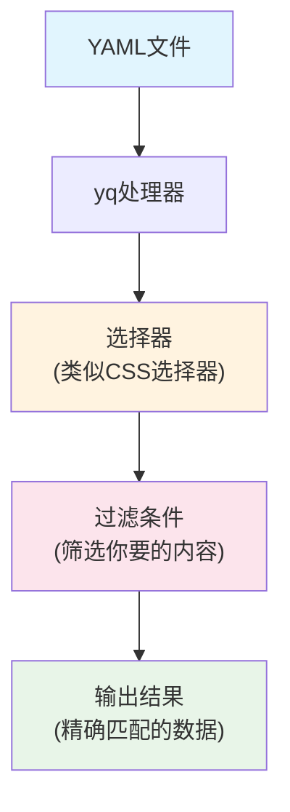
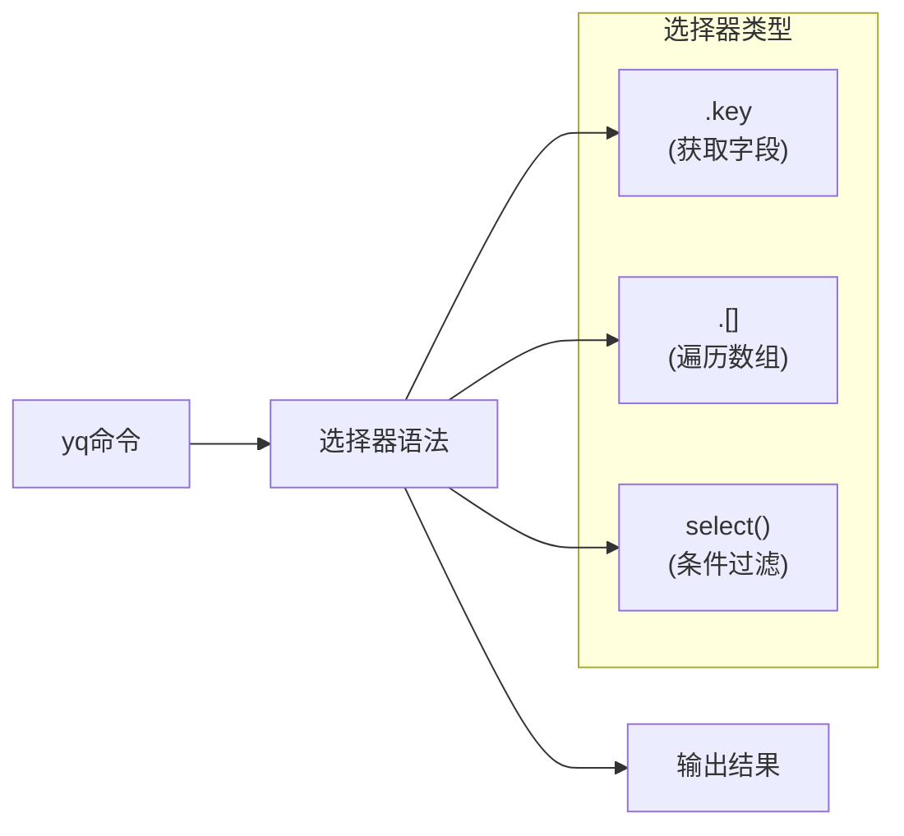
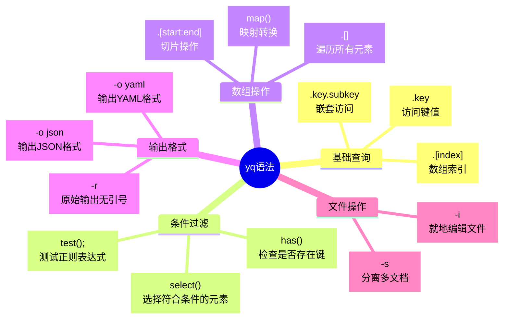

作为一名运维工程师，你是否经常需要在复杂的Kubernetes配置文件中查找特定的服务配置？或者需要从包含几十个资源定义的YAML文件中提取某个特定的Deployment？如果你还在用文本编辑器一行行查找，或者写复杂的脚本来处理YAML文件，那么yq这个工具将会彻底改变你的工作方式。

<!--more-->

## 什么是yq？

yq就像是专门为YAML文件设计的"智能搜索器"。如果你熟悉处理JSON的jq工具，那么yq就是YAML版本的jq。它可以让你用简单的命令快速查询、提取、修改YAML文件中的任何内容。

想象一下，你面前有一本厚厚的电话簿，你需要找到某个人的电话号码。传统方法是一页页翻找，而yq就像是一个智能助手，你只需要告诉它"找到姓张的所有人"，它就会立刻把结果列出来。

## 为什么需要yq？

在现代DevOps环境中，我们经常遇到这些场景：

**场景一：多服务配置管理**
一个微服务项目可能有几十个服务，每个都有自己的Kubernetes配置。当你需要快速查看所有服务的镜像版本时，用传统方法需要打开每个文件逐个查找。

**场景二：批量配置更新**
需要将所有Deployment的资源限制从1GB内存调整到2GB，手动修改几十个文件既耗时又容易出错。

**场景三：配置验证**
在部署前需要验证所有服务是否都配置了正确的标签和注解，人工检查几乎不可能做到100%准确。

## yq的核心概念

yq的工作原理可以用这个流程图来理解：



## 安装yq

根据你的操作系统选择安装方式：

```bash
# macOS
brew install yq

# Ubuntu/Debian
sudo snap install yq

# 或者下载二进制文件
wget https://github.com/mikefarah/yq/releases/latest/download/yq_linux_amd64 -O /usr/bin/yq
chmod +x /usr/bin/yq
```

安装完成后验证：
```bash
yq --version
```

## 基础语法入门

yq的语法遵循一个简单的模式：`yq '选择器' 文件名`

让我们用一个具体的例子来学习。假设你有这样一个Kubernetes配置文件 `app.yaml`：

```yaml
apiVersion: apps/v1
kind: Deployment
metadata:
  name: web-server
  labels:
    app: web
spec:
  replicas: 3
  template:
    spec:
      containers:
      - name: nginx
        image: nginx:1.19
        resources:
          limits:
            memory: "1Gi"
---
apiVersion: v1
kind: Service
metadata:
  name: web-service
  labels:
    app: web
spec:
  ports:
  - port: 80
    targetPort: 8080
```

### 基本查询操作



**1. 获取基本信息**
```bash
# 获取所有资源的kind
yq '.kind' app.yaml

# 获取所有资源的名称
yq '.metadata.name' app.yaml

# 获取Deployment的副本数
yq 'select(.kind == "Deployment") | .spec.replicas' app.yaml
```

**2. 处理多文档YAML**

这是yq最强大的功能之一。当你的YAML文件包含多个用`---`分隔的文档时：

```bash
# 只获取第一个文档
yq 'select(document_index == 0)' app.yaml

# 只获取Deployment类型的文档
yq 'select(.kind == "Deployment")' app.yaml

# 只获取Service类型的文档
yq 'select(.kind == "Service")' app.yaml
```

## 实用场景演示

### 场景1：快速查看服务镜像版本

```bash
# 查看所有容器的镜像
yq 'select(.kind == "Deployment") | .spec.template.spec.containers[].image' *.yaml

# 输出：
# nginx:1.19
# redis:6.2
# postgres:13
```

### 场景2：提取服务端口配置

```bash
# 获取所有Service的端口配置
yq 'select(.kind == "Service") | .metadata.name + ": " + (.spec.ports[].port | tostring)' *.yaml

# 输出：
# web-service: 80
# api-service: 3000
# db-service: 5432
```

### 场景3：验证资源限制配置

```bash
# 检查哪些Deployment没有设置内存限制
yq 'select(.kind == "Deployment" and .spec.template.spec.containers[].resources.limits.memory == null) | .metadata.name' *.yaml
```

## 修改YAML文件

yq不仅能查询，还能修改文件。使用`-i`参数可以直接修改原文件：

```bash
# 更新镜像版本
yq -i '(select(.kind == "Deployment") | .spec.template.spec.containers[0].image) = "nginx:1.20"' app.yaml

# 增加副本数
yq -i '(select(.kind == "Deployment") | .spec.replicas) = 5' app.yaml

# 添加新的标签
yq -i '(select(.kind == "Deployment") | .metadata.labels.environment) = "production"' app.yaml
```

## 高级技巧

### 1. 输出格式化

```bash
# 以JSON格式输出
yq -o json '.metadata' app.yaml

# 紧凑格式输出
yq -c '.spec.ports' app.yaml
```

### 2. 条件组合

```bash
# 多条件查询：找到生产环境的Web应用
yq 'select(.metadata.labels.app == "web" and .metadata.labels.environment == "production")' *.yaml

# 使用正则表达式
yq 'select(.metadata.name | test("^web-.*"))' *.yaml
```

### 3. 数据统计

```bash
# 统计Deployment数量
yq 'select(.kind == "Deployment")' *.yaml | yq -s '. | length'

# 计算总副本数
yq 'select(.kind == "Deployment") | .spec.replicas' *.yaml | yq -s 'add'
```

## 与其他工具配合

yq的真正威力在于与其他命令行工具的组合使用：

```bash
# 与grep配合查找
yq '.metadata.name' *.yaml | grep -i "web"

# 与sort排序
yq '.metadata.name' *.yaml | sort

# 生成报表
yq -r 'select(.kind == "Deployment") | .metadata.name + " -> " + .spec.template.spec.containers[0].image' *.yaml > deployment-images.txt
```

## 最佳实践建议

1. **善用select()过滤器**：这是最常用也最强大的功能
2. **熟练掌握多文档处理**：现代K8s配置通常都是多文档格式
3. **结合pipeline思维**：yq的管道操作符`|`可以串联多个操作
4. **备份重要文件**：使用`-i`修改文件前先备份
5. **利用别名简化常用操作**：
   ```bash
   alias yq-deps="yq 'select(.kind == \"Deployment\") | .metadata.name'"
   alias yq-images="yq 'select(.kind == \"Deployment\") | .spec.template.spec.containers[].image'"
   ```

## 语法速查表



## 小结

yq就像是给YAML文件装上了"智能检索系统"。掌握了它，你就能：

- 在几秒内从复杂的配置文件中找到任何信息
- 批量修改配置而不用担心人为错误  
- 自动化配置验证和部署前检查
- 生成各种运维报表和统计信息

从传统的"大海捞针"式查找，到现在的精确定位，yq让YAML文件处理变得既高效又可靠。在DevOps的日常工作中，这个小工具能为你节省大量时间，让你专注于更有价值的技术挑战。

现在就试试用yq来处理你手头的YAML文件吧！你会发现，原来复杂的配置管理可以变得如此简单。
