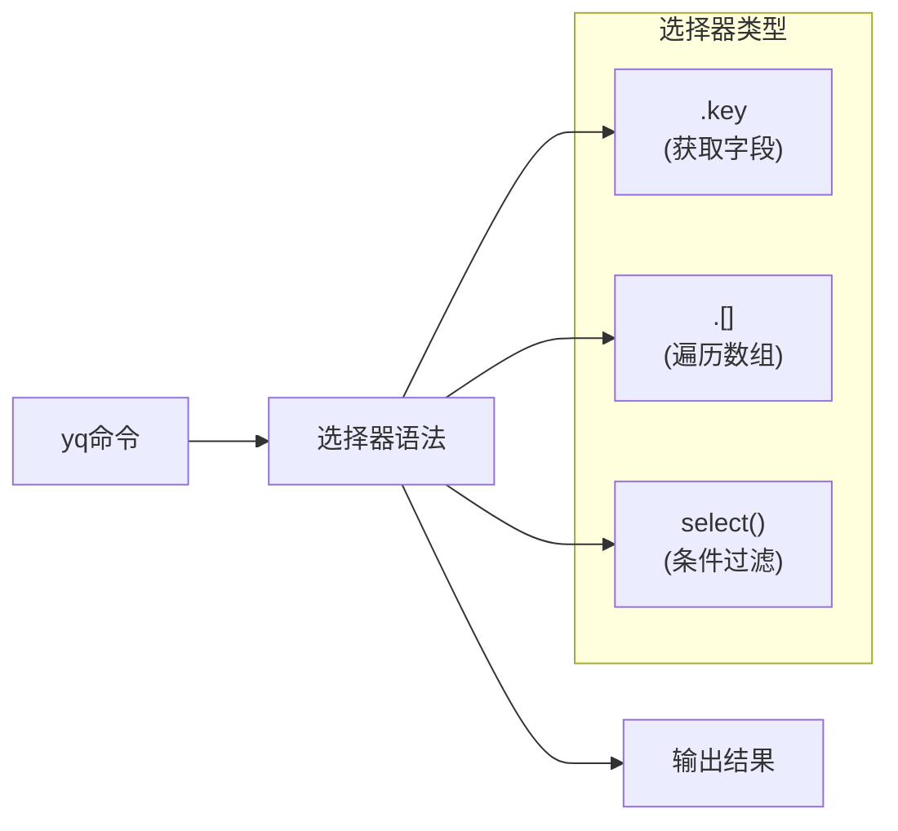

Часто ли вам, как операционному инженеру, требуется найти определенную конфигурацию сервиса в сложных конфигурационных файлах Kubernetes? Если вы все еще используете текстовый редактор для поиска строки за строкой или пишете сложные скрипты для работы с YAML-файлами, то yq - это инструмент, который полностью изменит вашу работу.

<! --подробнее-->

## Что такое yq?

yq - это "интеллектуальный поисковик" для файлов YAML. Если вы знакомы с инструментом jq для работы с JSON, то yq - это YAML-версия jq, которая позволяет быстро запрашивать, извлекать и изменять что-либо в YAML-файле с помощью нескольких простых команд.

Представьте, что перед вами толстая телефонная книга и вам нужно найти чей-то номер телефона. Традиционный способ - пролистывать страницы за страницами, но yq - это как интеллектуальный помощник: достаточно сказать ему "найти всех людей, чья фамилия Чжан", и он тут же выдаст список результатов.

## Зачем мне нужен yq?

В современных средах DevOps мы постоянно сталкиваемся с подобными сценариями:

**Сценарий 1: Управление конфигурацией нескольких сервисов**.
В проекте микросервисов могут быть десятки сервисов, каждый из которых имеет свою конфигурацию Kubernetes. Когда вам нужно быстро просмотреть версии образов всех сервисов, при традиционном подходе вам придется открывать каждый файл и искать его по одному.

**Сценарий 2: пакетное обновление конфигурации
Вам необходимо изменить лимит ресурсов всех развертываний с 1 ГБ памяти до 2 ГБ, а ручное изменение десятков файлов отнимает много времени и чревато ошибками.

**Сценарий 3: Проверка конфигурации**.
Перед развертыванием необходимо убедиться, что все службы настроены с правильными тегами и аннотациями, а добиться 100-процентной точности при ручной проверке практически невозможно.

## Основные концепции yq

Принцип работы yq можно понять с помощью этой блок-схемы:

```mermaid
graph TD
    A["YAML文件"] --> B["yq处理器"]
    B --> C["选择器<br/>(类似CSS选择器)"]
    C --> D["过滤条件<br/>(筛选你要的内容)"]
    D --> E["输出结果<br/>(精确匹配的数据)"]
    
    style A fill:#e1f5fe
    style E fill:#e8f5e8
    style C fill:#fff3e0
    style D fill:#fce4ec
```.

## Установите yq

Выберите способ установки в соответствии с вашей операционной системой:

```bash
# macOS
brew install yq

# Ubuntu/Debian
sudo snap install yq

# 或者下载二进制文件
wget https://github.com/mikefarah/yq/releases/latest/download/yq_linux_amd64 -O /usr/bin/yq
chmod +x /usr/bin/yq
```.

Проверьте после завершения установки:
```bash
yq --version
```

## Начало работы с базовым синтаксисом

Синтаксис yq соответствует простой схеме: `yq '选择器' 文件名`

Давайте изучим его на конкретном примере. Предположим, у вас есть конфигурационный файл Kubernetes `app.yaml`:

```yaml
apiVersion: apps/v1
kind: Deployment
metadata:
  name: web-server
  labels:
    app: web
spec:
  replicas: 3
  template:
    spec:
      containers:
      - name: nginx
        image: nginx:1.19
        resources:
          limits:
            memory: "1Gi"
---
apiVersion: v1
kind: Service
metadata:
  name: web-service
  labels:
    app: web
spec:
  ports:
  - port: 80
    targetPort: 8080
```.

### Основные операции запроса



**1. Получение базовой информации.
```bash
# 获取所有资源的kind
yq '.kind' app.yaml

# 获取所有资源的名称
yq '.metadata.name' app.yaml

# 获取Deployment的副本数
yq 'select(.kind == "Deployment") | .spec.replicas' app.yaml
```

```bash
# 获取所有资源的kind
yq '.kind' app.yaml

# 获取所有资源的名称
yq '.metadata.name' app.yaml

# 获取Deployment的副本数
yq 'select(.kind == "Deployment") | .spec.replicas' app.yaml
``` **2. Работа с многодокументным YAML** **3.

Это одна из самых мощных возможностей yq. Если ваш YAML-файл содержит несколько документов, разделенных `---`:

```bash
# 只获取第一个文档
yq 'select(document_index == 0)' app.yaml

# 只获取Deployment类型的文档
yq 'select(.kind == "Deployment")' app.yaml

# 只获取Service类型的文档
yq 'select(.kind == "Service")' app.yaml
```

## Демонстрация практического сценария

### Сценарий 1: Быстрая проверка версии образа службы

```bash
# 查看所有容器的镜像
yq 'select(.kind == "Deployment") | .spec.template.spec.containers[].image' *.yaml

# 输出：
# nginx:1.19
# redis:6.2
# postgres:13
```

### Сценарий 2: Извлечение конфигурации порта службы

```bash
# 获取所有Service的端口配置
yq 'select(.kind == "Service") | .metadata.name + ": " + (.spec.ports[].port | tostring)' *.yaml

# 输出：
# web-service: 80
# api-service: 3000
# db-service: 5432
```

### Сценарий 3: Проверка конфигурации лимита ресурсов

```bash
# 检查哪些Deployment没有设置内存限制
yq 'select(.kind == "Deployment" and .spec.template.spec.containers[].resources.limits.memory == null) | .metadata.name' *.yaml
```

### Измените файл YAML

yq может не только запрашивать, но и модифицировать файлы. Используя параметр `-i`, вы можете модифицировать исходный файл напрямую:

```bash
# 更新镜像版本
yq -i '(select(.kind == "Deployment") | .spec.template.spec.containers[0].image) = "nginx:1.20"' app.yaml

# 增加副本数
yq -i '(select(.kind == "Deployment") | .spec.replicas) = 5' app.yaml

# 添加新的标签
yq -i '(select(.kind == "Deployment") | .metadata.labels.environment) = "production"' app.yaml
```.

## Дополнительные советы

### 1. Форматирование вывода

```bash
# 以JSON格式输出
yq -o json '.metadata' app.yaml

# 紧凑格式输出
yq -c '.spec.ports' app.yaml
```.

### 2. Условные комбинации

```bash
# 多条件查询：找到生产环境的Web应用
yq 'select(.metadata.labels.app == "web" and .metadata.labels.environment == "production")' *.yaml

# 使用正则表达式
yq 'select(.metadata.name | test("^web-.*"))' *.yaml
```

### 3. Статистика

```bash
# 统计Deployment数量
yq 'select(.kind == "Deployment")' *.yaml | yq -s '. | length'

# 计算总副本数
yq 'select(.kind == "Deployment") | .spec.replicas' *.yaml | yq -s 'add'
```

### Работа с другими инструментами

Настоящая сила yq заключается в его использовании в сочетании с другими инструментами командной строки:

```bash
# 与grep配合查找
yq '.metadata.name' *.yaml | grep -i "web"

# 与sort排序
yq '.metadata.name' *.yaml | sort

# 生成报表
yq -r 'select(.kind == "Deployment") | .metadata.name + " -> " + .spec.template.spec.containers[0].image' *.yaml > deployment-images.txt
```

## Рекомендации по лучшей практике

1. **Пользуйтесь фильтром select()**: это самая часто используемая и самая мощная функция.
2. **Учитесь работать с несколькими документами**: современные конфигурации K8s обычно имеют многодокументный формат.
3. **В сочетании с конвейерным мышлением**: конвейерный оператор yq `|` может объединять несколько операций
4. **Бекап важных файлов**: используйте `-i` для резервного копирования файлов перед их изменением
5. **Используйте псевдонимы для упрощения общих операций**:
   ```bash
   alias yq-deps="yq 'select(.kind == \"Deployment\") | .metadata.name'"
   alias yq-images="yq 'select(.kind == \"Deployment\") | .spec.template.spec.containers[].image'"
   ```

## Краткий справочник по синтаксису

```mermaid
mindmap
  root((yq语法))
    基础查询
      key[".key<br>访问键值"]
      subkey[".key.subkey<br>嵌套访问"]
      index[".[index]<br>数组索引"]
    条件过滤
      select["select()<br>选择符合条件的元素"]
      test["test();<br>测试正则表达式"]
      has["has()<br>检查是否存在键"]
    数组操作
      traverse[".[]<br>遍历所有元素"]
      cut[".[start:end]<br>切片操作"]
      map["map()<br>映射转换"]
    输出格式
      json["-o json<br>输出JSON格式"]
      yaml["-o yaml<br>输出YAML格式"]
      raw["-r<br>原始输出无引号"]
    文件操作
      inplace["-i<br>就地编辑文件"]
      split["-s<br>分离多文档"]
``` ## Сокращение синтаксиса.

## Резюме

yq - это "интеллектуальная поисковая система" для файлов YAML. Освойте его, и вы сможете:

- За считанные секунды найти любую информацию в сложном конфигурационном файле.
- Производить пакетные изменения конфигурации, не опасаясь человеческой ошибки
- Автоматизировать проверку конфигурации и проверку перед развертыванием.
- Генерировать всевозможные отчеты и статистику по операционной деятельности

От поиска иголки в стоге сена до точного определения местоположения - yq делает работу с файлами YAML эффективной и надежной. В повседневной работе DevOps этот небольшой инструмент может сэкономить вам массу времени, позволяя сосредоточиться на более важных технических задачах.

Попробуйте использовать yq для обработки YAML-файлов, которые есть у вас под рукой! Вы увидите, насколько простым может быть комплексное управление конфигурацией.
