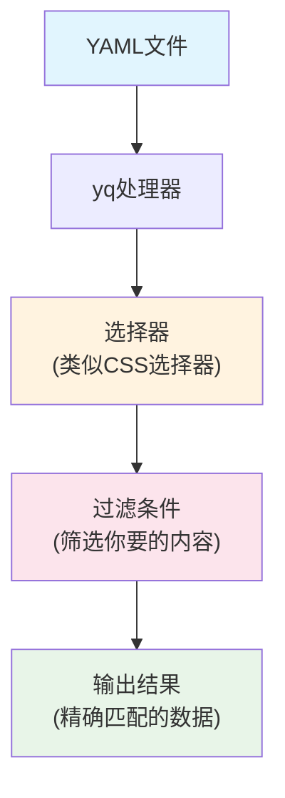
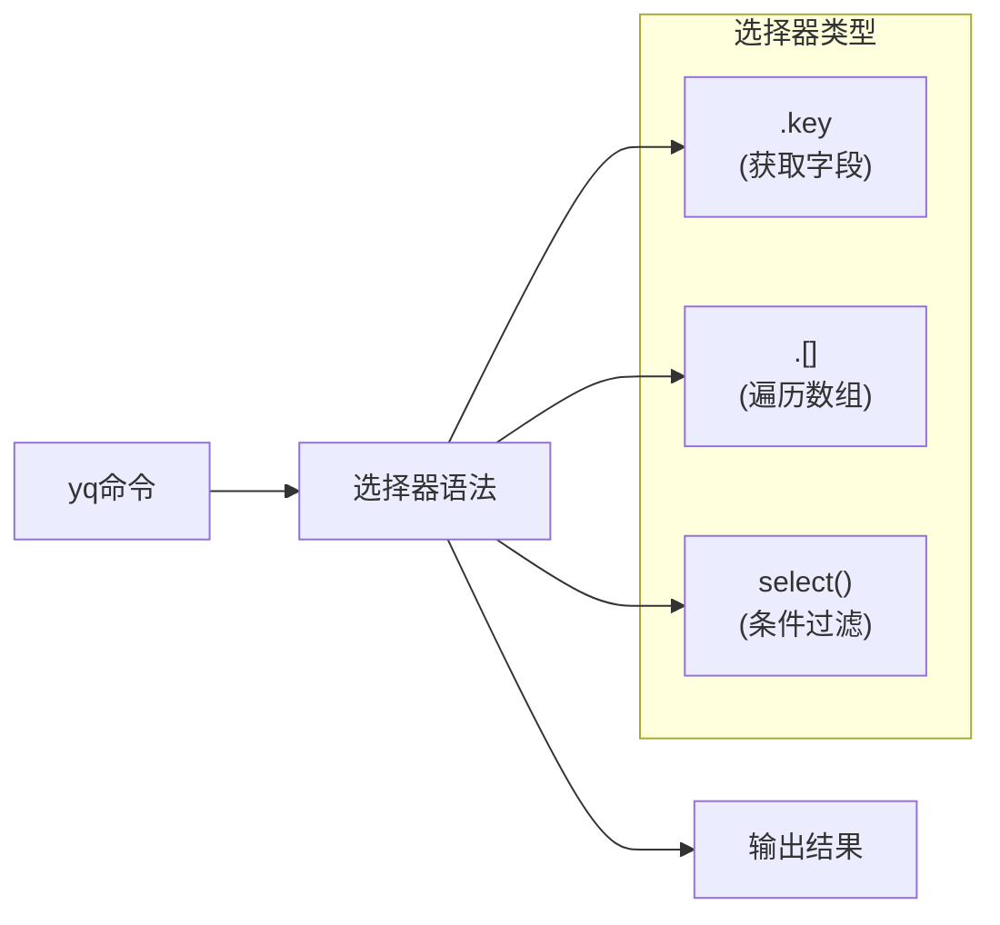
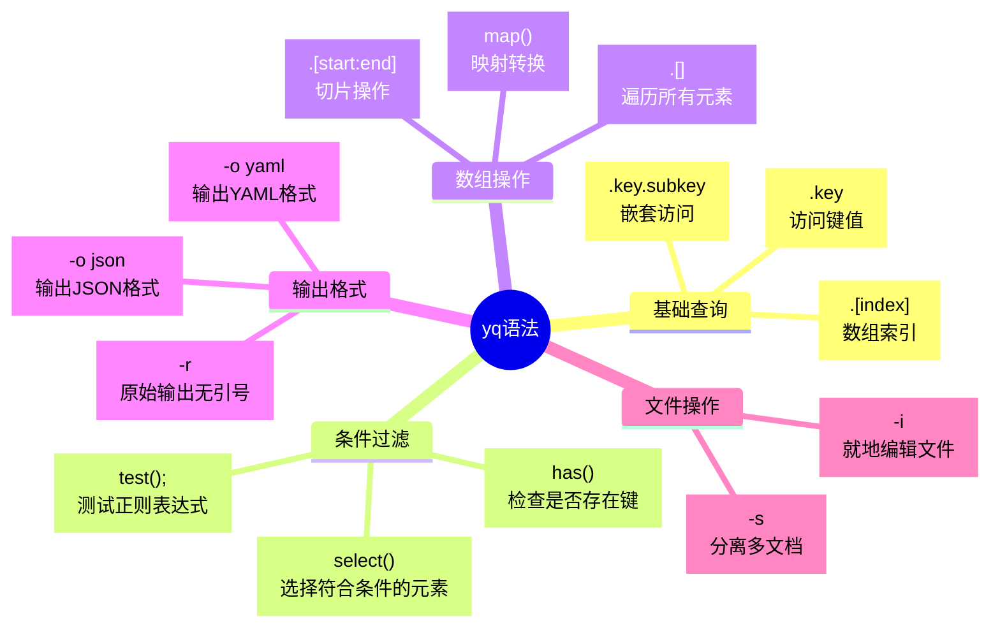

Часто ли вам, как операционному инженеру, требуется найти определенную конфигурацию сервиса в сложных конфигурационных файлах Kubernetes? Если вы все еще используете текстовый редактор для поиска строки за строкой или пишете сложные скрипты для работы с YAML-файлами, то yq - это инструмент, который полностью изменит вашу работу.

<!--more-->

## 什么是yq？

yq - это "интеллектуальный поисковик", созданный специально для файлов YAML. Если вы знакомы с инструментом jq для работы с JSON, то yq - это YAML-версия jq, которая позволяет быстро запрашивать, извлекать и изменять что-либо в YAML-файле с помощью простых команд.

Представьте, что перед вами толстая телефонная книга и вам нужно найти чей-то номер телефона. Традиционный способ - перелистывать страницы, но yq - это интеллектуальный помощник: достаточно сказать ему "найти всех людей с фамилией Чжан", и он тут же выдаст список результатов.

## 为什么需要yq？

В современных средах DevOps мы постоянно сталкиваемся с подобными сценариями:

**Сценарий 1: управление конфигурацией нескольких сервисов**.
В проекте микросервисов могут быть десятки сервисов, каждый из которых имеет свою конфигурацию Kubernetes. Когда вам нужно быстро просмотреть версии образов всех сервисов, при традиционном методе вам нужно открыть каждый файл и найти их по одному.

**Сценарий 2: пакетное обновление конфигурации**.
Необходимо изменить лимит ресурсов всех развертываний с 1 ГБ памяти до 2 ГБ, вручную изменять десятки файлов - трудоемко и чревато ошибками.

**Сценарий 3: проверка конфигурации**.
Перед развертыванием необходимо убедиться, что все службы настроены с правильными тегами и аннотациями, а выполнить проверку вручную со 100-процентной точностью практически невозможно.

## yq的核心概念

Работа yq может быть понятна с помощью этой блок-схемы:



## 安装yq

Выберите способ установки в соответствии с вашей операционной системой:

```bash
# macOS
brew install yq

# Ubuntu/Debian
sudo snap install yq

# 或者下载二进制文件
wget https://github.com/mikefarah/yq/releases/latest/download/yq_linux_amd64 -O /usr/bin/yq
chmod +x /usr/bin/yq
```

安装完成后验证：
```bash
yq --version
```

## 基础语法入门

Синтаксис yq подчиняется простой схеме: `yq 'selector' filename`.

Давайте разберемся на конкретном примере. Предположим, у вас есть конфигурационный файл Kubernetes `app.yaml`:

```yaml
apiVersion: apps/v1
kind: Deployment
metadata:
  name: web-server
  labels:
    app: web
spec:
  replicas: 3
  template:
    spec:
      containers:
      - name: nginx
        image: nginx:1.19
        resources:
          limits:
            memory: "1Gi"
---
apiVersion: v1
kind: Service
metadata:
  name: web-service
  labels:
    app: web
spec:
  ports:
  - port: 80
    targetPort: 8080
```

### 基本查询操作



**1. 获取基本信息**
```bash
# 获取所有资源的kind
yq '.kind' app.yaml

# 获取所有资源的名称
yq '.metadata.name' app.yaml

# 获取Deployment的副本数
yq 'select(.kind == "Deployment") | .spec.replicas' app.yaml
```

**2. Работа с многодокументным YAML**.

Это одна из самых мощных возможностей yq. Если ваш YAML-файл содержит несколько документов, разделенных `---`:

```bash
# 只获取第一个文档
yq 'select(document_index == 0)' app.yaml

# 只获取Deployment类型的文档
yq 'select(.kind == "Deployment")' app.yaml

# 只获取Service类型的文档
yq 'select(.kind == "Service")' app.yaml
```

## 实用场景演示

### 场景1：快速查看服务镜像版本

```bash
# 查看所有容器的镜像
yq 'select(.kind == "Deployment") | .spec.template.spec.containers[].image' *.yaml

# 输出：
# nginx:1.19
# redis:6.2
# postgres:13
```

### 场景2：提取服务端口配置

```bash
# 获取所有Service的端口配置
yq 'select(.kind == "Service") | .metadata.name + ": " + (.spec.ports[].port | tostring)' *.yaml

# 输出：
# web-service: 80
# api-service: 3000
# db-service: 5432
```

### 场景3：验证资源限制配置

```bash
# 检查哪些Deployment没有设置内存限制
yq 'select(.kind == "Deployment" and .spec.template.spec.containers[].resources.limits.memory == null) | .metadata.name' *.yaml
```

## 修改YAML文件

yq не только запрашивает, но и изменяет файлы. С помощью параметра `-i` вы можете изменять исходный файл напрямую:

```bash
# 更新镜像版本
yq -i '(select(.kind == "Deployment") | .spec.template.spec.containers[0].image) = "nginx:1.20"' app.yaml

# 增加副本数
yq -i '(select(.kind == "Deployment") | .spec.replicas) = 5' app.yaml

# 添加新的标签
yq -i '(select(.kind == "Deployment") | .metadata.labels.environment) = "production"' app.yaml
```

## 高级技巧

### 1. 输出格式化

```bash
# 以JSON格式输出
yq -o json '.metadata' app.yaml

# 紧凑格式输出
yq -c '.spec.ports' app.yaml
```

### 2. 条件组合

```bash
# 多条件查询：找到生产环境的Web应用
yq 'select(.metadata.labels.app == "web" and .metadata.labels.environment == "production")' *.yaml

# 使用正则表达式
yq 'select(.metadata.name | test("^web-.*"))' *.yaml
```

### 3. 数据统计

```bash
# 统计Deployment数量
yq 'select(.kind == "Deployment")' *.yaml | yq -s '. | length'

# 计算总副本数
yq 'select(.kind == "Deployment") | .spec.replicas' *.yaml | yq -s 'add'
```

## 与其他工具配合

Настоящая сила yq заключается в его использовании в сочетании с другими инструментами командной строки:

```bash
# 与grep配合查找
yq '.metadata.name' *.yaml | grep -i "web"

# 与sort排序
yq '.metadata.name' *.yaml | sort

# 生成报表
yq -r 'select(.kind == "Deployment") | .metadata.name + " -> " + .spec.template.spec.containers[0].image' *.yaml > deployment-images.txt
```

## 最佳实践建议

1. **善用select()过滤器**：这是最常用也最强大的功能
2. **熟练掌握多文档处理**：现代K8s配置通常都是多文档格式
3. **结合pipeline思维**：yq的管道操作符`|`可以串联多个操作
4. **备份重要文件**：使用`-i`修改文件前先备份
5. **利用别名简化常用操作**：
   ```bash
   alias yq-deps="yq 'select(.kind == \"Deployment\") | .metadata.name'"
   alias yq-images="yq 'select(.kind == \"Deployment\") | .spec.template.spec.containers[].image'"
   ```

## 语法速查表



## 小结

yq - это "интеллектуальная поисковая система" для файлов YAML. Освойте ее, и вы сможете:

- Поиск любой информации в сложных конфигурационных файлах за считанные секунды
- Изменяйте конфигурации партиями, не опасаясь человеческих ошибок
- Автоматизация проверки конфигурации и предварительных проверок перед развертыванием
- Генерируйте различные отчеты и статистику

От традиционного поиска "иголки в стоге сена" до точного определения местоположения - yq делает работу с файлами YAML эффективной и надежной. В повседневной работе DevOps этот небольшой инструмент может сэкономить вам массу времени, позволяя сосредоточиться на более важных технических задачах.

Попробуйте использовать yq с файлом YAML, который есть у вас под рукой! Вы увидите, что управление сложными конфигурациями может быть очень простым.