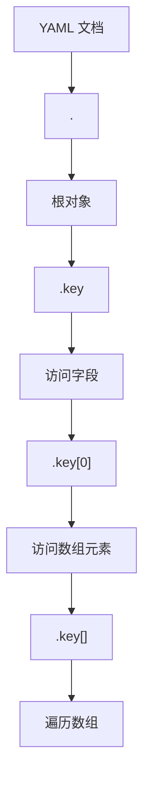
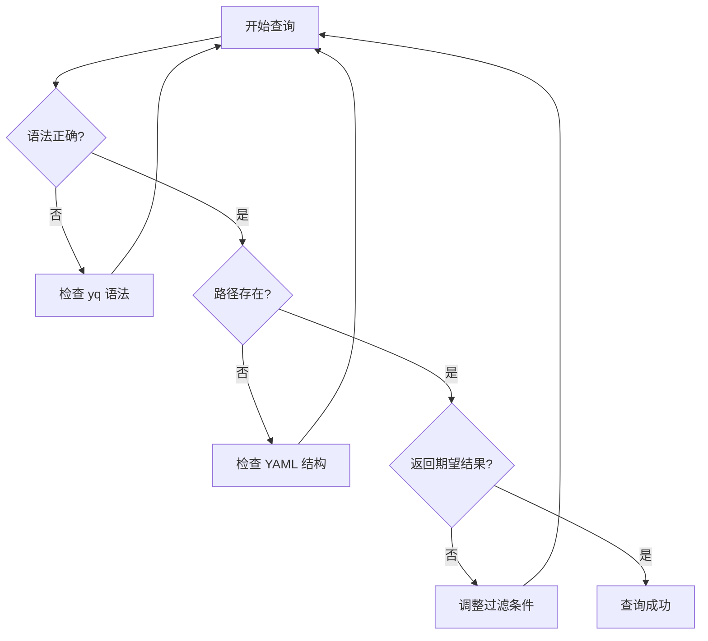

如果你是一名 DevOps 工程师或者 Kubernetes 管理员，你一定深有体感：每天都在与各种 YAML 配置文件打交道。从 Pod 配置到 Service 定义，从 ConfigMap 到 Ingress 规则，YAML 无处不在。但是当这些文件变得复杂时，如何快速提取和操作其中的数据就成了一个挑战。

幸运的是，有了 yq 这个工具，处理 YAML 就像使用 jq 处理 JSON 一样简单优雅。

<!--more-->

## 什么是 yq？

yq 是一个轻量级且可移植的命令行 YAML 处理器，它的语法与广受欢迎的 jq 工具非常相似。如果你已经熟悉 jq，那么学习 yq 几乎没有额外成本。如果你还不了解 jq，可以把它理解为专门用来查询和操作结构化数据的"搜索引擎"。

想象一下，你有一个包含几百行的 Kubernetes 部署文件，你想快速找到某个容器的镜像版本，或者修改所有 Service 的端口配置。传统方法可能需要你手动搜索或者写复杂的脚本，但使用 yq，一行命令就能搞定。

## 安装 yq

在 macOS 上：
```bash
brew install yq
```

在 Linux 上：
```bash
# 下载预编译的二进制文件
sudo wget -qO /usr/local/bin/yq https://github.com/mikefarah/yq/releases/latest/download/yq_linux_amd64
sudo chmod +x /usr/local/bin/yq
```

或者通过 Go 安装：
```bash
go install github.com/mikefarah/yq/v4@latest
```

## 基础语法速成

yq 的语法核心思想是"路径导航"。就像在文件系统中使用路径找到文件一样，你可以使用路径表达式在 YAML 结构中找到数据。

### 基本查询语法



让我们通过一个实际的 Kubernetes 配置文件来理解：

```yaml
apiVersion: apps/v1
kind: Deployment
metadata:
  name: web-app
  namespace: production
spec:
  replicas: 3
  selector:
    matchLabels:
      app: web-app
  template:
    spec:
      containers:
      - name: app-container
        image: nginx:1.20-alpine
        ports:
        - containerPort: 80
        env:
        - name: ENV_VAR
          value: "prod-env"
      - name: sidecar-container
        image: busybox:1.35
```

## 实战案例：Kubernetes 配置管理

### 案例1：提取容器信息

```bash
# 获取所有容器名称
yq '.spec.template.spec.containers[].name' deployment.yaml
# 输出: app-container, sidecar-container

# 获取主容器的镜像
yq '.spec.template.spec.containers[0].image' deployment.yaml
# 输出: nginx:1.20-alpine

# 获取所有镜像列表
yq '.spec.template.spec.containers[].image' deployment.yaml
```

### 案例2：环境变量管理

```bash
# 查找包含连字符的环境变量值（用我们之前讨论的正则表达式）
yq '.spec.template.spec.containers[].env[]? | select(.value | test(".*-.*")) | .value' deployment.yaml
# 输出: prod-env

# 只获取小写字母和连字符组成的值
yq '.spec.template.spec.containers[].env[]? | select(.value | test("^[a-z-]+$")) | .value' deployment.yaml
```

### 案例3：批量配置修改

假设你需要将所有环境为 "prod" 的服务副本数改为 5：

```bash
# 查看当前副本数
yq '.spec.replicas' deployment.yaml

# 修改副本数（这会直接修改文件）
yq -i '.spec.replicas = 5' deployment.yaml

# 批量修改多个文件
find . -name "*.yaml" -exec yq -i '.spec.replicas = 5' {} \;
```

## 高级技巧：复杂数据操作

### 条件过滤与选择

在微服务架构中，你可能需要从大量配置中筛选特定的服务：

```bash
# 选择特定类型的资源
yq 'select(.kind == "Service")' *.yaml

# 选择包含特定标签的资源
yq 'select(.metadata.labels.app == "web-app")' *.yaml

# 复合条件：选择生产环境的 Deployment
yq 'select(.kind == "Deployment" and .metadata.namespace == "production")' *.yaml
```

### 数据转换与映射

```bash
# 提取所有服务的名称和端口信息
yq '.spec.ports[] | "\(.name): \(.port)"' service.yaml

# 创建容器名称到镜像的映射
yq '.spec.template.spec.containers[] | "\(.name) -> \(.image)"' deployment.yaml

# 统计各个命名空间的资源数量
yq 'group_by(.metadata.namespace) | map({"namespace": .[0].metadata.namespace, "count": length})' *.yaml
```

### 多文档处理

Kubernetes 中经常需要处理包含多个资源定义的 YAML 文件：

```bash
# 处理多文档 YAML（用 --- 分隔的）
yq 'select(.kind == "Service") | .metadata.name' multi-resource.yaml

# 从多个文件中提取特定信息
yq '.metadata.name' deployment.yaml service.yaml configmap.yaml

# 合并多个配置文件
yq 'select(. != null)' *.yaml > combined.yaml
```

## 与其他工具的配合使用

### 与 kubectl 结合

```bash
# 获取所有 Pod 的 YAML 并提取镜像信息
kubectl get pods -o yaml | yq '.items[].spec.containers[].image'

# 修改本地配置后应用到集群
yq -i '.spec.replicas = 3' deployment.yaml
kubectl apply -f deployment.yaml

# 比较线上配置和本地配置
kubectl get deployment web-app -o yaml | yq '.spec.replicas'
yq '.spec.replicas' local-deployment.yaml
```

### 与 Git 配合做配置版本管理

```bash
# 在提交前检查配置变更
git diff HEAD~1 | grep -A 5 -B 5 "replicas"

# 使用 yq 验证配置格式
find . -name "*.yaml" -exec yq 'has("apiVersion")' {} \; | grep -v true
```

## 性能优化建议

当处理大型 YAML 文件时，yq 的性能表现通常很好，但你仍然可以通过以下方式优化：

1. **使用具体路径而非通配符**：`yq '.spec.containers[0].image'` 比 `yq '..image'` 更快
2. **管道操作优于多次查询**：`yq '.spec | .replicas, .selector'` 比两次分别查询更高效
3. **批量处理文件**：`yq '. as $item ireduce ({}; . * $item)' *.yaml` 比逐个处理文件更快

## 错误排查与调试

```bash
# 验证 YAML 语法
yq '.' config.yaml > /dev/null && echo "Valid YAML" || echo "Invalid YAML"

# 调试复杂查询
yq --verbose '.spec.template.spec.containers[] | select(.name == "app")' deployment.yaml

# 输出查询路径（用于调试）
yq -r 'path(.. | select(type == "string"))' config.yaml
```

这里可以插入一个调试流程的 mermaid 图：



## 最佳实践总结

1. **从简单开始**：先用基本的路径查询，再逐步添加过滤条件
2. **善用管道**：将复杂操作分解为多个简单步骤的管道组合
3. **备份重要文件**：使用 `-i` 参数修改文件前，确保有备份
4. **结合脚本使用**：对于重复性任务，将 yq 命令封装到脚本中
5. **版本控制**：将配置文件纳入 Git 管理，便于追踪变更

## 拓展应用场景

除了 Kubernetes，yq 在以下场景中也非常有用：

- **CI/CD 配置管理**：GitHub Actions、GitLab CI、Jenkins 的 YAML 配置
- **Ansible playbook 操作**：提取和修改 playbook 中的任务配置
- **Docker Compose 文件处理**：管理复杂的多服务应用栈
- **Helm Chart 开发**：处理 values.yaml 和模板文件
- **配置文件迁移**：在不同环境间迁移和转换配置

yq 不仅仅是一个查询工具，它更像是连接现代基础设施即代码(Infrastructure as Code)理念的桥梁。通过掌握 yq，你可以更加自信地处理复杂的云原生环境配置，让枯燥的配置管理工作变得高效而优雅。

无论你是刚入门的 DevOps 新手，还是经验丰富的平台工程师，yq 都值得加入你的工具箱。它不仅能提高你的工作效率，更重要的是，它能让你以更加结构化和系统性的方式思考配置管理这个问题。
