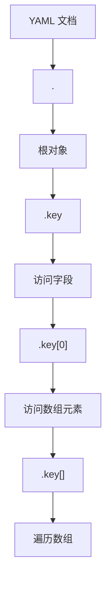
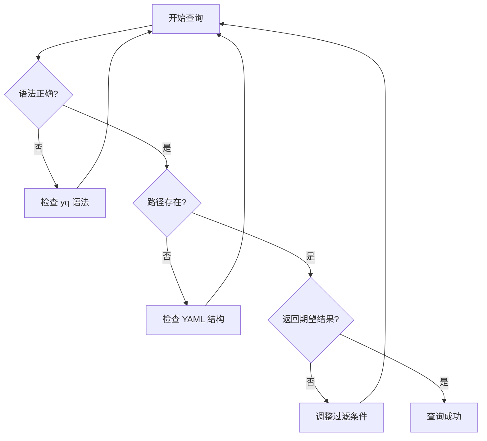

Если вы DevOps-инженер или администратор Kubernetes, вы знаете, каково это - ежедневно работать с конфигурационными файлами YAML. От конфигурации стручков до определений сервисов, от ConfigMap до правил Ingress - YAML присутствует везде. Но когда эти файлы становятся сложными, возникает проблема быстрого извлечения и манипулирования данными в них.

К счастью, yq - это инструмент, который делает работу с YAML такой же простой и элегантной, как работа с JSON, используя jq.

<! --подробнее-->

## Что такое yq?

yq - это легкий и портативный процессор командной строки YAML с синтаксисом, очень похожим на популярный инструмент jq. Если вы уже знакомы с jq, то изучение yq не потребует от вас особых затрат. Если вы не знакомы с jq, думайте о нем как о "поисковой системе", предназначенной для запросов и манипулирования структурированными данными.

Представьте, что у вас есть файл развертывания Kubernetes с сотнями строк, и вы хотите быстро найти зеркальную версию контейнера или изменить конфигурацию портов всех ваших сервисов. Традиционные методы могут потребовать поиска вручную или написания сложных скриптов, но с помощью yq вы можете сделать это с помощью одной команды.

## Установите yq

На macOS:
```bash
brew install yq
```.

На Linux:
```bash
# 下载预编译的二进制文件
sudo wget -qO /usr/local/bin/yq https://github.com/mikefarah/yq/releases/latest/download/yq_linux_amd64
sudo chmod +x /usr/local/bin/yq
```.

Или установите через Go:
```bash
go install github.com/mikefarah/yq/v4@latest
```

## Краткий курс по базовому синтаксису

Основная идея синтаксиса yq - это "навигация по пути". Точно так же, как вы используете пути для поиска файлов в файловой системе, вы можете использовать выражения пути для поиска данных в структуре YAML.

### Основной синтаксис запросов



Чтобы понять это, давайте рассмотрим конфигурационный файл Kubernetes:

```yaml
apiVersion: apps/v1
kind: Deployment
metadata:
  name: web-app
  namespace: production
spec:
  replicas: 3
  selector:
    matchLabels:
      app: web-app
  template:
    spec:
      containers:
      - name: app-container
        image: nginx:1.20-alpine
        ports:
        - containerPort: 80
        env:
        - name: ENV_VAR
          value: "prod-env"
      - name: sidecar-container
        image: busybox:1.35
```

## Практический пример: управление конфигурацией Kubernetes

### Пример 1: извлечение информации о контейнере

```bash
# 获取所有容器名称
yq '.spec.template.spec.containers[].name' deployment.yaml
# 输出: app-container, sidecar-container

# 获取主容器的镜像
yq '.spec.template.spec.containers[0].image' deployment.yaml
# 输出: nginx:1.20-alpine

# 获取所有镜像列表
yq '.spec.template.spec.containers[].image' deployment.yaml
```

### Пример 2: Управление переменными окружения

```bash
# 查找包含连字符的环境变量值（用我们之前讨论的正则表达式）
yq '.spec.template.spec.containers[].env[]? | select(.value | test(".*-.*")) | .value' deployment.yaml
# 输出: prod-env

# 只获取小写字母和连字符组成的值
yq '.spec.template.spec.containers[].env[]? | select(.value | test("^[a-z-]+$")) | .value' deployment.yaml
```

### Случай 3: Массовое изменение конфигурации

Предположим, вам нужно изменить количество копий всех сервисов со средой "prod" на 5:

```bash
# 查看当前副本数
yq '.spec.replicas' deployment.yaml

# 修改副本数（这会直接修改文件）
yq -i '.spec.replicas = 5' deployment.yaml

# 批量修改多个文件
find . -name "*.yaml" -exec yq -i '.spec.replicas = 5' {} \;
```.

## Дополнительные советы: сложные операции с данными

### Условная фильтрация и выборка

В архитектуре микросервисов вам может понадобиться отфильтровать определенные сервисы из большого количества конфигураций:

```bash
# 选择特定类型的资源
yq 'select(.kind == "Service")' *.yaml

# 选择包含特定标签的资源
yq 'select(.metadata.labels.app == "web-app")' *.yaml

# 复合条件：选择生产环境的 Deployment
yq 'select(.kind == "Deployment" and .metadata.namespace == "production")' *.yaml
```.

### Преобразование и сопоставление данных

```bash
# 提取所有服务的名称和端口信息
yq '.spec.ports[] | "\(.name): \(.port)"' service.yaml

# 创建容器名称到镜像的映射
yq '.spec.template.spec.containers[] | "\(.name) -> \(.image)"' deployment.yaml

# 统计各个命名空间的资源数量
yq 'group_by(.metadata.namespace) | map({"namespace": .[0].metadata.namespace, "count": length})' *.yaml
``` ## Преобразование и отображение данных

### Работа с несколькими документами

В Kubernetes часто возникает необходимость обрабатывать YAML-файлы, содержащие несколько определений ресурсов:

```bash
# 处理多文档 YAML（用 --- 分隔的）
yq 'select(.kind == "Service") | .metadata.name' multi-resource.yaml

# 从多个文件中提取特定信息
yq '.metadata.name' deployment.yaml service.yaml configmap.yaml

# 合并多个配置文件
yq 'select(. != null)' *.yaml > combined.yaml
```.

## Работа с другими инструментами

### Работает с kubectl

```bash
# 获取所有 Pod 的 YAML 并提取镜像信息
kubectl get pods -o yaml | yq '.items[].spec.containers[].image'

# 修改本地配置后应用到集群
yq -i '.spec.replicas = 3' deployment.yaml
kubectl apply -f deployment.yaml

# 比较线上配置和本地配置
kubectl get deployment web-app -o yaml | yq '.spec.replicas'
yq '.spec.replicas' local-deployment.yaml
```.

### Версионирование конфигурации с помощью Git

```bash
# 在提交前检查配置变更
git diff HEAD~1 | grep -A 5 -B 5 "replicas"

# 使用 yq 验证配置格式
find . -name "*.yaml" -exec yq 'has("apiVersion")' {} \; | grep -v true
``` ### Работа с Git для версионирования.

### Рекомендации по оптимизации производительности

При работе с большими YAML-файлами производительность yq обычно очень высока, но вы все равно можете оптимизировать ее, сделав следующее:

1. **Используйте конкретные пути вместо подстановочных знаков**: `yq '.spec.containers[0].image'` быстрее, чем __PROTECTED_INLINE_CODE_16
2. **Передача данных лучше, чем несколько запросов**: `yq '.spec | .replicas, .selector'` эффективнее, чем два отдельных запроса
3. **Пакетная обработка файлов**: `yq '. as $item ireduce ({}; . * $item)' *.yaml` быстрее, чем обработка файлов по одному.

## Устранение неполадок и отладка

```bash
# 验证 YAML 语法
yq '.' config.yaml > /dev/null && echo "Valid YAML" || echo "Invalid YAML"

# 调试复杂查询
yq --verbose '.spec.template.spec.containers[] | select(.name == "app")' deployment.yaml

# 输出查询路径（用于调试）
yq -r 'path(.. | select(type == "string"))' config.yaml
```

Здесь можно вставить русалочью диаграмму процесса отладки:



## Резюме лучших практик

1. **Начните с простого**: начните с базового запроса пути и постепенно добавляйте фильтры.
2. **Используйте конвейеры**: разбивайте сложные операции на комбинации конвейеров с множеством простых шагов
3. **Бекап важных файлов**: убедитесь, что у вас есть резервная копия, прежде чем изменять файлы с параметром `-i`.
4. **Использование в сочетании со сценариями**: для выполнения повторяющихся задач заключите команду yq в сценарий.
5. **Контроль версий**: включите конфигурационные файлы в Git для удобства отслеживания изменений.

## Расширенные сценарии применения

Помимо Kubernetes, yq может быть полезен в следующих сценариях:

- **Управление конфигурацией CI/CD**: конфигурация YAML для GitHub Actions, GitLab CI, Jenkins
- **Операции с плейбуком Ansible**: извлечение и изменение конфигураций задач в плейбуке.
- **Работа с файлами в Docker Compose**: управление сложными мультисервисными стеками приложений
- **Разработка диаграмм Хелма**: работа с файлами values.yaml и шаблонами
- **Миграция файлов конфигурации**: миграция и преобразование конфигураций между различными окружениями

Не просто инструмент для работы с запросами, yq - это мост к современной концепции "Инфраструктура как код". Освоив yq, вы сможете уверенно справляться со сложностями конфигурирования облачных нативных сред, делая утомительную задачу управления конфигурациями эффективной и элегантной.

Независимо от того, новичок ли вы в DevOps или опытный инженер платформы, yq станет достойным дополнением к вашему набору инструментов. Он не только повысит вашу производительность, но и, что более важно, позволит вам более структурированно и систематично подходить к управлению конфигурациями.
