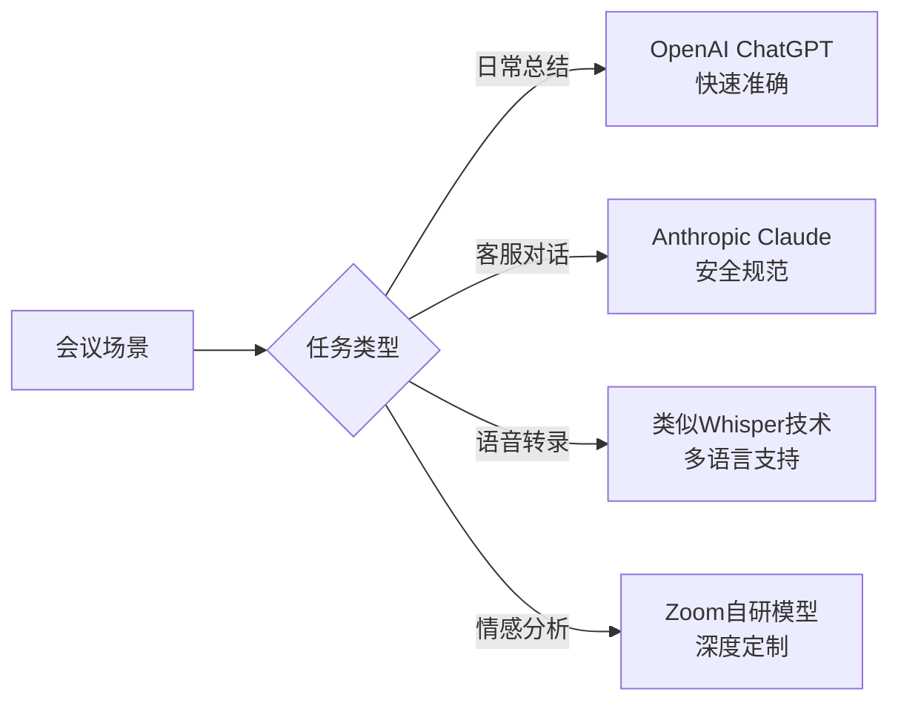
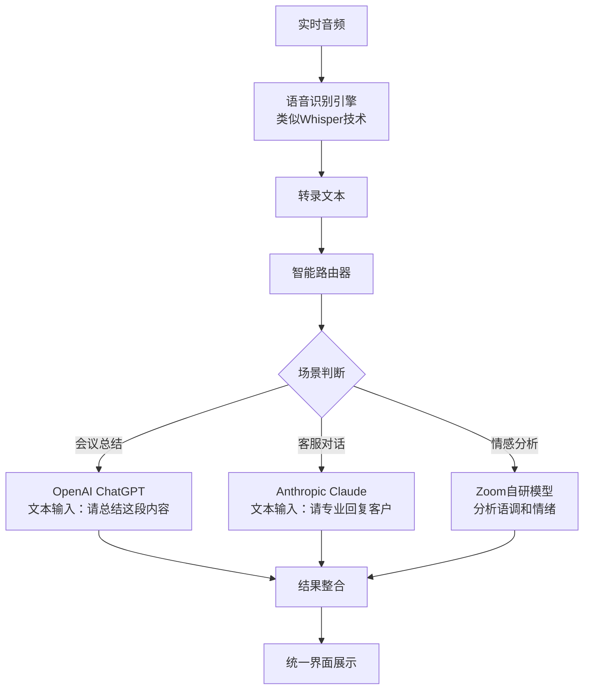
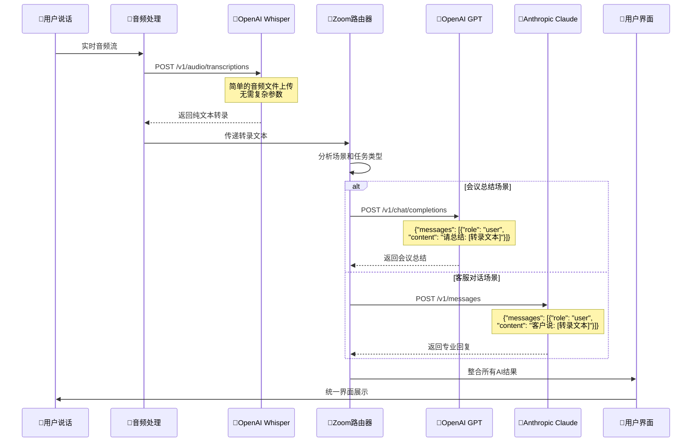
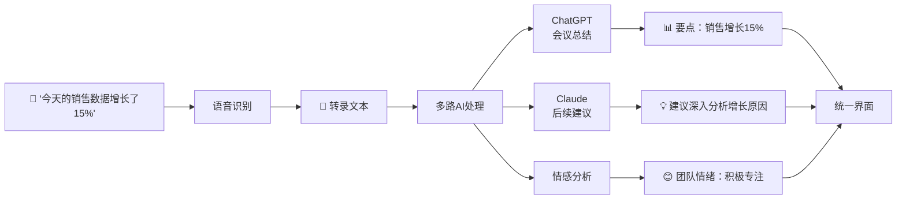
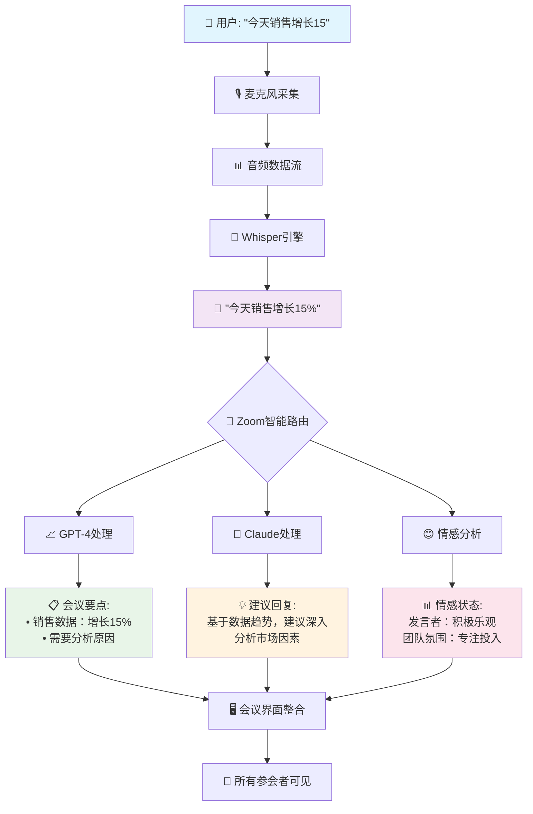

当你在 Zoom 会议中看到实时转录文字逐句出现，AI 助手准确总结讨论要点，甚至能回答"刚才讨论的销售数据是多少？"这样的问题时，你是否好奇过这背后的技术魔法是如何实现的？

作为一个深度体验过 Zoom AI Companion 的用户，我决定深入挖掘这个看似简单却极其复杂的 AI 系统的技术内幕。

<!--more-->

## 从简单问题开始的技术探索

最初让我产生好奇的是几个看似简单的技术问题：

- Zoom 是否使用了类似 OpenAI Whisper 的模型进行语音转录？
- 会议总结功能是否直接调用了 ChatGPT 这样的大语言模型？
- 在实现过程中是否涉及到了 OpenAI Function Calling 或 Anthropic MCP 这样的高级功能？

通过深入调研，我发现答案比想象中更有趣，也揭示了一个企业级 AI 产品背后的复杂技术决策。

## Zoom 的"双保险"AI 策略

### 意外的合作伙伴组合

令人意想不到的是，Zoom 同时与两个直接竞争对手建立了深度合作关系：

**OpenAI 合作（2023年3月）**
- 集成 ChatGPT 技术用于会议总结和内容生成
- 利用 Whisper 模型的语音识别能力

**Anthropic 合作（2023年5月）**  
- 投资并整合 Claude 模型
- 重点应用于客户服务和需要严格规则遵循的场景

这种看似矛盾的策略背后，实际上体现了 Zoom 首席产品官 Smita Hashim 提出的"联合AI方法"（Federated AI Approach）。

### 什么是"联合AI方法"？

简单来说，就是不把鸡蛋放在一个篮子里。Zoom 同时使用多家 AI 供应商的模型，根据不同场景的需求智能选择最合适的技术：



这种策略的好处显而易见：
- **风险分散**：避免过度依赖单一供应商
- **技术互补**：发挥不同模型的专长
- **灵活应对**：快速适应AI技术的发展变化

## 技术架构：比想象中更简单

经过深入分析，我发现 Zoom AI Companion 的核心技术流程其实相当直接，并不需要复杂的 Function Calling 或 MCP 协议：

### 实际的数据处理流程



### 为什么不需要复杂的AI编排？

原因很简单：**这是一个典型的"管道式"处理流程**

1. **音频转文本**：使用成熟的语音识别API
2. **文本理解**：将转录结果作为普通文本输入给大模型
3. **结果整合**：在应用层面组合不同模型的输出

整个过程就像一条生产线，每个环节都专注于自己最擅长的任务。

### 数据流动的具体细节

让我们深入看看数据在整个系统中的具体流动过程：



### 为什么不需要复杂的 Function Calling？

很多人会好奇，为什么 Zoom 不使用 OpenAI 的 Function Calling 或 Anthropic 的 MCP 这样的高级功能？答案其实很简单：

```python
# 实际的API调用就是这样直接：

# 步骤1：语音转录
transcription = openai.audio.transcriptions.create(
    file=audio_file,
    model="whisper-1"
)
text_content = transcription.text

# 步骤2：根据场景选择模型
if meeting_context == "summary":
    # 直接的文本输入，无需函数调用
    response = openai.chat.completions.create(
        model="gpt-4",
        messages=[{
            "role": "user", 
            "content": f"请总结以下会议内容：{text_content}"
        }]
    )
    
elif meeting_context == "customer_service":
    # 同样是简单的文本对话
    response = anthropic.messages.create(
        model="claude-3-sonnet",
        messages=[{
            "role": "user",
            "content": f"客户反馈：{text_content}，请提供专业回复"
        }]
    )

# 步骤3：结果整合（在应用层完成）
final_result = {
    "transcription": text_content,
    "ai_response": response.content,
    "timestamp": datetime.now()
}
```

**关键原因：**
1. **任务简单明确**：主要是文本理解和生成，不需要调用外部工具
2. **数据流线性**：音频→文本→AI处理→结果，没有复杂的分支逻辑
3. **上下文充足**：转录文本包含了AI模型需要的所有信息
4. **性能优先**：简单的API调用延迟更低，用户体验更好

## 技术选型背后的深层逻辑

### OpenAI vs Anthropic：术业有专攻

通过分析 Zoom 的具体应用场景，我发现了一个有趣的模式：

**OpenAI 擅长的场景：**
- 快速的内容生成和总结
- 复杂的语言理解任务
- 创意性的文本处理

**Anthropic Claude 的优势：**
- 更严格的安全性和合规性
- 在客户服务场景中的谨慎表达
- 更好的规则遵循能力

Zoom 官方也证实了这一点，他们特别提到选择 Claude 用于 Contact Center 产品，正是因为其"Constitutional AI 方法和严格遵循规则的能力"。

### Zoom 的自研投入：被低估的技术壁垒

很多人以为 Zoom 只是简单地调用外部 AI API，但实际上，Zoom 在以下领域投入了大量自研技术：

1. **实时音频处理**：低延迟的音频流处理和编解码
2. **智能任务路由**：根据会议场景自动选择最合适的AI模型
3. **情感和氛围分析**：基于语音特征、文本内容和视觉信号的多模态分析
4. **用户体验整合**：将AI功能无缝集成到会议流程中

这些技术看似不起眼，却构成了难以复制的竞争优势。

## 现实应用中的智能体验

### 会议中的AI助手是如何工作的？

想象一个典型的销售会议场景：



当有人问"刚才提到的销售数据是多少？"时，系统并不需要复杂的函数调用，而是直接将问题和之前的转录文本一起发送给大模型，让它从上下文中找到答案。

### 情感分析：被忽视的技术亮点

情感分析功能经常被忽视，但它提供了独特的价值：

- **实时参与度监控**：识别谁在积极参与，谁可能需要关注
- **讨论氛围感知**：检测紧张、兴奋或困惑的时刻
- **决策质量评估**：分析团队在重要决策时的情感状态

这种能力让 Zoom 不仅仅是一个会议工具，更像是一个理解人类互动的智能伙伴。

### 完整的业务数据流：从声音到洞察

为了让技术流程更加清晰，让我们看看一个完整的会议场景中数据是如何流动的：



这个流程展示了几个关键点：

1. **数据的单向流动**：从音频到文本到AI分析，没有复杂的循环或回调
2. **并行处理**：不同的AI模型可以同时处理同一段文本，提高效率
3. **结果聚合**：所有AI输出在应用层面简单组合，无需复杂的协调机制
4. **实时性保证**：每个环节都优化为最短路径，确保用户感受不到延迟

## 技术趋势的启示

### 简单往往更有效

Zoom AI Companion 的成功证明了一个重要观点：**最有效的技术方案往往是最简单的**。

让我们对比一下不同的技术实现方案：

```mermaid
graph TD
    subgraph Simple[“🚀 Zoom的简单方案”]
        A1[音频] --> B1[Whisper API]
        B1 --> C1[文本]
        C1 --> D1[智能路由]
        D1 --> E1[GPT/Claude API]
        E1 --> F1[结果展示]
    end
    
    subgraph Complex[“🤯 复杂方案（未采用）”]
        A2[音频] --> B2[ASR引擎]
        B2 --> C2[文本]
        C2 --> D2[Function Calling]
        D2 --> E2[工具选择]
        E2 --> F2[MCP协调]
        F2 --> G2[模型间通信]
        G2 --> H2[结果整合]
        H2 --> I2[结果展示]
    end
    
    style A1 fill:#e8f5e8
    style F1 fill:#e8f5e8
    style A2 fill:#ffebee
    style I2 fill:#ffebee
```



**为什么简单方案更好？**

| 方面 | Zoom的简单方案 | 复杂方案 |
|------|----------------|----------|
| **延迟** | 2-3秒响应 | 5-10秒响应 |
| **稳定性** | 高（少失败点） | 低（多环节故障） |
| **维护成本** | 低 | 高 |
| **用户体验** | 流畅无感 | 明显延迟 |
| **技术门槛** | 伭用性和整合 | 技术复杂度 |

这个对比说明了一个深刻的道理：**在企业级应用中，用户体验和系统稳定性往往比技术复杂度更重要**。

与其追求复杂的AI编排和模型间通信，不如专注于：
- 选择合适的技术组件
- 优化用户体验
- 确保系统的稳定性和可靠性

### 企业AI应用的未来方向

从 Zoom 的实践中，我们可以看到企业AI应用的几个重要趋势：

1. **多供应商策略**将成为主流，避免技术锁定
2. **专业化分工**将更加明确，不同AI模型承担不同任务
3. **用户体验整合**将成为核心竞争力
4. **隐私和安全**将推动更多本地处理能力的发展

## 写在最后

当我们惊叹于AI技术的神奇时，往往容易忽视背后的工程智慧。Zoom AI Companion 的成功，不仅仅在于使用了先进的AI模型，更在于如何将这些技术巧妙地整合，创造出真正有用的产品体验。

对于想要构建类似系统的开发者和企业来说，Zoom 的经验告诉我们：与其追求技术的复杂性，不如专注于解决用户的真实需求。有时候，最简单的技术架构，反而能创造最大的价值。

未来，随着AI技术的继续发展，我们可能会看到更多类似的"联合AI"应用出现。在这个过程中，如何平衡技术的先进性与实用性，将成为每个AI产品都需要面对的核心挑战。

---

*本文基于公开资料的技术分析，旨在探讨企业级AI应用的设计思路和技术选型策略。具体的技术实现细节可能因产品更新而有所变化。*
