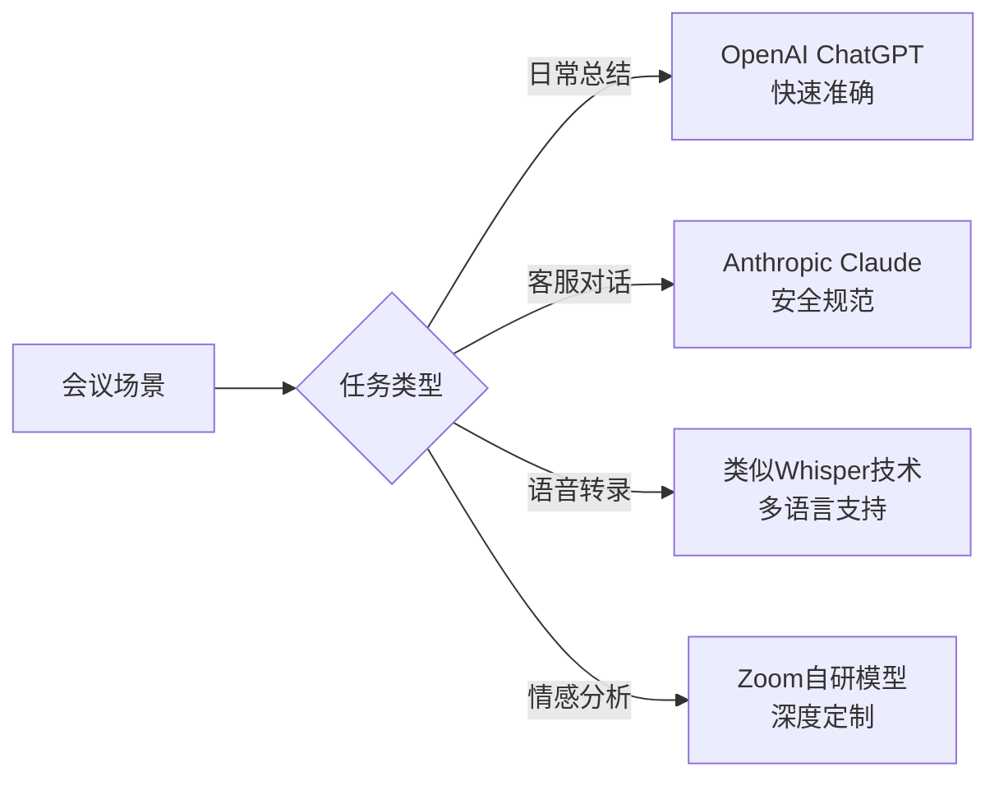
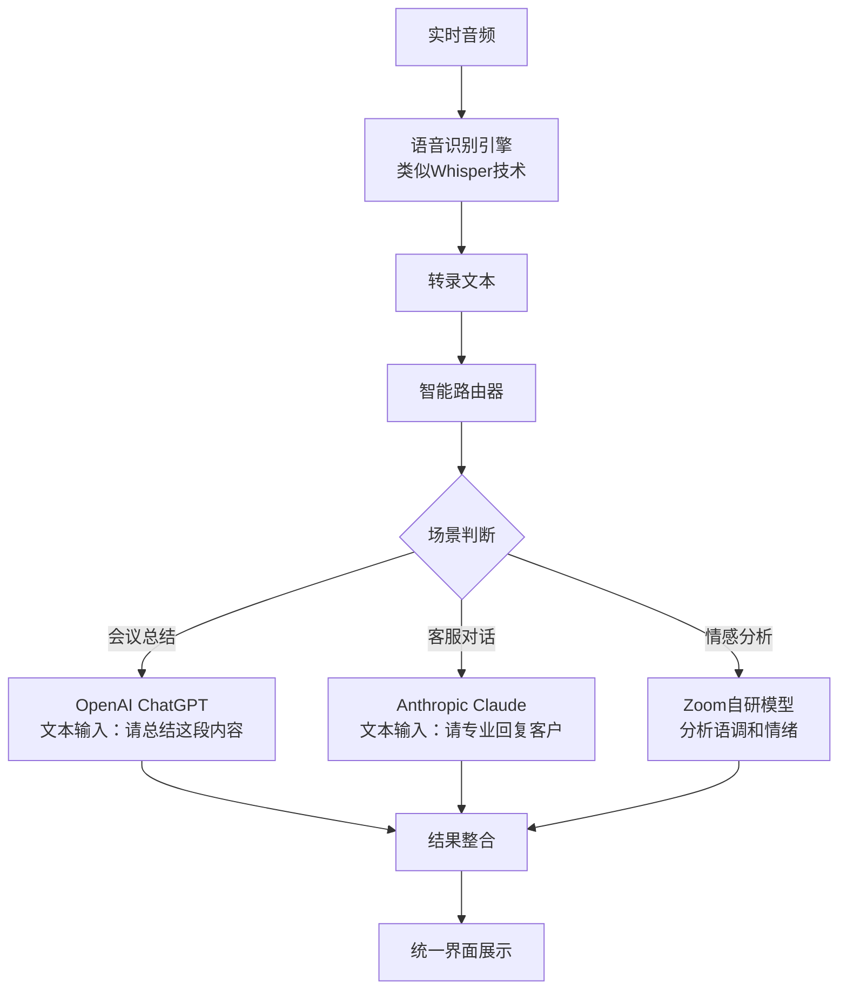
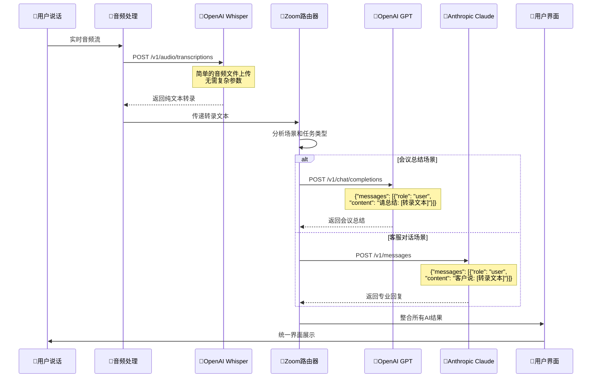
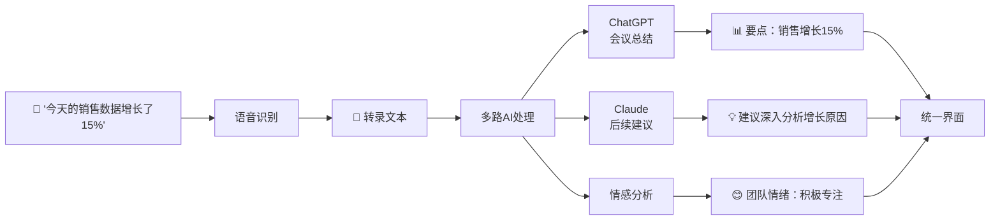
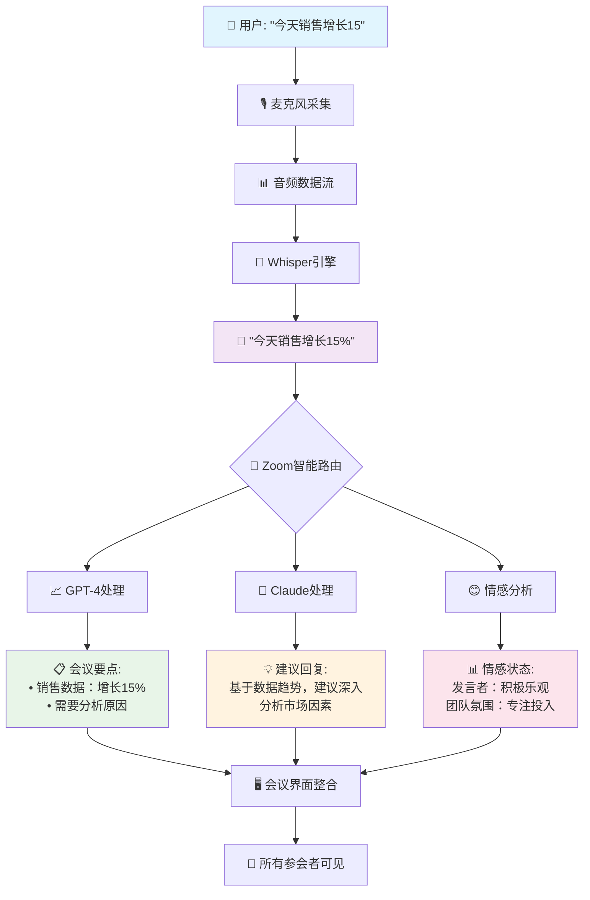

Когда вы видите в реальном времени транскрибированный текст, появляющийся предложение за предложением на встрече в Zoom, ИИ-помощник может точно резюмировать основные моменты обсуждения и даже ответить на вопрос: "Какие цифры продаж мы только что обсуждали? Вы когда-нибудь задумывались, как достигается техническая магия, стоящая за такими вопросами?

Как пользователь, испытавший Zoom AI Companion в полной мере, я решил поглубже разобраться в технических особенностях этой, казалось бы, простой, но чрезвычайно сложной системы искусственного интеллекта.

<!--more-->

## 从简单问题开始的技术探索

Поначалу меня заинтриговали несколько, казалось бы, простых технических вопросов:

- Использует ли Zoom такую модель, как OpenAI Whisper, для транскрипции речи?
- Обращается ли функция подведения итогов совещания непосредственно к такой крупной языковой модели, как ChatGPT?
- Задействованы ли в реализации такие продвинутые функции, как OpenAI Function Calling или Anthropic MCP?

Проведя глубокое исследование, я обнаружил, что ответы оказались интереснее, чем ожидалось, и раскрыли сложные технические решения, лежащие в основе продукта ИИ корпоративного уровня.

## Zoom 的"双保险"AI 策略

### 意外的合作伙伴组合

Удивительно, но Zoom также установил тесные партнерские отношения с двумя прямыми конкурентами:

**Сотрудничество с OpenAI (март 2023 года)**.
- Интеграция технологии ChatGPT для подведения итогов совещаний и создания контента
- Возможность распознавания речи с использованием моделей Whisper

**Антропийное сотрудничество (май 2023 года)**.
- Инвестиции и интеграция моделей Claude
- Сосредоточьтесь на обслуживании клиентов и сценариях, требующих строгого соблюдения правил

За этой, казалось бы, противоречивой стратегией стоит подход Federated AI Approach, предложенный директором по продуктам Zoom Смитой Хашим (Smita Hashim).

### 什么是"联合AI方法"？

Проще говоря, мы не складываем все яйца в одну корзину; Zoom использует модели от нескольких поставщиков ИИ одновременно, разумно выбирая наиболее подходящую технологию в зависимости от потребностей различных сценариев:



Преимущества этой стратегии очевидны:
- **Диверсификация рисков**: избежание чрезмерной зависимости от одного поставщика
- **Технологическая взаимодополняемость**: использование опыта различных моделей
- **Гибкость реагирования**: быстрая адаптация к изменениям в технологиях искусственного интеллекта

## 技术架构：比想象中更简单

После глубокого анализа я обнаружил, что основной технический процесс Zoom AI Companion на самом деле довольно прост и не требует сложных протоколов Function Calling или MCP:

### 实际的数据处理流程



### 为什么不需要复杂的AI编排？

Причина проста:** это типичный "конвейерный" процесс**.

1. **Перевод аудио в текст**: использование развитых API для распознавания речи
2. **Понимание текста**: ввод результатов транскрипции в виде обычного текста в большую модель
3. **Интеграция результатов**: объединение результатов различных моделей на уровне приложения

Весь процесс похож на производственную линию, где каждая часть процесса сосредоточена на тех задачах, которые она выполняет лучше всего.

### 数据流动的具体细节

Давайте подробнее рассмотрим, как именно данные перемещаются по системе:



### 为什么不需要复杂的 Function Calling？

Многие задаются вопросом, почему Zoom не использует такие продвинутые функции, как вызов функций OpenAI или MCP от Anthropic. Ответ прост:

```python
# 实际的API调用就是这样直接：

# 步骤1：语音转录
transcription = openai.audio.transcriptions.create(
    file=audio_file,
    model="whisper-1"
)
text_content = transcription.text

# 步骤2：根据场景选择模型
if meeting_context == "summary":
    # 直接的文本输入，无需函数调用
    response = openai.chat.completions.create(
        model="gpt-4",
        messages=[{
            "role": "user", 
            "content": f"请总结以下会议内容：{text_content}"
        }]
    )
    
elif meeting_context == "customer_service":
    # 同样是简单的文本对话
    response = anthropic.messages.create(
        model="claude-3-sonnet",
        messages=[{
            "role": "user",
            "content": f"客户反馈：{text_content}，请提供专业回复"
        }]
    )

# 步骤3：结果整合（在应用层完成）
final_result = {
    "transcription": text_content,
    "ai_response": response.content,
    "timestamp": datetime.now()
}
```

**Основные причины:**
1. **Задача проста и понятна**: в основном понимание и генерация текста, нет необходимости вызывать внешние инструменты
2. **Линейный поток данных**: аудио → текст → обработка ИИ → результат, никакой сложной разветвленной логики
3. **Контекстно-достаточный**: расшифрованный текст содержит всю информацию, необходимую для модели ИИ
4. **В первую очередь производительность**: простые вызовы API с меньшей задержкой и лучшим пользовательским опытом

## 技术选型背后的深层逻辑

### OpenAI vs Anthropic：术业有专攻

Проанализировав конкретные сценарии применения Zoom, я обнаружил интересную закономерность:

**Сценарии, в которых специализируется OpenAI:**.
- Быстрая генерация и обобщение контента
- Сложные задачи понимания языка
- Творческая обработка текста

Преимущества **Антропического Клода:**.
- Повышенная безопасность и соответствие нормативным требованиям
- Свобода действий в сценариях обслуживания клиентов
- Улучшенные возможности следования правилам

Это подтвердили представители Zoom, которые особо отметили, что выбрали Claude для своего продукта Contact Center из-за его "конституционного подхода к ИИ и способности следовать строгим правилам".

### Zoom 的自研投入：被低估的技术壁垒

Многие думают, что Zoom просто вызывает внешние API-интерфейсы искусственного интеллекта, но на самом деле Zoom вложила много собственных технологий в следующие области:

1. **Обработка аудио в реальном времени**: обработка аудиопотока с низкой задержкой и кодеки
2. **Интеллектуальная маршрутизация задач**: автоматический выбор наиболее подходящей модели ИИ в зависимости от сценария встречи
3. **Анализ настроения и атмосферы**: мультимодальный анализ на основе особенностей речи, текстового контента и визуальных сигналов
4. **Интеграция пользовательского опыта**: бесшовная интеграция функций ИИ в процесс проведения совещания

Эти технологии могут показаться незначительными, но они представляют собой конкурентное преимущество, которое трудно повторить.

## 现实应用中的智能体验

### 会议中的AI助手是如何工作的？

Представьте себе типичный сценарий встречи продавцов:



Когда кто-то спрашивает: "Каковы цифры продаж, о которых говорилось ранее?" Вместо сложного вызова функции система отправляет вопрос вместе с предварительно расшифрованным текстом в большую модель и позволяет ей найти ответ в контексте.

### 情感分析：被忽视的技术亮点

Функцию анализа настроений часто упускают из виду, но она обладает уникальной ценностью:

- **Мониторинг участия в дискуссии в режиме реального времени**: определение того, кто активно участвует в дискуссии, а кто может нуждаться во внимании
- **Восприятие атмосферы дискуссии**: выявление моментов напряжения, волнения или замешательства
- **Оценка качества решений**: анализ эмоционального состояния команды во время принятия важных решений

Благодаря этим возможностям Zoom становится не просто инструментом для проведения конференций, а интеллектуальным партнером, понимающим взаимодействие между людьми.

### 完整的业务数据流：从声音到洞察

Чтобы прояснить технические моменты, давайте рассмотрим, как протекают данные в полном сценарии встречи:



Этот процесс демонстрирует несколько ключевых моментов:

1. **Односторонний поток данных**: от аудио к тексту и анализу ИИ без сложных циклов и обратных вызовов
2. **Параллельная обработка**: разные модели ИИ могут одновременно обрабатывать один и тот же текст, повышая эффективность.
3. **Агрегация результатов**: все результаты ИИ просто объединяются на уровне приложения без сложных механизмов координации
4. **Гарантия реального времени**: каждое соединение оптимизировано для кратчайшего пути, чтобы пользователи не ощущали задержек.

## 技术趋势的启示

### 简单往往更有效

Успех Zoom AI Companion подтверждает важную мысль: ** Самые эффективные технологические решения часто оказываются самыми простыми**.

Давайте сравним различные варианты технической реализации:

```mermaid
graph TD
    subgraph Simple[“🚀 Zoom的简单方案”]
        A1[音频] --> B1[Whisper API]
        B1 --> C1[文本]
        C1 --> D1[智能路由]
        D1 --> E1[GPT/Claude API]
        E1 --> F1[结果展示]
    end
    
    subgraph Complex[“🤯 复杂方案（未采用）”]
        A2[音频] --> B2[ASR引擎]
        B2 --> C2[文本]
        C2 --> D2[Function Calling]
        D2 --> E2[工具选择]
        E2 --> F2[MCP协调]
        F2 --> G2[模型间通信]
        G2 --> H2[结果整合]
        H2 --> I2[结果展示]
    end
    
    style A1 fill:#e8f5e8
    style F1 fill:#e8f5e8
    style A2 fill:#ffebee
    style I2 fill:#ffebee
```



**Почему простая программа лучше? **

| Аспекты | Простые сценарии | Сложные сценарии | Увеличить
|------|----------------|----------|
| **Задержка** | 2-3-секундный отклик | 5-10-секундный отклик |
| **Стабильность** | Высокая (мало точек отказа) | Низкая (много отказов)|
| **Стоимость обслуживания** | Низкая | Высокая | Высокая.
| **Опыт пользователя** | Плавный и ненавязчивый | Значительные задержки |
| **Технические барьеры** | Удобство использования и интеграция | Техническая сложность |

Это сравнение иллюстрирует глубокую истину:** В корпоративных приложениях опыт пользователей и стабильность системы зачастую важнее технической сложности**.

Вместо того чтобы заниматься сложной оркестровкой ИИ и межмодельным взаимодействием, сосредоточьтесь на:
- выборе правильных технологических компонентов
- Оптимизация пользовательского опыта
- Обеспечение стабильности и надежности системы

### 企业AI应用的未来方向

Исходя из практики Zoom, можно выделить несколько важных тенденций в развитии корпоративного ИИ:

1. **Стратегия нескольких поставщиков** станет основной, чтобы избежать технологической замкнутости
2. **Специализированное разделение труда** станет более четким, и разные модели ИИ будут выполнять разные задачи
3. **Интеграция пользовательского опыта** станет основной компетенцией
4. **Приватность и безопасность** будут способствовать увеличению локальных возможностей обработки данных

## 写在最后

В то время как мы восхищаемся чудесами технологии искусственного интеллекта, часто легко упустить из виду стоящую за ней инженерную изобретательность. Успех Zoom AI Companion заключается не только в использовании передовых моделей искусственного интеллекта, но и в том, как эти технологии умело интегрированы для создания по-настоящему полезного опыта использования продукта.

Разработчикам и организациям, стремящимся создать подобные системы, опыт Zoom подсказывает, что вместо того, чтобы стремиться к технической сложности, следует сосредоточиться на решении реальных потребностей наших пользователей. Иногда самая простая техническая архитектура может создать наибольшую ценность.

В будущем, по мере развития технологий ИИ, мы можем увидеть больше подобных приложений "совместного ИИ". В этом процессе баланс между технологическим прогрессом и практичностью станет основной проблемой, с которой придется столкнуться каждому продукту ИИ.

---

*Эта статья основана на техническом анализе общедоступной информации и направлена на изучение идей дизайна и стратегий выбора технологий для приложений ИИ корпоративного уровня. Конкретные технические детали реализации могут измениться в связи с обновлением продукта. *